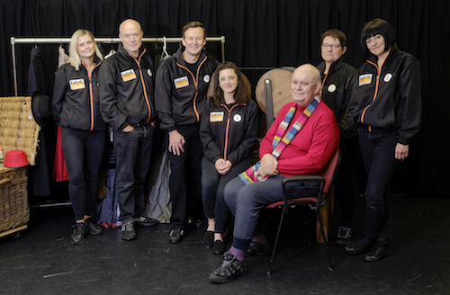

**[\<\<\< Previous page](/life/chronology/2015)**

**[Next page \>\>\>](/life/chronology/2017)**

### Notable Events

During 2016, Alan Ayckbourn…

○ directed ***[Hero’s Welcome](/plays/heros-welcome)*** and ***[Confusions](/plays/confusions)*** at the *Brits Off Broadway* festival, New York, at the 59E59 Theaters.

○ received the Oxford Literary Festival Honorary Fellowship.

○ wrote ***[Consuming Passions](/plays/consuming-passions)*** - a play in two parts - which is premiered at the **[Stephen Joseph Theatre](/career/ayckbourn-and-the-sjt/sjt-venues/stephen-joseph-theatre)**. Initially advertised as two separate but connected lunchtime plays, it is later announced the combined plays are his official 80th play.

○ wrote his first play with improvisational elements with ***[The Karaoke Theatre Company](/plays/the-karaoke-theatre-company)***, premiered at the SJT.

○ saw ***[How The Other Half Loves](/plays/how-the-other-half-loves)*** have its first major West End revival since 1970, playing at the Theatre Royal Haymarket.

○ contributed lyrics to ***[Where Is Peter Rabbit?](/plays/childrens-plays-index/contributions/where-is-peter-rabbit)***, a musical celebrating the 150th anniversary of the birth of Beatrix Potter at the Old Laundry Theatre, Bowness-on-Windermere. The piece is devised by his long-time designer, Roger Glossop.

○ saw ***[Unseen Ayckbourn: Illustrated Edition](/publications)*** by **[Simon Murgatroyd](http://www.simon-murgatroyd.com/)** published with an updated look at lost and unwritten plays.

*Alan Ayckbourn with The Karaoke Theatre Company cast.  
© Tony Bartholomew*

### World Premieres

○ ***The Karaoke Theatre Company***  
12 July: Stephen Joseph Theatre  
○ ***Consuming Passions***  
12 August: Stephen Joseph Theatre  
○ ***No Knowing*** (One Act plays)  
6 December: Stephen Joseph Theatre

### Notable Ayckbourn Productions

○ ***Hero’s Welcome* / Confusions** (Tour)  
13 January: UK Tour produced by Stephen Joseph Theatre  
○ ***Hero's Welcome*** (New York premiere)  
26 May: 59E59 Theaters  
○ ***Confusions*** (New York premiere)  
28 May: 59E59 Theaters  
○ ***How The Other Half Loves*** (Revival)  
7 July: Theatre Royal Haymarket, London  
○ ***Relatively Speaking*** (Tour)  
29 August: UK tour produced by Bath Theatre Royal  
○ ***Henceforward…*** (Revival)  
13 September: Stephen Joseph Theatre

### Professional Directing

○ ***Hero's Welcome***  
59E59 Theaters, New York  
○ ***Confusions***  
50E59 Theaters, New York  
○ ***Consuming Passions*** \*  
○ ***The Karaoke Theatre Company*** \*  
○ ***Henceforward…*** \*  
○ ***No Knowing*** \*  
○ ***Hero's Welcome***  
UK tour  
○ ***Confusions***  
UK tour

\*Stephen Joseph Theatre, Scarborough

### Awards

○ Oxford Literary Festival Honorary Fellowship

### Quotes

"I like the one act format because it embraces an economy of writing; one always attempts in the ideal world to keep plays as short as possible - sometimes it works, sometimes it doesn’t. One always tries to be concise - I equate it to drawing a picture using the minimum number of lines to convey the maximum effect. And so to that extent my work is being drawn in while expanding, although I still look for big ideas."  
*(Official Website interview, 24 February 2014)*

"I think we as a race generally take one step forward and one step sideways and two steps backwards! So there is never a tremendous sense of progression. There was a moment in the tail-end of the 1980s when it seemed the sky was the limit; men had already gone to the moon and at the speed we were going, we were going to be on Saturn within three weeks and then everything slowed down tremendously; yet other things such as computers have sped up behind belief. So who can tell? When I saw *2001: A Space Odyssey* in 1968, you thought that could be very possible. But now you think, a huge spaceship going to Jupiter? You must be joking. A space station on the moon? You’re kidding. That huge space station circling the earth with all those people having cocktails looking out at the planet, I suppose it’s foreseeable now but some way off, I suspect it’ll probably be 2101 now before we hit that."  
*(Official Website interview, 24 February 2014)*

"I’m a natural control freak, which I do acknowledge readily. I’m a director who likes to direct his own plays and I like them to be just so. And I’m quite specific and I think, ‘oh dear, that is so anal’ and I’ve no control over it!"  
*(Front Row, 11 July 2016)*

“You can do incredibly exciting things in the movies these days, and increasingly so in television, but theatre has at its core one element that they are still striving to recreate: that live element.”  
*(Sunday Times, 24 July 2016)*

“I don’t think I’m a global writer, I never have been: I don’t want to write about Balkan wars or huge events. I am quite happy to be chronicling how we continue to treat each other as individuals and this town is certainly full of individuals.”  
*(Sunday Times, 24 July 2016)*

“In retrospect I feel disappointed \[about the EU Referendum\]. I feel that the world should be coming together and it appears to be rapidly falling apart. But then if you are lucky enough to live long enough you are also unlucky enough to see the same bloody things happening."  
*(Sunday Times, 24 July 2016)*

"The one facet of theatre that’s totally unique. You can forget all the other things: big flying pieces of scenery and spectacular lighting effects and the huge orchestras that swell up. In the end it’s just a group of human beings with a certain talent for acting getting together and doing something, trying to tell a story which somebody else who has a certain talent for writing has constructed, and allowing it to happen."  
*(2016)*

"I think one of the things that drives me, apart from live theatre, is the need to surprise myself."  
*(2016)*

"Science Fiction gives you common ground with the generations you are no longer part of. You can invent a world which hopefully they will accept which doesn’t depend on me knowing their jargon or their way of texting or anything like that. I invent the ground rules. You ask them please accept the ground rules of this."  
*(2016)*

"I always felt that I’m probably very calm and I hope pleasant person, but whenever I’ve hurt people, they’re always people I love, because it’s a sort of defensive thing. Over the years, when I was very young, I got quite aggressive to some people with whom I should have known better."  
*(2016)*
