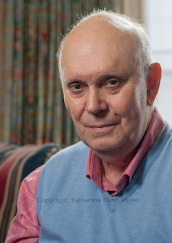
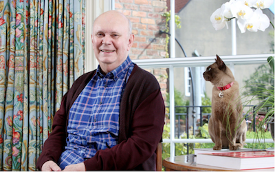

**[\<\<\< Previous page](/life/chronology/2017)**

Next pa**[Next page \>\>\>](/life/chronology/2019)**

<aside>

*© Katherine Dunn Mines*

</aside>

### Notable Events

During 2018, Alan Ayckbourn…

○ was appointed **[Director Emeritus](/career/ayckbourn-and-the-sjt/director-emeritus-sjt)** at the **[Stephen Joseph Theatre](/career/ayckbourn-and-the-sjt/sjt-venues/stephen-joseph-theatre)**.

○ saw the stage adaptation of ***[The Divide](/plays/the-divide)*** transfer to The Old Vic as part of the company's bicentennial celebrations.

○ directed ***[A Brief History Of Women](/plays/a-brief-history-of-women)*** for the *Brits Off Broadway* festival breaking attendance records for the SJT at the venue.

○ received the Oldie Of The Year Award for Oldie Drama King Of The Year.

○ delivered the annual Wolfit Lecture at Castle House, Newark, in March.

○ saw the publication of *Alan Ayckbourn: Plays 6* (Faber) and *Alan Ayckbourn: Writers And Their Work* (2nd Ed.) by Michael Holt (Northcote House).

○ saw Samuel French publish ***[Haunting Julia](/plays/haunting-julia)***.

### World Premieres

○ ***Better Off Dead***  
11 September: Stephen Joseph Theatre

### Notable Ayckbourn Productions

○ ***The Divide*** (West End premiere)  
7 February: The Old Vic, London  
○ ***A Brief History Of Women*** (New York premiere)  
1 May: 59e59 Theatres, New York  
○ ***Joking Apart*** (Revival)  
31 July: Stephen Joseph Theatre

### Professional Directing

○ ***A Brief History Of Women***  
59e59 Theatres, New York  
○ ***Better Off Dead***  
Stephen Joseph Theatre, Scarborough  
○ ***Joking Apart***  
Stephen Joseph Theatre, Scarborough

### Awards & Honours

○ Director Emeritus at the Stephen Joseph Theatre  
○ The Oldie Of The Year Awards: Oldie Drama King Of The Year.

### Quotes

<aside>

*Alan Ayckbourn with his cat Scampston.*  
*© Daily Telegraph (TBC)*

</aside>

"It’s when people say 'you’ve never topped *Relatively Speaking*, that’s my favourite'. And you think 'Oh, that’s a wasted life then."  
*(Official Website interview, 12 March 2018)*

"Anger drives comedy, the best comedy is angrily driven."  
*(Official Website interview, 12 March 2018)*

"There is a strange feeling of the tricks memory plays. I know with my Mum when she wrote, I think she probably stepped over the line on more than one occasion when the reality became the fiction and vice versa. All her life I would say 'No, we didn’t do that, you made that up.' I think the danger is that you, as a writer, start to live in your dream worlds and if you’re used to all your life creating worlds where things are ordered and people do as they are told then suddenly the real world becomes much less attractive so you begin to inhabit the dream world a lot more. Then you rather resent coming back to the real world."  
*(Official Website interview, 12 March 2018)*

“I’m delighted to accept the title of Director Emeritus of the SJT - even though I had to ask what ‘Emeritus’ meant!”  
*(20 April 2018)*

“A successful first play is a curse, really. You’ll live to regret it.”  
*(The Times, 14 May 2018)*

"I can remember all the plots, and so when I tackle a new one, I'll be thinking, 'oh, that happened in that one', and so the path of taking a conclusively new path is getting more difficult, and I hope that now some of my plays are getting so old, no critic will remember them all, but at least you'd be plagiarising yourself,"  
*(The Press, 13 September 2018)*

"People ask me, 'why do you keep writing?' and I say, 'just in the hope of getting better. I'll get it right, one day."  
*(Sydney Morning Herald, 26 October 2018)*
