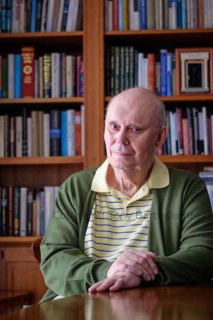

**[\<\<\< Previous page](/life/chronology/2018)**

Next pa**[Next page \>\>\>](/life/chronology/2020)**

<aside>

*© Tony Bartholomew*

</aside>

### Notable Events

During 2019, Alan Ayckbourn…

○ celebrated his 80th birthday and the 60th anniversary of his professional playwriting debut with ***[The Square Cat](/plays/the-square-cat)*** at the **[Theatre in the Round at the Library Theatre](/career/ayckbourn-and-sjt/sjt-venues/theatre-in-the-round-at-the-library-theatre)**, Scarborough.

○ hosted the event *80 Years Young* at the **[Stephen Joseph Theatre](/career/ayckbourn-and-sjt/sjt-venues/stephen-joseph-theatre)**, Scarborough, in September celebrating his family and children's plays.

○ saw ***[The Divide](/plays/the-divide)*** published as a novel by PS Publishing; marking the culmination of the author's original intent for the work (it was conceived and written as a novel and was never intended for the stage).

○ saw the first revival of ***[Dear Uncle](/plays/dear-uncle-chekhov)*** - his adaptation of Chekhov's *Uncle Vanya* - performed at the Theatre by the Lake, Keswick; appropriately enough given the play's location is transposed to the Lake District during the 1930s.

○ saw Samuel French publish ***[Roundelay](/plays/roundelay)***, ***[Arrivals & Departures](/plays/arrivals-and-departures)***, ***[Private Fears In Public Places](/plays/private-fears-in-public-places)***, ***[Sugar Daddies](/plays/sugar-daddies)*** and ***[Hero's Welcome](/plays/heros-welcome)***.

○ saw the publication of ***[Unseen Ayckbourn: Anniversary Edition](/)***by **[Simon Murgatroyd](http://www.simon-murgatroyd.com/)**. A limited edition to mark the playwright's 80th birthday and 60th anniversary of his playwriting debut.

○ saw the publication of *Towards Ayckbournia in Germany*, a 'festschrift' edited by Albert-Reiner Glaap celebrating his 80th birthday.

○ approved an exclusive rehearsed reading of his fourth play, ***[Standing Room Only](/plays/standing-room-only)***, by Dick & Lottie Theatre Company to celebrate his 60 years of playwriting. This marked the first public performance of the play since 1966.

○ marked the 50th anniversary of his classic comedy ***[How the Other Half Loves](/plays/how-the-other-half-loves)***.

○ endorsed the first Ayckbourn Film Festival at the Stephen Joseph Theatre, Scarborough.

○ lost his long-time literary agent Tom Erhardt - who had taken over from Margaret 'Peggy' Ramsay during 1991. He died on 28 December aged 91, although had stepped down as Alan's agent several years previously.

### World Premieres

○ ***Birthdays Past, Birthdays Present***  
9 September: Stephen Joseph Theatre

### Notable Ayckbourn Productions

○ ***Season's Greetings*** (Revival)  
31 July: Stephen Joseph Theatre  
○ ***Standing Room Only*** (Rehearsed reading)  
4 July: The Square Chapel, Halifax (Dick & Lottie Theatre Company)  
○ ***Dear Uncle*** (Revival)  
1 August: Theatre by the Lake, Keswick  
○ ***Relatively Speaking*** (Revival)  
4 September: Salisbury Playhouse  
○ ***Ten Times Table*** (UK Tour)  
8 October: Theatre Royal Bath (Classic Comedy Company)

### Professional Directing

○ ***Birthdays Past, Birthdays Present***  
Stephen Joseph Theatre, Scarborough  
○ ***Season's Greetings***  
Stephen Joseph Theatre, Scarborough

### Quotes

"Is there any doubt where my heart lies? The Stephen Joseph Theatre is for me the perfect round space which we, the company, virtually had built to order for us utilising the best of all we'd learned from our previous buildings. Not too big, not too small and with the audience sitting all round in the same room sharing the same performance with performers and each other. A truly magical space."  
*(Theatres Magazine, Spring 2019)*

"Pinter had a profound influence on my stuff in later years. I absorbed him into my bloodstream, though I had a lot of Noël Coward running around my system too."  
*(Yorkshire Post, 23 March 2019)*

"I'm like one of those bloody ocean liners in that they take a third of a mile more to stop. And every time I think I'm finished something else arrives."  
*(Yorkshire Post, 23 March 2019)*

"When I heard the theatre \[the Library Theatre in Scarborough\] was by the seaside it made perfect sense as to why I wanted to come here - so I came and it was seaside plus. It is the size of the place I like. I’m not a big urban writer. I could not write about Birmingham, Manchester or London with any comfort. Most of my plays are set in smaller communities than that. I was known as a suburban writer for some time. I think of myself as a small-town writer. Scarborough for that reason remains interesting to me. Everybody sorts of knows each other and in that way it is like a large village. They have certainly heard of each other, even if they don’t recognise one another in the street. At the same time it has an enormous flow of people coming through it - holidaymakers and newcomers. It has a cosmopolitan feel and yet at the same time it is essentially English. Scarborough has all the national concerns and smaller concerns of its own."  
*(The Scarborough News, 28 March 2019)*

“Playwriting is an exercise in storytelling and keeping several dozen people on the edge of their seats for two hours. The way it is told is almost as important as what it says. I always feel I do not want to start a play until I know the journey I am going on. You can change your mind - go via Malton or Pickering but you will get to York in the end. The more you do the more risk you can take because you are sure you are not going to go off road.”  
*(The Scarborough News, 28 March 2019)*

“Cinema taught me all the basics of structure I needed to know. When I started to write for theatre my brain was working in cinematic terms rather than theatre terms which is why I have bent a few conventions in my time.”  
*(The Scarborough News, 28 March 2019)*

"J.B. Priestley was a major influence on my early writing, especially his so called ‘time’ plays, *Time and the Conways*, *Dangerous Corner* etc. When I was starting out, soon after my first West End hit, (nobbut a lad, at the time) I was fortunate to be introduced to the grand old man. 'You’re a very good dramatist' he growled. I smiled, accepting the compliment with what I hoped was suitable modesty. Then, after a slight pause he added with a throaty chuckle, 'Or so I’ve heard.' What could be more Yorkshire?  
*(Dalesman, Spring 2019)*

"I prefer to embrace the new. I prefer to look forward to what’s to come. Though I must admit that, as years pass, the vista is getting smaller."  
*(Personal correspondence, 2019)*

“We set up our expectations for a wonderful family time at Christmas, but people don’t behave like that, and instead Christmas is a suicide note waiting to happen. You invite people you only see once a year and somehow you expect you’re all going to have fun, but it’s not a good idea to have that belief.”  
*(The Press, 11 April 2019)*

"My characters have no politics because I don’t really."  
*(Sky News, 23 April 2019)*

"I think - along with 99% of the country - I’m sick to death of it \[Brexit\]. It’s really put me off politicians. I mean I could write a very nasty play about politicians these days because I’m beginning to get angry. And that’s a good sign for a writer!"  
*(Sky News, 23 April 2019)*

"One of my fascinations when I was nobbut a lad was science fiction and I loved it. A lot of writers have found it’s a way of making moral tales about the present day. It is stories, what if this happened and what if that happened? And it’s also - and this is significant - it’s also a way an author of my advanced years can reach a younger audience because it creates…. If you write a science fiction piece or a fantasy piece, you create a fantasy world which is flat. They don’t belong in it and you don’t belong in it and we meet on this neutral ground."  
*(Sky News, 23 April 2019)*

"I grew up in theatre and I think I was born at a very lucky time if I wanted to be in theatre because the world smiled a lot more generously on the theatre. The Government formed things like the Arts Council which actually cared about theatre, not like it does these days."  
*(Sky News, 23 April 2019)*
