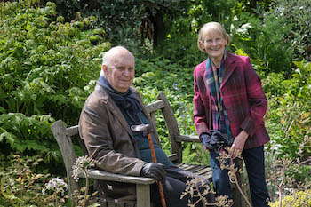

**[\<\<\< Previous page](/life/chronology/2019)**

**[Next page \>\>\>](/life/chronology/2021)**

### Notable Events

During 2020, Alan Ayckbourn…

○ premiered his latest play, ***[Anno Domino](/plays/anno-domino)***, as an audio stream due to the Covid-19 theatre lockdown…

○ … and returned to professional acting for the first time since 1964 playing all the male roles, opposite Heather Stoney, in *Anno Domino*; the first play he has written, directed and performed in.

○ saw his home theatre - the **[Stephen Joseph Theatre](/career/ayckbourn-and-the-sjt/sjt-venues/stephen-joseph-theatre)** (SJT), Scarborough - and all UK theatres close during March as a result of the Covid-19 pandemic.

○ had the planned productions of his plays ***[Truth Will Out](/plays/childrens-plays-index/unproduced-plays)*** & ***[Just Between Ourselves](/plays/just-between-ourselves)*** at the SJT cancelled due to the Covid-19 pandemic.

○ recorded his 1994 play ***[Haunting Julia](/plays/haunting-julia)*** as an audio play for streaming by the SJT during December 2020, both directing and performing all the male roles.

○ saw the 2001 TV recording of his and Andrew Lloyd Webber's musical *By Jeeves* live-streamed as part of Lloyd Webber's *The Shows Must Go On!* initiative on Youtube.

○ saw Samuel French publish the plays ***[Better Off Dead](/plays/better-off-dead)***, ***[No Knowing](/plays/no-knowing)***, ***[Consuming Passions](/plays/consuming-passions)*** & ***[Birthdays Past, Birthdays Present](/plays/birthdays-past-birthdays-present)***.

○ marked the 60th anniversary of his third play ***[Dad's Tale](/plays/dads-tale)*** and the 50th anniversary of ***[Family Circles](/plays/family-circles)***.

○ wrote several as yet unproduced plays during lockdown.

### World Premieres

○ ***Anno Domino***  
25 May: Stephen Joseph Theatre (audio stream)

### Notable Ayckbourn Productions

○ ***Relatively Speaking*** (Revival)  
27 February: The Mill at Sonning  
○ ***Ten Times Table*** (UK Tour)  
(Classic Comedy Company)

### Plays In Other Media

○ ***By Jeeves***  
Live-stream: 8 May, Youtube  
○ ***Anno Domino***  
Audio-stream: 25 May, SJT website  
○ ***Haunting Julia***  
Audio-stream: 1 December, SJT website

*Alan Ayckbourn & wife, Heather Stoney*  
*© Tony Bartholomew*

### Quotes

**Note:** *2020 was an extraordinary year during which the Covid-19 pandemic closed every theatre in the UK from mid-March. As a result, all the quotes on this page from March onwards should be viewed in light of the global situation and the fact that the future of the performing arts looked extremely bleak.*

"We are in a world where everything is, in a good way, connected but also, in a bad way, also all connected. Just as the tree has all its many branches, it only takes one person to shake it and the whole damned apple crop drops to the ground."  
*(Interview with Simon Murgatroyd, 25 February 2020)*

"Do you need to say #bekind? Isn’t it natural to consider other people? I think it’s like someone’s gone around to every house in the country - in the world - and handed people a loud hailer and said, ‘there you are, you can be heard all over the place now’ and you go, ‘that’s great, everybody can be heard.’ But, if we are honest, there are a lot of people who shouldn’t be heard - quite frankly - and that, in itself, is a terrible thing to say."  
*(Interview with Simon Murgatroyd, 25 February 2020)*

"Politicians, by their behaviour and their flexibility with the truth, shall we say - be it Donald Trump or Boris Johnson - have lost the trust of quite a lot of people. The sort of people who laugh when you see an average interviewer asking, ‘what do you think of the politicians?’ and they laugh. There’s so much disillusionment."  
*(Interview with Simon Murgatroyd, 25 February 2020)*

"I’m always amazed that people who get rich quick are so boring and you think, what a waste of a life really."  
*(Interview with Simon Murgatroyd, 25 February 2020)*

"I think we are walking around the perimeter of a very deep hole and it only takes one step and we’re going to slip in. One wonders who’s going to slip first. It may be a meteorite is heading towards us any minute and someone hasn’t told someone or thought, ‘oh, I’ll mention it tomorrow…' as he’s got one or two things on his mind and he’s a meteorite denier anyway…." \*  
*(Interview with Simon Murgatroyd, 25 February 2020)*

"You watch a streamed play and you might as well be watching television. Although everyone tries to make it feel like theatre, and some people, they watch it on Zoom together, it's not the same… The theatre in the end essentially has to be live. It has to be a moment when I always say to an audience who come on a specific night, this performance is purely for YOU. The excitement and spontaneity of live theatre is like nothing else.”  
*(BBC Radio 4 Interview, 20 May 2020)*

"When I’m writing, I tend to say everything out loud, in character; when directing, I tend to say everything silently, under my breath but, of course, NEVER out loud! Most off-putting that would be for the actors, poor things.”  
*(Charleshutchpress, 21 May 2020)*

“Interestingly, audio and in-the-round stage performance are very similar. People always say with radio plays, that they enjoy them ‘because they ask you to use your imagination’. People say similar things when watching plays in-the-round. The only difference is that audio has no pictures!”  
*(Charleshutchpress, 21 May 2020)*

"All relationships, however resilient they appear, are built on sand. It takes one couple to break up - then everyone is questioning their own relationship.”  
*(Daily Telegraph, 22 May 2020)*

“I’m limited in physical ability - I’m a head that writes plays.”  
*(Daily Telegraph, 22 May 2020)*

“I thank God that I always seem to have another play in me. Somehow there’s always more to say.”  
*(Daily Telegraph, 22 May 2020)*

“Theatre is one of the last places that is going to get back to something like normal. It relies precisely on gathering people in one place. That is what it is. A theatre is an intimate space. If you want to catch a germ, then a small theatre built in the round, like the Stephen Joseph Theatre in Scarborough, the place I’m most associated with, is the perfect place. If you want to have a wonderful theatrical experience, it is a wonderful place for that too, of course.”  
*(The Observer, 24 May 2020)*

“People may have gone back to the theatres quickly after plagues and diseases since the Middle Ages, but they didn’t have Netflix then did they? There was not much else to do."  
*(The Observer, 24 May 2020)*

“I always enjoyed acting, but one thing I didn’t miss when I stopped was having to go into the theatre in the evening. When I wrote my first play I realised I had the evening free. I went round the corner to the pub instead, but then I got a bit worried about how it might all be going and went in.”  
*(The Observer, 24 May 2020)*

"I’ve always loved radio, ever since I joined the BBC in the 1960s. All the other producers and directors went off to play with this new toy they had found called television. I attached myself to a brilliant radio producer called Alfred Bradley and did some really interesting plays with him.”  
*(Yorkshire Post, 27 May 2020)*

“Sonia Friedman (theatre producer) warned this week that we could lose 70 per cent of our theatres if something isn’t done. The SJT has been very sensible in recent years and put a bit of fat on, but I have to wonder, at 81, if I can hold out much hope of being back there."  
*(Yorkshire Post, 27 May 2020)*

“I might have put on my last play for the theatre. No. I can’t even contemplate that.”  
*(Yorkshire Post, 27 May 2020)*

"We need to save theatres and I don’t just mean Drury Lane or the National, but the real theatres, the small companies all over the country that are suffering these terrible blows. We are always going to need live performances with actors and audiences. We must make sure that theatre survives.”  
*(Yorkshire Post, 27 May 2020)*

“When I look back on life, it does feel that I have often arrived at the right place at the right time. I arrived at the BBC when everyone was heading to television so I had the chance to play with radio. I arrived in Scarborough where I got the chance to work with Stephen Joseph and made plays here. Perhaps they’ll look back and say ‘well, if it hadn’t been for lockdown and the virus he might never have written his *La Boheme*.”  
*(Yorkshire Post, 27 May 2020)*

"The theatres are trying to reinvent themselves, really, and are attempting to raise their voices and say, 'We are still here, we are still here. We can give you something'."  
*(NPR, 9 June 2020)*

"That \[the closure of the UK theatres\] has left a very big hole in my life. And I'm carrying on writing, because writing is a solitary and selfish craft. But I can't wait to run into a room with my new toy under my arm - my play - and share it with a few people. So, it's a curious time and it will get curiouser."  
*(NPR, 9 June 2020)*

“There’s a school of thought that says that theatre can happen just about anywhere. To an extent, I’ve found that to be true. But for theatre to thrive and be more than merely a series of isolated events, it needs special buildings in which performers and audiences can meet and celebrate the human condition. It is important that big or small, old or new, our theatres survive.”  
*(2020)*

“I don’t know why Christmas has this attraction to ghost stories. I suppose if you can’t make people laugh, then scare them,”  
*(Yorkshire Post, 21 November 2020)*

“I’ve always had a play in my head. Sometimes they’re good ideas and sometimes they aren’t so good but they all bridge to each other.”  
*(Yorkshire Post, 21 November 2020)*

“It’s \[Theatre\] an enormous industry and it earns this country billions of pounds. It’s a success story and we are bloody good at it and it needs to be saved and its importance needs to be acknowledged. The situation needs to be solved long term. We are gradually losing the best technicians who will probably never return, and we also risk losing a generation of young actors."  
*(Yorkshire Post, 21 November 2020)*

“I was fortunate to be around at a time when theatres had strong support from governments and the Arts Council was new and very insistent that companies like ours did new work. So the incentives were there and the desire was there for new work. It was a very lucky time and it’s not the same now. I feel very sorry for a young writer these days because he, or she, writes a play and then they have to tout it round. The risk factor on new work is enormous and as a person who ran theatres in later years I realised how increasingly difficult it was to take a chance with a new work.”  
*(Yorkshire Post, 21 November 2020)*

“When does anyone ever write a brilliant first play? Almost never, and if they do write one it’s rarely acknowledged as such. Harold Pinter’s first one absolutely stoned, but now people get down on one knee whenever you mention Harold’s name and his genius has latterly been recognised."  
*(Yorkshire Post, 21 November 2020)*

“When the lockdown started I thought I might as well carry on writing. I’ve finished two plays since then, neither of which I suspect will get done in my lifetime. I think I’m like one of those old battleships where they say ‘pull astern’ and it still takes another two or three miles to stop. So I’ve probably stopped the engines long ago but I’m still moving forwards. I’m probably writing out of reflex, though I do still have the urge. I’ve bugger all else to do apart from watching Netflix...”  
*(Yorkshire Post, 21 November 2020)*

*“Over the years, I have always enjoyed creating off-stage characters almost as much as on-stage ones. They serve to provide, at their simplest, a depth and perspective to an overall stage picture.”*  
*(The Press, 27 November 2020)*

“I’m still optimistic for the future of theatre, but not so optimistic for myself. We’re in the vulnerable bracket. Days of jumping into rehearsals with a lot of actors breathing all over each other is not a good idea, so I’m not going to be doing that. The other thing is, how long will I keep going? The only dispiriting feeling is thinking, ‘Are my new plays going to get done?’. There are four or five now. Normally, a play is written and then it’s performed and that’s wonderful encouragement, but for me, until a play is done, has run the gamut of rehearsals, performances, audience response and post-mortem, I’m marking time, but the plays keep coming.”  
*(The Press, 27 November 2020)*
