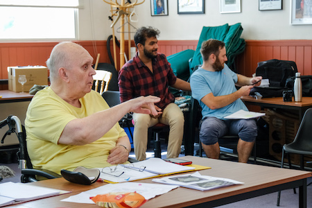

**[\<\<\< Previous page](/life/chronology/2021)**

**[Next page \>\>\>](/life/chronology/2023)**

### Notable Events

During 2022, Alan Ayckbourn…

○ welcomed the discovery by his Archivist, **[Simon Murgatroyd](http://www.simon-murgatroyd.com/)**, of the original, incomplete and thought-lost draft of ***[Absurd Person Singular](http://www.absurdpersonsingular.com/)*** in the Ayckbourn Archive at the **[Borthwick Institute for Archives](/)**. This, alongside other discoveries, rewrote the history of how the play came to be created.

○ premiered his 86th play - ***[All Lies](/plays/all-lies)*** - at The Old Laundry Theatre, Bowness-on-Windermere. The first time he has premiered a play outside his adopted home town of Scarborough since 1987. It then transfered to the Esk Valley Theatre, Glaisdale, near Whitby.

○ premiered his 87th play, ***[Family Album](/plays/family-album)***, at the Stephen Joseph Theatre, Scarborough, which was also streamed.

○ marked the 50th anniversary of the world premiere of his acclaimed work, ***[Absurd Person Singular](/plays/absurd-person-singular)***, with a special event at the Stephen Joseph Theatre centred on the playwright leading a rehearsed reading of the play.

○ saw a major revival of ***[Woman In Mind](/plays/woman-in-mind)*** produced at the Chichester Festival Theatre, directed by Anna Mackmin.

○ marked the 50th anniversary of his appointment as **[Artistic Director](/career/artistic-director)** of the Stephen Joseph Theatre, which he held from 1972 to 2009.

○ inaugurated the Portholes in Time Sea Wall Heritage Trail in Scarborough, which tells the history and heritage of the town in 31 plaques along the Marine Drive - one of which is about Sir Alan.

○ marked the 25th anniversary of being knighted for 'services to the theatre'.

○ had ***[Bedroom Farce](/plays/bedroom-farce/bedroom-farce-adaptations-in-other-media)*** adapted for radio for the first time in an adaptation premiered on BBC Radio 4 on 31 December 2022, directed by Martin Jarvis.

○ saw the publication of ***[Unseen Ayckbourn: 2022 Edition](/)***by **[Simon Murgatroyd](http://www.simon-murgatroyd.com/)**. A revised edition of the guide to his work.

### World Premieres

○ ***All Lies***  
6 May: The Old Laundry Theatre, Bowness-on-Windermere  
○ ***Family Album***  
6 September: Stephen Joseph Theatre, Scarborough

### Notable Ayckbourn Productions

○ ***All Lies*** (transfer)  
4 August: The Esk Valley Theatre, Glaisdale, near Whitby  
○ ***Absurd Person Singular*** (rehearsed reading)  
26 June: Stephen Joseph Theatre, Scarborough  
○ ***Woman In Mind*** (revival)  
23 September: Chichester Festival Theatre

### Professional Directing

○ ***All Lies***  
The Old Laundry Theatre, Bowness-on-Windermere  
○ ***Family Album***  
Stephen Joseph Theatre, Scarborough

### Plays in Other Media

○ ***Family Album***  
Film stream: 25 October, SJT Website  
○ ***Bedroom Farce***  
BBC Radio 4: 31 December

*Alan Ayckbourn during rehearsals for Family Album*  
*© Tony Bartholomew*

### Quotes

“The only way we can move on is by looking back to the past and being honest about it. Only by saying, ‘this is who we were’ can we begin to work out who we will be.”  
*(Daily Telegraph, 22 June 2022)*

"It's interesting to have lived through so much as a writer and see not just the rise of women but the decline men. The Alpha male is a dying species."  
*(Daily Telegraph, 22 June 2022)*

"I wish we could return to actor-led theatre. During my 40 years as artistic director at the Stephen Joseph Theatre, I always insisted that the writer and director should come second to the performer. Tailor your plays and productions to your performers. Find stuff to suit them and not vice versa."  
*(The Stage, 26 August 2022)*

“At one stage, I was very worried \[about COVID\], On a personal level, as a playwright with an exclusively stage-based career, the income dropped to zero overnight. Most worrying, though, was the dread that audiences would get out of the habit of coming to the theatre - either through nervousness or because they had mistakenly grown to believe that streamed theatre was any sort of substitute for a live performance, which it most definitely is not.”  
*(The Stage, 26 August 2022)*

“I’ve been writing for a very long time and living for slightly longer,” Ayckbourn says. “When you get to my age, the choices open to you as far as writing is concerned are fairly limited. I mean, anyone in their eighties now has to either look backwards or look forwards.I don’t think I could write a really astute play about contemporary times, because I feel I’m slightly out of it.”  
*(Big Issue North, September 2022)*

“Writing for in-the-round is very much right for company theatres – teams of actors rather than one star, and three subsidiaries. For performers, theatre in the round is a great leveller. If you’ve got one guy on stage who’s got the story, you’ve got the other guy on who’s the listener. Both of them dominate the audience equally and they both share the audience in the round. Those of you without a clear view of the storyteller are then almost forced per se to watch the listener, and so the responsibility for the listener is that much greater. I always try and make the listener’s role as important as the narrator themselves.”  
*(Big Issue North, September 2022)*
