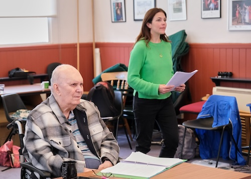
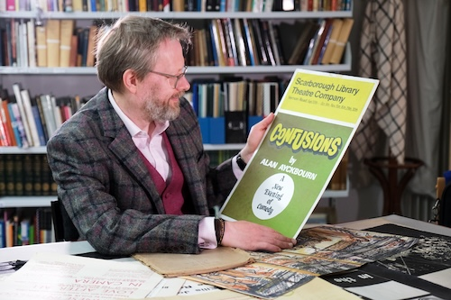

**[\<\<\< Previous page](/life/chronology/2022)**

**[Next page \>\>\>](/life/chronology/2024)**

### Notable Events

During 2023, Alan Ayckbourn…

○ premiered his 88th play, ***[Welcome to the Family](/plays/welcome-to-the-family)***, at The Old Laundry Theatre, Bowness-on-Windermere.

○ premiered his 89th play, ***[Constant Companions](/plays/constant-companions)***, at the Stephen Joseph Theatre, Scarborough.

○ directed a rehearsed reading of the previously unseen 2020 play, ***[Truth Will Out](/plays/truth-will-out)***, as part of a fund-raising weekend at the Stephen Joseph Theatre, Scarborough.

○ donated **[The Ayckbourn Collection](/)** - a curated collection of approximately 60 significant items relating himself, Stephen Joseph and theatre in the round - to Scarborough Museums and Galleries. The donation was curated and facilitated by his archivist, **[Simon Murgatroyd M.A.](http://www.simon-murgatroyd.com/)**, who also donated to the collection.

○ saw Samuel French publish the plays ***[The Girl Next Door](/plays/the-girl-next-door)*** and ***[Family Album](/plays/family-album)***.

○ marked the 20th anniversary of the publication of his book *The Crafty Art of Playmakin*g with a special one-off event at the Stephen Joseph Theatre.

○ saw items from The Ayckbourn Collection at Scarborough Museums and Galleries put on display at Scarborough Art Gallery; the first exhibition dedicated to the playwright and his work to ever be staged in the town outside of the Stephen Joseph Theatre.

○ marked the 50th anniversary of his acclaimed trilogy ***[The Norman Conquests](/plays/the-norman-conquests)***.

○ saw Antony Eden win Best Supporting Performance for the world premiere production of *Family Album* in 2022 at the SJT.

○ supported the launch of **[A Round Town](http://www.a-round-town.com/)** by his archivist, Simon Murgatroyd; a website dedicated to the history of theatre in the round in Scarborough from 1955 to 2009 celebrating the work of Stephen Joseph and Alan Ayckbourn and its significance to the cultural heritage and history of Scarborough.

○ supported the launch of regular talks about his life and work as well as Stephen Joseph and theatre in the round in Scarborough by his archivist, Simon Murgatroyd.

○ saw the first major Grench translated production of ***[Relatively Speaking](/plays/relatively-speaking)*** - *Une Situation Délicate* - become one of his biggest ever successes in France.

○ 2023 saw the death of a notable number of significant Ayckbourn figures. The actors **[Michael Gambon](/career/advocates/alan-ayckbourn-advocates/michael-gambon)**, Russell Dixon and Janet Dale as well as the producer Bill Kenwright.

○ saw the publication of ***[Unseen Ayckbourn](/)***by **[Simon Murgatroyd](http://www.simon-murgatroyd.com/)**. A revised and updated edition of the guide to his work.

### World Premieres

○ ***Welcome to the Family***  
16 May: The Old Laundry Theatre, Bowness-on-Windemere  
○ ***Constant Companions***  
12 September: Stephen Joseph Theatre, Scarborough  
○ ***Truth Will Out*** ('Grey' play)  
17 September: Stephen Joseph Theatre, Scarborough

### Notable Ayckbourn Productions

○ ***Relatively Speaking*** (tour)  
12 January: Bath Theatre Royal  
○ ***How The Other Half Loves*** (revival)  
10 August: The Mill at Sonning  
○ ***Une Situation Délicate*** (revival)  
Various venues, Paris

### Professional Directing

○ ***Welcome to the Family***  
The Old Laundry Theatre, Bowness-on-Windermere  
○ ***Constant Companions***  
Stephen Joseph Theatre, Scarborough

*Alan Ayckbourn during rehearsals for Constant Companions*  
*© Tony Bartholomew*

*Alan Ayckbourn's Archivist, Simon Murgatroyd M.A., with items from The Ayckbourn Collection at Scarborough Museums and Galleries © Tony Bartholomew*

### Quotes

"It’s becoming increasingly difficult to write science fiction because, back in Arthur C. Clarke or Isaac Asimov’s day, it was pretty astonishing they foresaw quite as much as they did. It took several decades before some of the things they foresaw happened. Now, it’s sometimes several days!"  
*(Interview with Simon Murgatroyd, March 2023)*
