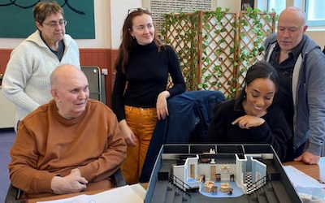

**[\<\<\< Previous page](/life/chronology/2023)**

Next page \>\>\>**[Next page \>\>\>](/life/chronology/2025)**

### Notable Events

During 2024, Alan Ayckbourn…

○ celebrated his 65th year as a professional playwright.

○ premiered his 90th play, ***[Show & Tell](/plays/show-and-tell)***, at the Stephen Joseph Theatre, Scarborough.

○ directed a revival of ***[Things We For Fo Love](/plays/things-we-do-for-love)*** - for the first time since its West End premiere in 1998 - at The Old Laundry Theatre, Bowness-on-Windermere.

○ led the first reading of the previously unheard play ***[Father of Invention](/plays/father-of-invention)***, written during the pandemic lockdowns, as part of the *Mr A's Amazing Days* event at the Stephen Joseph Theatre.

○ saw **[The Ayckbourn Collection](/)** display at Scarborough Art Gallery close after almost a year of display, marked by a talk with his archivist **[Simon Murgatroyd](http://www.simon-murgatroyd.com/)**.

○ saw the world premiere of a new documentary, *Everything Including The Kitchen Sink*, which featured intimate interviews with the playwright covering his life and career as part of the *Mr A's Amazing Days* event.

○ saw the 50th anniversary of his plays ***[Absent Friends](/plays/absent-friends)*** and ***[Confusions](/plays/confusions)*** and the 25th anniversary of ***[House & Garden](/plays/house-and)***.

○ was featured on BBC1, BBC Radio, the Daily Telegraph and The Guardian to mark the world premiere of his 90th play.

### World Premieres

○ ***Show & Tell***  
5 September, Stephen Joseph Theatre, Scarborough  
○ ***Father of Invention*** ('Grey' play)  
15 September: Stephen Joseph Theatre, Scarborough

### Notable Ayckbourn Productions

○ ***A Chorus of Disapproval*** *(revival)*  
25 April, Salisbury Playhouse  
○ ***Things We Do For Love*** *(revival)*  
17 May, Salisbury Playhouse  
○ ***Bedroom Farce*** *(revival)*  
1 August, The Mill at Sonning  
○ ***Snake in the Grass*** *(revival)*  
13 September, Dundee Rep

### Professional Directing

○ ***Things We Do For Love***  
The Old Laundry Theatre, Bowness-on-Windermere  
○ ***Show & Tell***  
Stephen Joseph Theatre, Scarborough  
○ ***Father of Invention*** *(rehearsed reading)*  
Stephen Joseph Theatre, Scarborough

*Alan Ayckbourn during rehearsals for Things We Do For Love © The Old Laundry Theatre*
