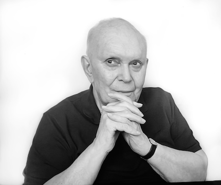

**[\<\<\< Previous page](/life/chronology/2024)**

**[Next page \>\>\>](/life/chronology/2026)**

### Notable Events

During 2025, Alan Ayckbourn…

○ premiered his 91st play, ***[Earth Angel](/plays/show-and-tell)***, at the Stephen Joseph Theatre, Scarborough.

○ received the ABTT Stephen Joseph Lifetime Achievement Award for his contribution to theatre-in-the-roiund and British theatre.

○ had a major West End revival with ***[Woman in Mind](/plays/woman-in-mind)*** open at the Duke of York's Theatre, starring Sheridan Smith, during the play's 40th anniversary.

○ gave the closing talk at the inaugural Whitby Lit Fest weekend in conversation with Kate Fenton.

○ saw the republication of his play ***[A Small Family Business](/plays/a-small-family-business)*** in Faber's new re-designed editions of significant plays.

○ saw the 60th anniversary of his play ***[Relatively Speaking](/plays/relatively-speaking)*** celebrated in a weekend at the Stephen Joseph Theatre - *Actors, Audience and Ayckbourn* - which included a talk by his Archivist Simon Murgatroyd and a rehearsed reading of the play directed by Antony Eden; this was a last minute replacement for an advertised reading of the playwright's previously unseen play ***[Men, Meals & Me](/plays/childrens-plays-index/unproduced-plays)*** which would have been directed by the playwright. The withdrawal of the play by the theatre led to Alan declining to direct the reading of *Relatively Speaking*.

○ saw ***[A Theatrical Revolution](http://www.theatre-in-the-round.co.uk/page-187/page-144/page-176/)*** by **[Simon Murgatroyd](http://www.simon-murgatroyd.com/)** published with a look at the inaugural year of **[Theatre of the Round at the Library Theatre](http://www.theatre-in-the-round.co.uk/page-187/)**, Scarborough, in 1955.

○ supported an exhibition at Scarborough Library, curated by Simon Murgatroyd, celebrating the 70th anniversary of the founding of Theatre in the Round at the Library Theatre, Scarborough, in 1955 by Stephen Joseph - the UK's first professional theatre in the round company.

### World Premieres

○ ***Earth Angel***  
16 September, Stephen Joseph Theatre, Scarborough

### Notable Ayckbourn Productions

○ ***Woman in Mind*** *(West End)*  
9 December (first performance), Duke of York's Theatre  
○ ***Just Between Ourselves*** *(Tour)*  
London Classic Theatre  
○ ***Snake in the Grass*** *(revival)*  
15 September, Theatr Clywd / Bolton Octagon co-production  
○ ***Relatively Speaking*** *(rehearsed reading)*  
28 September, Stephen Joseph Theatre, Scarborough

### Professional Directing

○ ***Earth Angel***  
Stephen Joseph Theatre, Scarborough

### Awards & Honours

○ ABTT Stephen Joseph Lifetime Achievement Award

*Alan Ayckbourn (© Bronwen Sharp)*

### Quotes

“I once said that, at the age I am, my view has to be either backwards or forwards, but very rarely do I stare straight out of the window."  
*(charleshutchpress.co.uk, September 2025)*

“All you have to do as a practitioner of theatre is to pull back to the basics. I was brought up theatrically by the most brilliant teacher I met. I was fortunate enough to meet Stephen Joseph, who said, essentially, theatre is those two elements, the actor and the audience, and that is what theatre is about. And the rest of you guys, you designers and you writers and you directors - a growing number of practitioners now, the lighting designer and the soundscape designer and God knows what, the intimacy coach and all that business - you’re all redundant. The audience doesn’t give a stuff about you. They are only interested in what they see on stage.”  
*(Yorkshire Post, September 2025)*

"What I’ve been trying, over my long, long, long playwriting career, to do is to move the comic strain and the serious strain closer and closer together. It came to me graphically in the first production of *Relatively Speaking* in London \[in 1967\] when I was lucky enough to get Celia Johnson to play the leading lady. She was perfect; her comic timing was perfect. She was also recording Ibsen’s *Ghosts* for the BBC. And when I watched her in *Ghosts*, I realised that what she did was played it a whisker to the left of centre, whereas in *Relatively Speaking*, she was a whisker to the right. If she’d slipped the other side of that line, Ibsen would have become a complete farce and *Relatively Speaking* would have sent audiences out with their handkerchiefs wrung out. That’s the margin of error. And between that is pure truth."  
*(Financial Times, December 2025)*
