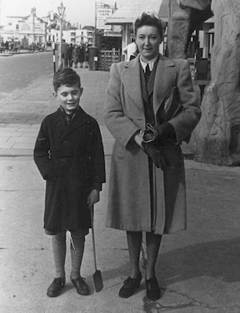

**[Next page \>\>\>](/life/chronology/1956)**

### Notable Events

<aside>

*Alan Ayckbourn with his mother 'Lolly'.*

</aside>

Between 1939 and 1955, Alan Ayckbourn…

**○ 1939:** was born on 12 April in Hampstead to Irene Maud Worley, a writer, and Horace Ayckbourn, a violinist with the London Symphony Orchestra; decades later he would discover he was an illegitimate child. His mother was better known under her writing pseudonym Mary James and also affectionately called Lolly.

**○ 1946:** began attending Wisborough Lodge school, Billinghurst, West Sussex.

**○ 1946 - 1951:** Mother remarried; variously lived at Billinghurst, Wisborough Green, Horsham, Uckfield, Hayward's Heath and Lewes.

**○ 1948:** had his first work published when his poem ***[The Old House](/plays/childrens-plays-index/miscellaneous-writing)*** was printed in the first issue of *The Lodgean*; the magazine of Wisborough Lodge school.

**○ Circa 1950:** wrote his first first play - an adaptation of the *Jennings* novels - whilst attending Wisborough Lodge school; intending to play the role of Darbyshire he was ill and neither acted in nor saw the play.

**○ 1951:** received a Barclays Bank scholarship to attend Haileybury and Imperial Service College near Hertford; now known simply as Haileybury.

**○ 1954:** had his first professionally published work with the poem ***[Dawn](/plays/childrens-plays-index/miscellaneous-writing)*** printed in the December issue of Collins' Young Elizabethan magazine.

**○ 1955:** toured the Netherlands in a Haileybury production of ***[Romeo And Juliet](/career/actor/romeo-and-juliet)***, in which he played Peter.
