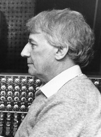

*In 1964, the first West End transfer of an Alan Ayckbourn play received a critical mauling and closed in less than a month. As a result of the failure of Mr Whatnot, Alan Ayckbourn seriously considered leaving theatre and although he ultimately did not take that step, between 1965 and 1970 he worked primarily as a* ***[radio drama producer](/career/bbc-career)*** *for the BBC based at Leeds.*

*He had been offered the job by and worked with Alfred Bradley, a much admired and respected drama producer whose passion for encouraging new writing and writers saw him inspire many leading Northern writers of the time. He worked at the BBC between 1959 and 1980 and even after his retirement, he was actively involved in radio - apparently Alfred rang Alan Ayckbourn for a radio play just the week before he died in 1991 aged 65.*

*These page contains quotes by Alan Ayckbourn about Alfred Bradley.*

<aside>

*Alfred Bradley  
(© To be confirmed)*

</aside>

"Although only a dozen or so years older than I, Alfred turned out to be what I later referred to as one of my 'guardian uncles'; those remarkable people whom I was lucky enough to meet in my early years who subsequently shaped and informed my life. I remain indebted to him."  
*2011*

"Alfred Bradley - who was a brilliant, much loved, wonderful producer - did more single-handedly for the writing talent in the north of England. All sorts of writers came in touch with Alfred and all of them benefitted and he certainly helped me."  
*BBC Radio Leeds interview, 2012*

"He was amazing at uncovering talent, selflessly, not just as a feather in his cap. He was able to rejoice in other people's talents. He was very script-orientated but he had a lot of time for actors. It's unusual to find both."  
*The Guardian, 1991*

"I’ve always loved radio, ever since I joined the BBC in the 1960s. All the other producers and directors went off to play with this new toy they had found called television. I attached myself to a brilliant radio producer called Alfred Bradley and did some really interesting plays with him.”  
*Yorkshire Post, 2020*

"I went and got a job at the BBC, as a producer… *Mr Whatnot* had flopped in the West End as a result of a disastrous series of circumstances and everyone had told me that this was the moment when you were going to have trouble parking the Rolls Royce! In fact I had trouble paying the bill on the typing paper. So I needed a job and another fairy uncle drifted into view - this time Alfred Bradley, who was Head of Drama \[at the BBC\] at Leeds, a sort of far flung empire you see, who was at that time encouraging the most extraordinary sort of wave of northern talent. The Stan Barstows and John Braines and Willis Halls and all those people who were all at that stage starting their writing careers or establishing them. He needed someone just to help. He had only seen me acting but I think I was the only candidate with any production experience. And so I got the job and spent five years there working on radio plays, which was terrific."  
*Interview with Peter Cheeseman, 1987*

### Extracts from Conversations With Ayckbourn (by Ian Watson, Faber, 1981)

**Alan Ayckbourn:** I joined the BBC with no thought of writing again - certainly not for London or the stage.  
**Ian Watson:** How did the radio job come about?  
**Ayckbourn:** Oh, that was funny. Everything happens by odd coincidences. I’d got an agent, of course, Peggy Ramsay, and I rang her a couple of days after *Mr Whatnot* had opened, just for commiseration…. By chance, in the office was another client of hers at that time, Alfred Bradley (Senior Drama Producer for BBC North Region Radio), who was writing children’s work mainly. He realised that his half-an-hour in London with Peggy was going to be absolutely wiped out if he allowed me to stay on the phone to her, because I needed half-an-hour at least with Peggy, while she told me that the critics were all bastards, and all that. So Alfred said, ‘Get him off the phone. Tell him to write for the job.’  
**Watson:** You must have known Alfred at this time.  
**Ayckbourn:** Oh, I did, yes. Alfred I’d known because he’d come over and seen quite a few productions - mostly at Scarborough, some at Stoke. He was a friend of Stephen’s. He said, ‘Get him off the line. Tell him to apply for the job.’ Peggy said, ‘Alf’s here.’ I said, ‘Alf who?’ She said, ‘Alf Bradley.’ I said, ‘Oh yes? Great.’ She said, ‘He says apply for the job in the *New Statesman*. Get a copy of last week’s *New Statesman*, and there’s a good job in it, and he says you could stand a good chance if you apply.’ And I said, ‘Well, I . . .’ ‘Cheerio, now!’ said Peggy, and, bang!, down went the phone. So I waited a few days, and then I thought, ‘Oh well!’ So I dug out an old *New Statesman*, and there was this job, so I wrote off. The BBC took ages and then they sent me an application form, and I wrote back again. And then I got the board. I travelled up to Leeds, got seen by this committee, and Alfred was very encouraging. I realised that they would interview the candidates and, provided they looked as if they weren’t going to blow the building up, they would then ask Alfred which one he liked. At that point, I think I was probably the one with the most active directing experience, so he said to me, ‘Well, unless Tyrone Guthrie applies, I think you’re OK on the present showing.’ Nicely the job did come my way with an astronomic salary. It was £38 a week: it was unbelievable.

### Interview with Alan Yentob for Imagine (BBC1, 2011)

**Alan Yentob:** You also had a longish diversion into radio, didn’t you?  
**Alan Ayckbourn:** Five years as a radio drama producer. That was a learning curve. Another one of my guardian uncle figures: this was a man called Alfred Bradley, who was single-handedly producing a great wave of Northern writing and he was swamped by local writers all from the north sending in their plays. He needed someone to help and he persuaded the BBC to create a special post which was another producer. At one point, I arrived just as he dumped these forty-six scripts on my desk and just said, ‘read those. And anything you think worth doing, do them.’ So I sorted them out and I started producing well before anyone had shown me anything about how to produce radio plays! The BBC always rather shuts the door after you’ve gone through it, so in my first year there I produced, I think it was 51 plays, one a week!  
**Yentob:** Alfred Bradley was an inspirational figure, a kind of critical figure really in the development of radio drama, as you say, with a remarkable list of names, who he discovered.  
**Ayckbourn:** He was a man who had a genuine joy in fostering talent. And be it the writing, or in my case, directing, he’d just say, ‘go for it, go for it, go on!’ and then he’d sit there looking proud as a mum.
