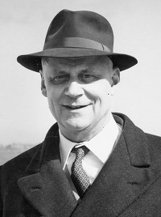

*Of all of Alan Ayckbourn's significant influences, one of the least known is Edgar Matthews. Yet this French Master at Haileybury College has always been regarded by Alan as a huge influence on his decision to enter the world of theatre. This page contains quotes by Alan Ayckbourn concerning Edgar Matthews.*

*Holdings related to Edgar Matthews within the Ayckbourn Archive at the Borthwick Institute for Archives at the University of York can be found* ***[here](http://borthcat.york.ac.uk/informationobject/browse/)***.

<aside>

*Edgar Matthews*  
*(© To be confirmed)*

</aside>

"Two people inspired me. A wonderful teacher, Edgar Matthews, at my school, Haileybury, who first introduced me to theatre and sent us on tours to the States and the Netherlands with our school Shakespeare productions. The other, Stephen Joseph, the pioneer of theatre in-the-round in the UK whom I met when I joined his newly formed theatre company in Scarborough."  
*Correspondence, 2005*

"We had one art maniac at Haileybury, Edgar Matthews, and he was instrumental in setting up the school Shakespeare production and we toured Europe and America - all the excitement of touring but none of the responsibility!"  
*Interview, 2002*

"Later on in public school, I became more and more theatrically inclined, and there was always some master who should not have been a schoolteacher at all, who should have been in the theatre - a nut about it. I was lucky enough to find one of those, a man called Edgar Matthews - a Frenchmaster - and he used to run incredible Shakespeare tours every summer holiday and take a party of boys around Europe doing *Romeo and Juliet*. And I went off on a couple of these tours and got completely smitten. By the time I left school, I was determined on an acting career and he got me a job."  
*Interview, 1987*

"I was very lucky. I was at school at the time when we had a master, Edgar Matthews, who was a tremendous enthusiast of the theatre. I think there's always one school master in a big organisation who's sort of an actor manager or a producer manager, and he would have become a very large London producer if he hadn't been a French master, and he took us on the most marvellous tours of Shakespeare. We went to the USA and we went to Holland and that really gave me the acting bug."  
*Interview, 1974*

"If you're very lucky, you meet influential people in your life and one of my great mentors was a man called Edgar Matthews who ran the school Shakespeare production every year and he was, again, one of those demented amateur producers who taught French but really lived for his theatre."  
*Interview, 1996*

### Extracts from Conversations With Ayckbourn (by Ian Watson, Faber, 1981)

There was a master at \[Haileybury\] school called Edgar Matthews, who had been a friend of Donald Wolfit's and indeed whose daughter had been Wolfit's secretary. He was getting near to retirement age and was teaching French at the school, and once a year he organised a Shakespeare tour during the school holidays, taking a party of boys off to the Continent; to France and Germany and all over the place...

He was a wizard of organisation. He also directed the plays and his wife and daughters acted in them. You weren't allowed to go in for them the first year or two, but I auditioned when I was fifteen, I think, and I got into the first one I could. I got a small part, as Peter, in *Romeo and Juliet*. And off we went to Holland and we toured around there. And that was magic. That was the first real 'theatre' theatre I'd experienced, which was just terrific - you know, all that spirit gum and greasepaint...

We played very odd places: some were quite good theatres, other places were quite primitive. I don't think our Shakespeare was earth-shattering, but it was fairly good. I was just acting. This was tremendous. And I think Edgar must have thought I had a bit of talent…

Edgar marked me down as a comedy actor. They were doing *Macbeth*, and I didn't want to play that boring old porter, so I plunged in hoping to play Macbeth. He really didn't think I was up to that - I didn't really have the weight, I was a six-stone weakling - but he did cast me as Macduff. And this year he decided to really go to town. He was going to take us round America. We went over on the Queen Mary and we came back on the Queen Elizabeth - the first, not the second - and that in itself was worth all the money in the world: a group of public schoolboys, fifteen, sixteen, seventeen, getting themselves absolutely slewed all the way over - it was wonderful. And this was touring gone mad, because we had all the joy of touring with none of the professional responsibility. We didn't actually care if the show never went on. We arrived and we went up the East Coast: we played in Maine, at the university there, and then we went up into Canada and played in Ottawa. And we played in Quebec, then we went down to Niagara and we played there; then we came through to Pittsburgh - and along the way we also took in Boston, Montreal, Peterborough and Washington DC. It was a very strange tour, but we did see a hell of a lot of America by Greyhound coach.

### Interview with Alan Yentob for Imagine (BBC1, 2011)

**Alan Yentob:** Was it Shakespeare that launched you into theatre?  
**Alan Ayckbourn:** There have been in my life some remarkable individuals, in this case when I got to Haileybury College, a school-master called Edgar Matthews - who but for school-mastering would have undoubtedly gone into the 'business'. His passion was taking out tours from school of Shakespeare and I quickly became aware of these. As soon as I became eligible by age, I went off to Holland with a tour of *Romeo and Juliet*, where I played Peter the servant, and that gave me a real taste for the stage. The following year was destined to be the swan-song as Edgar was going to retire and he really wanted to take the big one and go to the USA and Canada with a tour of The Scottish Play \[*Macbeth*\]. I auditioned for the lead and didn’t get that, but I got Macduff, which was quite a nice one. We all set off on the Queen Mary and we all came back on the Queen Elizabeth and in between we got drunk as lords, all in a greyhound bus, going all the way up the East coast of America into Canada, Ottawa, Toronto and then all the way down again into Pittsburgh and all the way back into New York and back on the boat.

**Yentob:** And were you a hit - drunk or otherwise - on stage?  
**Ayckbourn:** I managed to break the leading man’s finger and I think that may have been due to a misjudgement during the sword fight. But being schoolboys, there was no holds-barred! Edgar said, ‘You better swing that way, and he that way,’ but the sparks were flying off these shields! It was rudimentary Shakespeare and had all the joys of a professional touring actor, in that you got the fun and none of the responsibilities.
