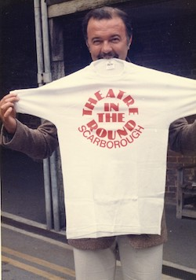

*Sir Peter Hall was a major influence on Alan Ayckbourn's theatrical career, particularly with regard to his directing. Sir Peter was responsible both for Alan's directorial debut in London, his first commission at the National Theatre and for him taking a sabbatical from the Stephen Joseph Theatre In The Round to join the* ***[National Theatre](/career/national-theatre)*** *for two years.*

*Holdings relating to Sir Peter Hall held in the Ayckbourn Archive at the Borthwick Institute for Archives at the University of York can be found* ***[here](http://borthcat.york.ac.uk/informationobject/browse/)***.

<aside>

## Resources

◦ The Ayckbourn Archive at the Borthwick Institute for Archives at the University of York holds correspondence and other material relating to Sir Peter Hall. The online catalogue specific to Hall can be found **[here](http://borthcat.york.ac.uk/informationobject/browse/)**.  
◦ Material relating to Sir Peter Hall's extensive careers at the National Theatre and the Royal Shakespeare Company can be found in the **[National Theatre Archive](http://catalogue.nationaltheatre.org.uk/CalmView/Default.aspx)**and within the collection of the **[Shakespeare Birthplace Trust.](http://collections.shakespeare.org.uk/)**

</aside>

Best known as the founder of the Royal Shakespeare Company, Sir Peter Hall was appointed the successor of the National Theatre - successor to Sir Lawrence Olivier - in 1973 and was responsible for the company's move from the Old Vic to its new purpose-built home on the South Bank. In 1975, he contacted Alan Ayckbourn about writing a piece for the new theatre; it would mark the start of an important relationship between the two.

Alan agreed to write a new play for the - then incomplete - Lyttelton auditorium. He wrote *Bedroom Farce*, which opened at the NT in 1977 and is regarded as the venue's first bona fide hit; to date it also shares the distinction of the most successful Ayckbourn London production alongside *Absurd Person Singular*. Traditionally, Hall is credited as co-director of *Bedroom Farce* with Alan, but actually this was a ruse. Alan had never directed in London prior to this and Hall knew that the NT board would not have been comfortable with the idea. Hall began work, blocking out the production and then, when Alan arrived, he conveniently vanished to direct *Volpone* leaving Alan to direct *Bedroom Farce* himself.

Hall would encourage further plays from Alan for the NT with *Sisterly Feelings* (1980), *Way Upstream* (1982) and *A Chorus Of Disapproval* (1985). In 1984, Hall asked Alan if he would consider taking a sabbatical from Scarborough to become a company director at the National Theatre; Alan in return said it was the only offer he would ever have considered to leave Scarborough for any length of time.

Alan agreed to the offer and moved to the National Theatre from 1986 to 1988; Hall requested he direct a play in each of the NT's three venues and write a new play specifically for the Olivier, *A Small Family Business*. Alan's other two plays were his adaptation of *Tons Of Money* and Arthur Miller's *A View From The Bridge* - a hugely acclaimed production. Indeed the success of the latter, which transferred to the West End with the majority of the company, led to Alan directing a fourth play, John Ford's *'Tis Pity She's A Whore*.

Hall left the National Theatre in 1988, the same year Alan returned to Scarborough, but they remained in contact and Alan came to regard Peter as one of his benevolent 'uncles'; key figures in his life who had a major influence upon his career such as **[Edgar Matthews](/life/influences/haileybury)**, **[Stephen Joseph](/life/stephen-joseph)** and **[Alfred Bradley](/life/influences/bradley-alfred)**.  
Hall returned to Alan's work in 2009 when he directed an acclaimed revival of *Bedroom Farce* at the Rose Theatre, Kingston, which later transferred into the West End.

Sir Peter Hall, born in 1930, died on 11 September 2017 at the age of 86.

### Sir Peter Hall on Alan Ayckbourn

"Without the persistent strain of melancholy (a melancholy, moreover, which can subvert the greatest romantic joy or the heartiest bursts of laughter) you might be thought just a brilliant boulevard dramatist, all be it an extraordinary prolific one.

"Because of the sadness in you and, I suspect, the compassion, you are much much more. I won't call you the English Chekhov because you are the English Ayckbourn. But please accept the league I am putting you in.

"You are a great realist and your seriousness in considering people has always justified the comic.

"The most extreme emotion is finally ridiculous, the highest transports of desire are comically embarrassing. Your laughter is not facetious: it is based on recognition and compassion. It can hurt, but there is no denying its accuracy.

"I reckon that you have the greatest gift for exposition in drama. Your dialogue is precise and economical. And although it looks very 'real' (because you have a very accurate ear for middle-class speech) you transcend accuracy to make something very rhythmic and controlled that can hold the audience in an iron grip.

"If, in a hundred years, anyone wants to know what it was like to live in the second half of the 20th century, I am quite sure they will turn to the plays of Alan Ayckbourn before they look at historians or sociologists. End-of-millennium-man is very accurately atomised in your plays.

"Thank you for giving us so much joy and, with that joy, your perception."  
*(Sir Peter Hall, 1999)*

### Alan Ayckbourn on Sir Peter Hall

"Peter was largely instrumental in getting my work taken seriously. Until his offer to stage a play of mine at the newly opened NT (National Theatre), I was considered by many to be a lightweight writer of boulevard comedies but thanks to his faith and encouragement, Peter changed all that for me, both as playwright and later as a director in my own right. I will remember him with gratitude and great fondness."  
*(12 September 2017)*

"He \[Peter Hall\] said to me, 'I want you to write a play for the new NT \[National Theatre\]. And I'd got my answer prepared, which was all sorts of humming and ha-ing. And he said one of his great Peter Hall lines, 'Alan, you can well do without the National Theatre. But ask yourself this, can the National Theatre do without you?' And my ego was so inflated, I went, 'Oh, well, put like that."  
*(Date unknown - broadcast in Sir Peter Hall Remembered BBC tribute)*

*Research by Simon Murgatroyd. Please do not reproduce without permission.*
