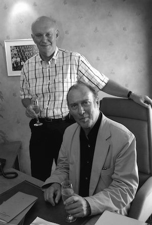

Alan Ayckbourn's writing was influenced by many playwrights - he frequently cites his influences from a very broad range of playwrights from Chekhov to Coward, Ionesco to Rattigan.

One name that frequently crops up is his contemporary Harold Pinter and Alan admits he was very influenced by the way Pinter used language in his writing. In recent years, it has become accepted that both Pinter and Ayckbourn share a precision in their use of language and that for the plays by either playwright to be done justice, the use of language, the rhythms of the language and the use of punctuation have to be very closely observed.

There is a strong case though for Pinter having a substantive influence over Alan Ayckbourn due to their first encounter and the opportune timing of it. During Christmas 1958, Stephen Joseph invited Harold Pinter to direct ***[The Birthday Party](/career/actor/the-birthday-party)*** - following its West End mauling - for the Studio Theatre Company based at Scarborough. Alan, at the time, was an actor with the company who had just been commissioned by Stephen Joseph to write his first full length play. While there is no suggestion Alan attempted to emulate Pinter's writing or styles, it is hard not to imagine from Alan's recollections, that just working with Pinter and experiencing what would have been a new form of theatre from a passionate young playwright and director was inspirational and invigorating to a 19 year old man about to embark on his own playwriting career.

The following article by Alan Ayckbourn is reproduced from The Observer, published on 6 March 1994 and offers an insight into the first meeting between Alan Ayckbourn and Harold Pinter.

### Time For Another Birthday Party And...

<aside>

*Alan Ayckbourn  
& Harold Pinter  
(© Tony Bartholomew)*

## Resources

◦ The archive of Harold Pinter's papers is held at the British Library in **[The Harold Pinter Archive](http://searcharchives.bl.uk/catalog/032-002110534/)**. Click here to see an overview of the **[collection](http://searcharchives.bl.uk/catalog/032-002110534/)**.  
◦ The Ayckbourn Archive at the Borthwick Institute for Archives at the University of York holds some correspondence and other material relating to Pinter. The online catalogue specific to Pinter can be found **[here](http://borthcat.york.ac.uk/informationobject/browse/)**.

</aside>

*The Birthday Party* opened at the Lyric Hammersmith in 1958; it was directed by Peter Wood. It got universally bad reviews except for one by Harold Hobson \[the play closed after one week and his ecstatic notice appeared in the Sunday Times the following day\].

Harold Pinter then wrote an article, I think in Encore magazine, which was a sort of 'author's complaint'. He felt the play hadn't had a fair crack of the whip, hadn't been seen at its best. Stephen Joseph, \[then Director of Scarborough's Studio Theatre\] who was always ready for this sort of thing, got hold of Harold, whom he'd known faintly from Central where Harold had been a student of his, and said 'I've read your whinge. Why don't you do it again with a scratch company?'

Harold came and auditioned the company, but he didn't have much choice of actors. There was me, David Sutton, Rodney Wood and David Campton none of whom were really actors; two of us were dramatists, one was the general manager, \[one has since become Michael Codron's associate producer\] Dona Martyn and Faynia Jeffrey.

We read the play and thought he was barking mad. It made absolutely no sense whatever. I can only compare it with the first time I heard Stravinsky, when I thought 'This man's got a tin ear.' But what helped us was that the author was directing it. And he was a mixture of an actor and an extremely nice guy and passionate in his belief that his play would work. So you went with it, to humour him. He cast me as Stanley.

When he arrived in Scarborough, he was in a very defensive, not to say depressed state. We had probably three weeks to rehearse. I remember asking Pinter about my character. 'Where does he come from? Where is he going to? What can you tell me about him that will give me more understanding?' And Harold just said 'Mind your own fucking business. Concentrate on what's there.'

I don't think he'd done a lot of professional directing before that production, but - much more than I am even - he was a total extension of his script. He was at that stage, I suppose, an actor directing rather than the director he's become. Absolutely fierce about the rhythm and the pauses and the use of the silences, which I suppose is natural, because he was using words in a way that one wasn't used to using them in theatre. An actor would be much more readily able to deal with it these days, I suspect, because they've taken it on board. But we didn't have the mental preparedness to do it.

He was instinctively good on pace. It was, for us, totally uncharted water. You have to imagine what a revolutionary way of writing it was then. He's had so many imitators and so many other people have assimilated what he does, it's now much less unusual - those short words, sentences, repeated things, which I've picked up on. It wasn't really till *The Caretaker* that he was established.

The production was received by those who saw it \[it played for three months in repertoire in Birmingham and Leicester\] - and I won't pretend it was packed - with extraordinary, rapt fascination, really electric. People did enjoy it. And people started, there and then, coming up to him afterwards and saying 'I see this as a sort of metaphor for the British economy' or something. And he would go, 'Mmhmmm, mmhmuun,' and look very interested. But he would never, ever mention anything other than the characters to us. And I always think of Pinter exactly on character level, which is how he directed and I've always directed his work like that. You let everyone else see metaphors for the British economy.

Another thing that happened during rehearsal: We were determined to corner him, and we went to a pub in Huntriss Row \[in Scarborough\]. We were just about to get going on this play and ask Harold: 'What does it mean?' Before he could tell us, a bloke slid in opposite us, very distraught. He said 'Can I sit with you for a minute?' 'Yes,' said Harold, and the chap said, 'I'm sorry, I've just had a terrible experience. I need to tell someone.' 'Oh, what is it?' replied Harold. 'I think I may have killed my mother-in-law.' Harold said, 'Oh really? How did this come about?'

He said 'Well, I've been married a short time. I come home with me money on a Thursday and every time that bloody woman's there. She just snatches the money out of me hands, without a by-your-leave. We're living with her, me and the wife, and I'm prepared to pay our rent, but she takes the whole bloody lot. So I got home a bit early this evening, before she got in, and I hid it. She came home and said, where the hell is it, and started tearing the room apart, trying to find it. She eventually said, 'I know, it's up the chimney, isn't it?' It's a big fireplace and she got in to look up it. I grabbed her by the ankles and shoved her up there, and she's wedged up there. I didn't know what to do and I just ran out.' Harold said, 'Oh, well. I think she's probably inhaling a lot of soot. She could be suffocating. I don't think you want to be on a murder charge for your mother-in-law, you may dislike her, but you don't want to go to prison for life for her.' The bloke agreed, 'You're absolutely right. I'm not bloody swinging for her.' And he ran out.

There was a long silence, and I said, 'what an extraordinary man!' And Harold said, 'Was he?' When Antonia heard this she pointed out, 'That always happens, he just attracts them.' So the answer to where do Pinter's extraordinary off-the-wall characters come from is that he keeps meeting them. He attracts them.

We've kept in touch, on and off, and corresponded. We met and had dinner not long ago. I suppose of all writers I'm probably in touch with him more than anyone, which isn't saying a lot. I think we did a really good *The Caretaker* (in 1961) for him. It was very funny, as was Pinter's production of *The Birthday Party*. It was also quite horrific, and he'd got all that stuff that I've picked up off him - the sort of dark / light business. But other productions I've seen of it, they've generally decided to play it more heavily. I think sometimes they lose his humour. When Pinter started writing, he was completely coming from left field, as they say, as opposed to Osborne and Wesker, who were still writing in a sense in a recognisable form, albeit they were introducing new elements. Osborne revolutionised the content of plays, but I'm sure Pinter revolutionised the very nature of the play.

It's very common to call him a poet, which tends to make him sound as if he writes everything in rhyming couplets, but he did use the play form and the play structure in a way that I don't think people had done before. He says he owes a lot to Beckett, and I suppose that's his nearest antecedent, but it's a very different sort of Beckett. A very much more human face. I always find Beckett a bit not of my universe. I don't find anything I can relate to in it, whereas I do find in Pinter people I know, although I wish I didn't.

*This piece was originally published in The Observer on 6 March 1994.*
