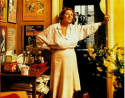

Margaret Ramsay, better known as Peggy, was one of the 20th century’s most successful and well-known play agents; the definition is important as Peggy always considered herself a playwright’s agent rather than a literary agent and her passion for theatre was renowned. She represented many of the most significant and important British playwrights of the century such as Edward Bond, Caryl Churchill, David Hare, Eugene Ionesco, Joe Orton, Stephen Poliakoff, J.B. Priestley, Alan Plater and Willy Russell amongst many others.

Whilst it would be wrong to argue Peggy was a major influence on Alan Ayckbourn’s writing and work, she was a highly significant and important part of his professional life as his first agent and played a huge part in his theatrical career and his success around the world. She took him on in 1961\* after the producer Peter Bridge had optioned his fourth play, *Standing Room Only,* for London. It began a professional relationship which would last for 30 years and see Alan became one of the UK’s most successful playwrights. She also played a large part in helping Alan get a job with the BBC following the trauma of his first West End production, *Mr Whatnot*. Alan’s biographer Paul Allen believes Alan was Peggy’s most lucrative talent and she was never anything but honest in her appraisal of his plays and support of him; as she was with all her playwrights. Alan, in turn, believed she made an extraordinary contribution to his career.

*"Margaret Ramsay, who was probably the last of the great theatrical literary agents - a woman I greatly admired and who did a tremendous amount for my career."*

Peggy established her play agency in 1953, which continued until her death in 1991. The agency re-emerged as Cassarotto Ramsay with Peggy’s deputy Tom Erhardt running it until 2014; Tom was Alan’s second agent between 1991 and 2014. Peggy died on 4 September 1991 in the London Clinic, aged 83. She was devoted to theatre and her playwrights to the end.

Much of her fascinating correspondence with Alan Ayckbourn is held in the Ayckbourn Archive at the **[Borthwick Institute for Archives](http://borthcat.york.ac.uk/informationobject/browse/)** at the University of York. The Margaret Ramsay Ltd Archive is held by the **[British Library](http://searcharchives.bl.uk/catalog/032-000003375/)** in its Modern Literary and Theatrical Collection.

### Peggy & Alan

<aside>

*Margaret ‘Peggy’ Ramsay  
(© To be confirmed)*

## Resources

◦ The archive of Peggy's papers from 1953 - 1992 is held at the British Library in **[The Archive of Margaret Ramsay Ltd](http://searcharchives.bl.uk/catalog/032-000003375/)**.There is a significant amount of material pertaining to Alan Ayckbourn. Click here to see an overview of the **[collection](http://searcharchives.bl.uk/catalog/032-000003375/)**.  
◦ The Ayckbourn Archive at the Borthwick Institute for Archives at the University of York holds a significant amount of correspondence between Alan and Peggy. The online catalogue specific to Peggy can be found **[here](http://borthcat.york.ac.uk/informationobject/browse/)**.

</aside>

*Interestingly, Alan has rarely spoken in-depth on record about Peggy, although one only has to explore the copious correspondence between them - held in the Ayckbourn and Ramsay Archives - to appreciate the importance she played in his theatrical career and the fondness they held for each other.*

*The most significant exploration of their relationship can be found in Colin Chamber’s excellent biography Peggy: The Life Of Margaret Ramsay Play Agent (Nick Hearn Books, 1997).*

*The following extract is his insightful concluding summary of their relationship:*

"He \[Alan Ayckbourn\] says she had no reason to take him on except her instinct. She admired his technical boldness and liked his point of view (acerbic on marriage and masculinity, sympathetic towards the underdog. She saw in the very first plays a wilder writer than was evident in the author of West End successes like *Relatively Speaking* or *How the Other Half Loves*, and one who was in touch with human suffering. She did not tell Ayckbourn to write plays of greater 'relevance' but did nudge him in the direction of his darker side and responded favourably to his more serious suggestions.

"While Ayckbourn's writing career was not directly influenced by Peggy he did respond to her philosophy, particularly in relation to success, and indirectly to her hints and oblique prompting. 'She's refreshing in a fast buck world,’ Ayckbourn says, 'but early on is where she counts when you have no money.’ She would say in admonition to him when he was gloomy in the first years of struggle, 'Any fool can be a failure,’ followed by a timely afterthought: 'The more you take out of theatre, the more you ought to be putting back in.' She used to send him books - by writers such as A.E. Housman or Siegfried Sassoon, or volumes on diet when she thought he was getting plump and sluggish.

"He keenly sought her approval in the early days but felt that she became less interested, and therefore less perceptive, the more skilled and established he became. She gave him self-confidence when it mattered. 'Be generous with your talent,’ she urged, 'and keep writing.' She offered him the wisdom of her many years' experience, on managers, actors, directors and designers. He was glad that she was on his side in negotiations: 'She would sound off like a fifty-one-gun salvo; you didn't point Peggy at anyone unless you intended to use her.'

"His commitment to Scarborough and, for a short period, to Stoke, meant that he could experiment away from the glare and distortions of London. Ayckbourn needed Peggy for the transfers to London and abroad, not for guidance on how or what to write. She admired him for staying in Scarborough rather than succumbing to the fleshpots of the metropolis. She felt, however, that from the mid-1970s on he was too comfortable there and that it was stopping him from developing beyond the middlebrow. She believed he had become trapped and was unable to challenge his own limitations severely enough. There was a tendency in the Scarborough productions, she thought, to play up the cruder aspects of the work at the expense of their subtleties. Despite this, Scarborough was one of the few places out of London that Peggy felt comfortable in and which she enjoyed visiting; despite her touring background, or maybe because of it, she experienced most theatre-going 'in the provinces' as if she were a delicate bud who had just stepped out of a Turgenev novel.

"As well as agreeing to be a director of his commissioning / producing company Redburn, she contributed generously to the building of the new Stephen Joseph Theatre In The Round in Scarborough, which opened in 1976 when it moved from the local library to the ground floor of a former boys' high school, with Ayckbourn as the theatre's Artistic Director. She joked that her donation was a bribe in order to be able to negotiate a better deal for Ayckbourn with his own theatre.

"Ayckbourn's affection for, and debt to, her was made manifest in 1988 when he decided to organise a tribute to the nearly 80-year-old Peggy in response to the refusal of the Society for West End Theatre to honour her. Ayckbourn learned that a proposal to award her a special achievement prize had been vetoed at a SWET meeting by certain managers who did not think that an agent, let alone the belligerent Peggy, should be thus acclaimed. So, unknown to her, he wrote to her clients asking them to contribute to a silver salver which would bear their signatures. It was presented to her at a surprise gathering to which she had been inveigled by Michael Codron under the pretence that she was attending a welcome party for the National Theatre's new artistic director, Richard Eyre. It was fitting that the ceremony to honour her should have taken place at the National, attended by the cream of British playwrights, and that the doyenne of British agents should be presented with the gift by the man whom she had helped to become Britain's most popular and prolific living playwright."

*Extract from pp.150-151 from Peggy: The Life Of Margaret Ramsay, Play Agent by Colin Chambers.**\* It has occasionally been written (including by Alan Ayckbourn!) that Peggy took Alan on in 1959, however this wasn’t the case. It was only after Standing Room Only had been optioned for the West End in 1961, that the producer Peter Bridge persuaded Peggy to take Alan on.*
