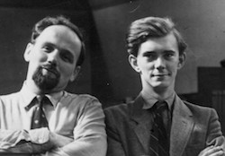
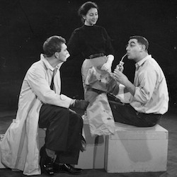
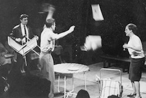
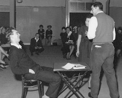

*On 24 September 2017, the Stephen Joseph Theatre held an event entitled Remembering Stephen Joseph to mark the 50th anniversary of his death on 5 October 1967. The afternoon featured Sir Alan Ayckbourn, Dr Paul Elsam, Simon Murgatroyd and the actor Joanna Tope.  
This is an edited transcript concentrating on Alan Ayckbourn’s responses to Dr Paul Elsam's questions about Stephen Joseph.*

**Dr Paul Elsam: What is your earliest memory of Stephen Joseph?  
Alan Ayckbourn:** I worked with him for several weeks without knowing who the hell he was! I was employed not by him, but by Rodney Wood - who became the general manager of the Library Theatre - when he was my stage director at Leatherhead Rep. I was just an ASM and when we had all finished the current season and he said the immortal words, ‘Anyone fancy a job in Scarborough?’ And I chimed up and said, ‘Where the Hell’s Scarborough?’ And he said, ‘Well just go up that way until York and turn right.’ And I said, ‘Oh, that sounds good, OK, I’m off.’

<aside>

</aside>

So without further ado, I was on a train to Scarborough. I changed at York and then it became really pretty with this beautiful scenery and I arrived in Scarborough. I met the director there, Clive Goodwin, who was directing a season of plays and there was no sign of this man, Stephen Joseph. So I proceeded to stage manage the opening production of *The Glass Menagerie* and then appeared in the second production of *An Inspector Calls*.

In between these roles, I was operating the lights as well and I would stand in this cramped little space in the narrow corridor between the dressing room and the stage, operating a lethal machine - a Strand Eight Way Slider Dimmer - which you got belting shocks off. I was operating the lights sight unseen, so I couldn’t see the stage; I had no view of the stage and the curtains were drawn on both entrances to avoid light leaks. I was operating the lights and I got to the end of the first scene and I did a down-fade with eight fingers and I then brought them up again at the beginning of the second scene with the same eight fingers and I was suddenly aware of an enormous man standing at the side of me. And he said, quite loudly, ‘There’s a better way to do that.’ And I said, ‘Excuse me sir, this is a restricted area. Professionals at work.’ And he said, ‘No, no, there’s a better way to do that.’ I said, ‘Yeah, I’m sure there is, thanks very much.’ And he said, ‘If you get a bit of wood’, and he found a bit of wood on this untidy floor, ‘you can lay it across the dimmers. If you use it there it’s a much easier way to do a blackout.’ He brought it down and I said, ‘You’ve just blacked out the stage…’ and he said, ‘Oh Jesus’ and then he ran through the door. At which point the actors came out very angry - ‘That was in the middle of my big speech’ - and I said - I was like Stan Laurel - ‘There was this great big man…’ - and one of the actors said, 'Oh thats got to be Stephen.’ I said, ‘Stephen Who?’ They said, ‘Stephen Joseph, the guy who runs the company.’ I said, ‘Oh that’s Stephen, he’s crazy!’ And that was our first meeting.

**Stephen has been described as someone who collected people and maintained wonderful relationships with them, was that your experience?**  
I think he collected me, in a way, because he took one look at me as this stage manager and failing electrician wanting to be an actor. So he gave me a go at acting and very shrewdly could see I wasn’t cut out to be the next Albert Finney, so he gently tilted the course of my progress towards the poisoned chalice for an actor of directing and then - simultaneously - towards writing. So he collected me and redirected me. In that sense, he was a producer of people’s lives as much as anything.

<aside>

</aside>

**Stephen gave you this break as a director and you will have - no doubt - wanted advice from him, can you remember any of that advice?**  
Yes, he gave it to me in one sentence. He’d asked me to direct the next play and I’d never directed at all and he said, there’s nothing to it. Which was more or less his view of directing anyway! When you were directed by Stephen, effectively he was never there half the time, he’d be building another rostra. But he said, ‘Directing is very very simple, all you need to do is to create an atmosphere in which others feel confident to create.’ And I said, ‘Oh, that’s all it is.’ But, of course, if you’ve got a room full of actors, all moving at different speeds and with different attitudes and with different aims, somehow you’ve got to create an atmosphere in which these disparate individuals feel drawn towards creating, feel confident of creating, so you put them at ease and yet not too much at ease or they go to sleep! You just have to motivate them, encourage them and - above all - give them a purpose. And that was something Stephen could do very easily in life - if not in the rehearsal room, because in my experience he was very rarely there. When I was doing a dress rehearsal for him once, he started building the bloody rostra. I was in the middle of a very moving speech, I said, ‘Do you want me to finish this speech or not?’ and he said, ‘Do you want this theatre to be built or not?’ It was one of our altercations, Stephen and I had quite a lot of altercations. He once said, ‘You’re letting me down by holding me up, Alan.'

**Stephen was a visionary and one of his ideas was for the Fish & Chip Theatre, what was your reaction to that?**  
Absolute horror. But Stephen was extraordinary. There was no two ways about it, but I remember his quote about every theatre should self-destruct after seven years. I think I know what he meant by that and it probably meant - just short of blowing up the building, which would be very harmful for those living around you - just rethink. I tried during the 40 years I ran the company since his death to do that. Every seven years we’d just do something outrageous. Sometimes it worked, sometimes it didn’t. I think Stephen - foolish or not - would have approved, he liked thinking out of the box.

**He made a memorable response to your first play, *The Square Cat*, what was that?**  
He said, ‘If you write another seven plays, you’ll be quite a good writer.’ I said, ‘Thank you so much.’

**Stephen was your mentor for both writing and directing in those early days, what can he claim credit for?**  
I think the key was he was a teacher really. He wasn’t, in my opinion, a frightfully good director. He wasn’t - by his own account - a very good actor. His writing - he’d write things in the margins of my script like’ ‘This is the sort of speech I want…’ but it was terrible. But he knew more about all those things than anyone else put together. He could talk beautifully about playwriting in a way I’ve never heard anyone talk about the structure and about the creation of it; the practical craft. He talked about acting - that was his gift as a director - because he knew more about acting than anyone I have known. Therefore, he knew more about directing. Although he was a practitioner in none of these areas, if you had the courage, the patience and the sense to listen to him, he had the key to all those things. He was just extraordinary. I’m still carrying some of the things he said to me and I’m passing them on as if they were mine!

<aside>

</aside>

**Stephen directed your first major hit, *Meet My Father* - later retitled *Relatively Speaking* - what do you remember of that experience?**  
I considered myself at that point in my career, rather pompously, as an exciting young experimental dramatist. I’d just written play called *Mr Whatnot* at Stoke-on-Trent, which was a huge success and which was based entirely on ‘20s silent movies. It was experimental and Stephen then said to me, would I write a play for the reformed Scarborough company? I said, ‘Yes, OK, I’m working at the BBC’ and he said, ‘Well, may I suggest your next play is a well-made play’ and I said, ‘What! Come on, I’m a cutting edge dramatist!’ He said, ‘But you’ll need to know how to experiment and how do you know how to experiment - how to break the rules - if you don’t know how to create them? Don’t try breaking rules when you don’t know what they are.’ So I tried to desperately write a well made play and I ground out *Relatively Speaking*, which really was blood, sweat and tears. I posted it to him, and I said, ‘Here you are, here’s your well-made play. Good luck to you.’ I didn’t go to the first performance but I met Stephen in Manchester some time later and I said, ‘How’s the play?’ as I hadn’t heard anything about it. He said, ‘It’s good, I cut a bit.’ I said, ‘Oh yeah, you’d need to do that.’ He said, ‘Its going well, the audiences appear to be enjoying it. I think you’ll be quite pleased.’ So I went over and I saw it. It was really rather low key and I thought, this isn’t bad actually - it’s quite good. He’d cut it and it was well played and it made all the difference. It isn’t that well-made - the first scene is a bit of a bugger, but the rest off it seems to work and it’s still touring around, still earning its money. So thank you Stephen for that one. I’ve been trying to break the rules ever since.

**Would it be any exaggeration to say that Stephen transformed stagecraft?**  
I think so, I think his emphasis on truth - artistic truth and consistency - was not something around at the time. The first professional actor I ever got close to was Donald Wolfit and you couldn’t be further away from the actors Stephen encouraged. Wolfit was, admittedly, from a previous generation, but he was nonetheless surrounded by actors in that tradition. I think Stephen was a man of his time. He had the excitement to create Theatre in the round, yet he also had the shrewdness to know that there was already an audience there that was not prepared to sit at the Leeds Grand Theatre and be shouted at by some speck in the distance being amplified which you’d need opera glasses to see, when you’d got actors in the Library Theatre who were literally inches from you, acting in a manner which you could see in *Coronation Street* to be quite honest.

I remember the lights coming on once at a production when we were in the Library Theatre and a woman saying, ‘Oh it’s in colour!’ Yes, madam, 3D and smell-a-rama and everything! But, obviously, she was already into a televisual experience and we were matching this challenge, because all around us at that time rep was crumbing and dying. So this new form of theatre embraced the new styles which the public were getting more and more used to. Why go to the theatre, when you can switch on a box in the corner? Because we’re live and in colour and for god sakes, it’s special. Every night is special. Forget the box. Forget the movies.

We suddenly found - in those early days of theatre in the round - we’d pissed off most of the establishment. If you ever went to work anywhere else, they’d say, ‘What have you been doing recently, Alan?’ and I’d say, ‘I worked with Stephen Joseph…’ and there’d be a terrible silence and I’d realise you were losing the job because Stephen was a bit of a troublemaker.

<aside>

</aside>

**Why do you think Stephen picked these fights with the establishment?**  
I think he felt, in a way, his back was against the wall, because he had no support from his family. His father, Michael Joseph, didn’t want to know. His mother, Hermione Gingold, sort of did extraordinary things. The theatre establishment - and probably some of this was his own doing - opposed and reacted very strongly to him.

Stephen was a strong individual and - in his own mind- what he wanted to do was so clear to him and obvious that this was the way forward. He, like all pioneers, took extreme views. He would say, if he were here today, that the only form of theatre that was worth doing is theatre-in-the-round. Now those of us who follow him would go, ‘Well, OK, it is preferred but no doubt the proscenium arch has one or two lovely surprises still in store and three sided, thrust and traverse stages are all in their way worth exploring’, but he was having none of that. It was like him or nothing, this or nothing.

Those sort of people are never going to be accepted. They get a reputation in this small parochial business as cranks or extremists. Yet, the only people I know who hate theatre-in-the-round are people who have never been! And they say, ‘I don’t want to sit and watch a lot of people’s backs… I can see the people opposite.’ That’s the point! It’s a communication. The audience is communicating, it’s that live experience. There’s communication going on between actor and audience, actor and actor, audience and audience, so everything is happening and it’s one of those miracles that is very hard to pin down. Stephen fought for this and really wanted it. And so he met opposition.

**What greater influence might Stephen have had on British theatre if he had lived much longer?**  
It’s very hard to know. I think one of the sadnesses for me is that he left theatre when he did and went into academia and was lost to the profession forever because he probably had a death wish - he would never open a theatre and run it successfully. I was sitting in his flat in London one day and the phone rang and it was a guy from Croydon saying Stephen has been to talk to us and we’re now in a position to go ahead - with what turns out to be the Ashcroft Theatre - and would Stephen ring back to talk about it. I got very excited as I knew how desperate Stephen was to open a custom built theatre in the round. When he came in, I said to him, ‘Stephen, Stephen, they’ve just rang in from Croydon…' and he said, ‘What? I said, ‘The people there are wanting to open a theatre in the round… They want to talk to you about the next step.’ He said, No, no, it’ll never happen.’ I spent the evening trying to persuade him to phone and talk to these people and they eventually went to someone else. He just wouldn’t take that final step. I swear to God when he opened the Victoria Theatre in Stoke-on-Trent, he already knew he was never going to take that on and he left it to Peter Cheeseman and the rest of us. He very rarely set foot in the building except for occasional visits when he would point out that the signs were missing or something.

I think Stephen probably was that extraordinary figure of a first stage rocket that started pushing the rest of us into space and then always knew he was going to drop away.

I live in his house, he’s with me everyday. I miss him more than anyone, if that’s possible. I sat with him in his bedroom during his dying days and he said one of the most frightening things to me and I was making stupid noises about ‘as soon as you’re better we can start again, Stephen, and we can get going again.’ He said, ‘Ayckers I’m dying, old mate, let's face it, I’m dying.’ And I just shut up because I couldn’t think of anything to say. And he said the most awful thing, he said ‘All the books I've read, they tell you this and they tell you that and I have to tell you, I’m fucking terrified.’ My heart just went out to him and I left him, I have to say. He was sitting there with this kitten he’d adopted, just flopping around on the duvet and that was the last of Stephen which I saw. He died. It was probably the saddest time of my life.

That was the death of a rocket, falling into the sea. I guess for many of us, we remember the energy which he lifted us and just thank him very much.
