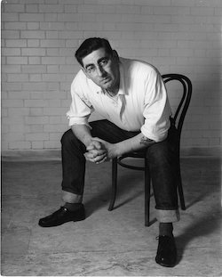

<aside>

*Stephen Joseph*

</aside>

Stephen Joseph is, inarguably, the single most influential figure in Alan Ayckbourn's life. Not only did Stephen guide and encourage Alan early in his career but he was also the first person to professionally employ Alan as both playwright and director.

Stephen's impact can be singularly seen in Alan's decision to run Theatre in thew Round at the Library Theatre, Scarborough, following his death. This ensured Stephen's legacy survived in the theatre that Alan Ayckbourn is inextricably associated with, the **[Stephen Joseph Theatre](http://www.a-round-town.com/)**.

Stephen Joseph, himself, was a British theatre pioneer during the 1950s and 1960s who, amongst many other achievements, was the founder of the Library Theatre in 1955, the UK's first professional theatre-in-the-round company.

This section explores Stephen Joseph's influence on Alan Ayckbourn as well as offering a brief overview of this influential figure in British theatre. A more comprehensive look at Stephen Joseph's life and contribution to theatre in the round can be found on our sister site **[A Round Town](http://www.a-round-town.com/)**.
