A collection of archive material, posters, rehearsal and production images pertaining to Alan Ayckbourn's *A Brief History of Women*. The Archive Images page is presented in association with the **[Borthwick Institute for Archives](/)** at the University of York where the Ayckbourn Archive is held. Click on an image to expand.

### A Brief History of Women (2017)

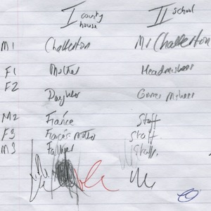

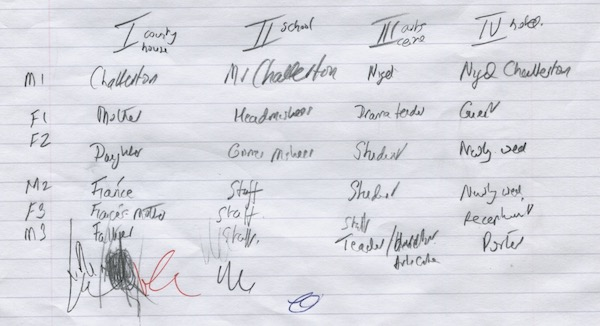

Early notes by Alan Ayckbourn for *A Brief History of Women* breaking down characters names and roles in each scene. Note the lead character, Spates, is called Chatterton here.

*Do not reproduce images without permission of the copyright holder.*

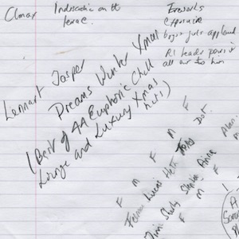

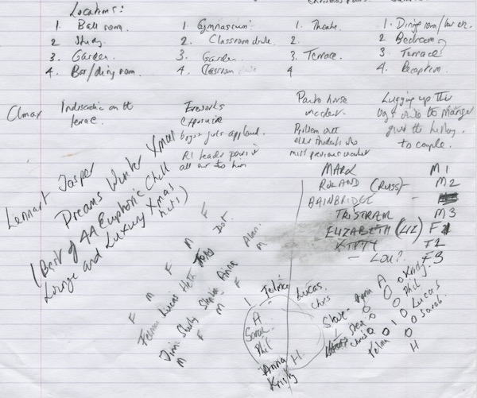

More notes for *A Brief History of Women* by Alan Ayckbourn including cross-casting for his revival of Taking Steps in the same season.

*Do not reproduce images without permission of the copyright holder.*

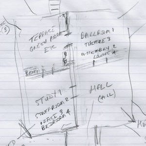

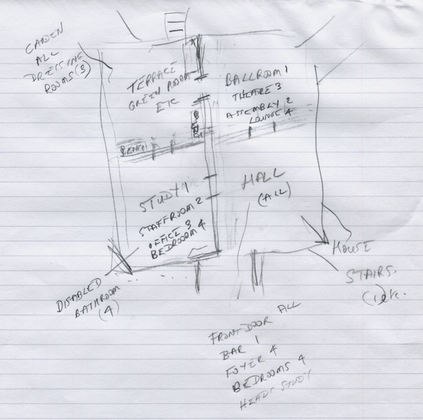

Alan Ayckbourn's sketch of the in-the-round layout of the set for the world premiere of *A Brief History of Women*. Set in the same location over 60 years, each of the four rooms had to be quickly changed for each scene as the house progressed from stately home to school to arts centre to hotel.

*Do not reproduce images without permission of the copyright holder.*

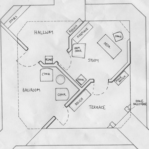

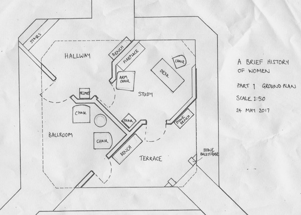

The actual in-the-round set layout out for Scene 1 of *A Brief History of Women,* designed by Kevin Jenkins. The first scene sees the house as a stately home in 1925.

**Copyright:** Kevin Jenkins  
**Holding:** The Bob Watson Archive

*Do not reproduce images without permission of the copyright holder.*

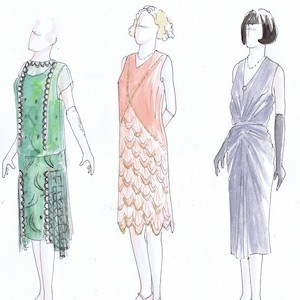

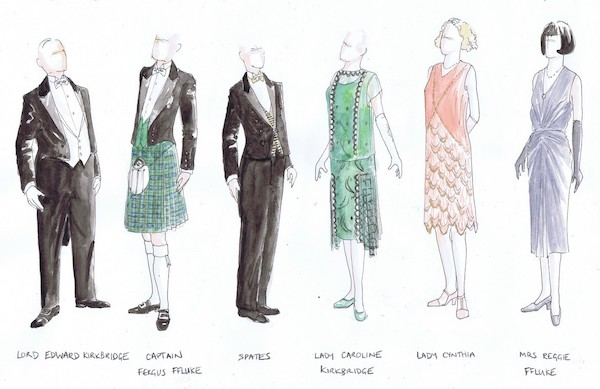

Costume designs for the first scene of *A Brief History of Women*, designed by Kevin Jenkins. The first scene is set in a stately home in 1925.

**Copyright:** Kevin Jenkins  
**Holding:** The Bob Watson Archive

*Do not reproduce images without permission of the copyright holder.*

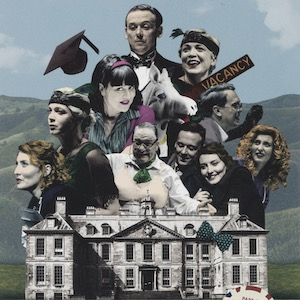

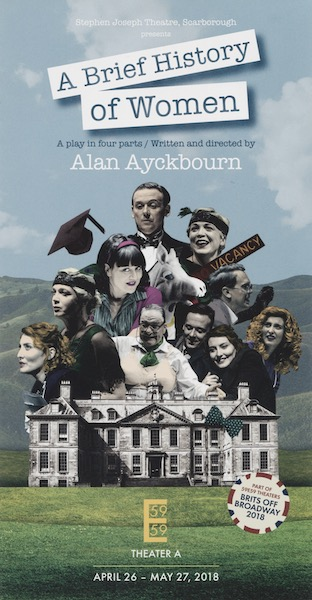

The poster for the North American premiere of *A Brief History of Women* at the 59E59 Theatres as part of the Brits Off Broadway Festival in New York. Alan Ayckbourn directed his original company for the acclaimed transfer.

**Design:** 59E59 Theatres (© Scarborough Theatre Trust)  
**Holding:** Borthwick Institute for Archives

*Do not reproduce images without permission of the copyright holder.*      *The Scene and Archive Images pages are presented in association with the* ***[Borthwick Institute for Archives](/)*** *at the University of York, where the Ayckbourn Archive is held.*

*All images on this page are copyright of the respective and labelled individual / organisation and should not be reproduced without permission.*  
