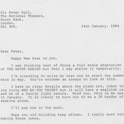
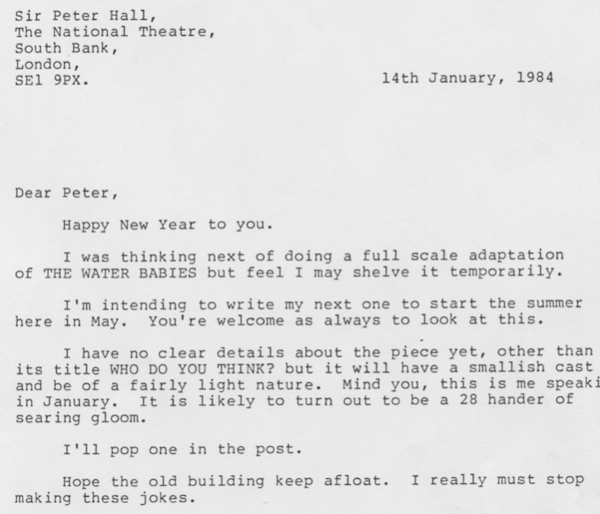
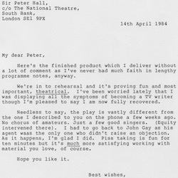
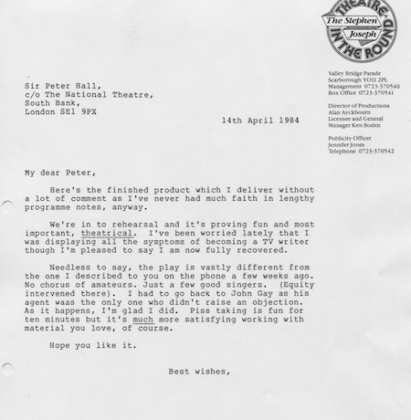
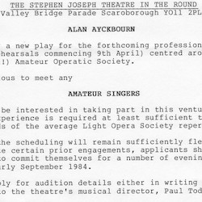
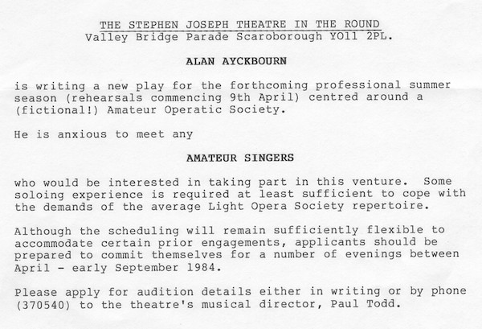
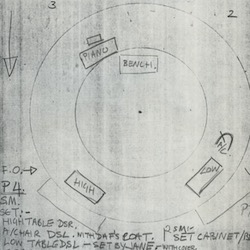
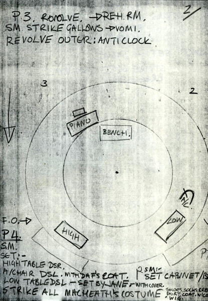

A collection of archive material, posters, rehearsal and production images pertaining to Alan Ayckbourn's *A Chorus of Disapproval*. The Archive Images page is presented in association with the **[Borthwick Institute for Archives](/)** at the University of York where the Ayckbourn Archive is held. Click on an image to expand.

### A Chorus Of Disapproval (1984)

This letter from Alan Ayckbourn to the National Theatre's Artistic Director, Peter Hall, is the earliest known reference to the play which would become *A Chorus Of Disapproval*. At this point, it's a completely unrelated - and unwritten - play called *Who Do You Think?* which then became *A Chorus Of Disapproval*, possibly as a result of interest from Peter Hall.

*Do not reproduce images without permission of the copyright holder.*

A later letter from Alan Ayckbourn to Peter Hall about *A Chorus Of Disapproval* noting how much it has altered since the previous letter and also hinting at some of the notorious issues Alan had with his early ideas for the play.

*Do not reproduce images without permission of the copyright holder.*

Alan Ayckbourn's original intention for *A Chorus Of Disapproval* was to feature 'plants' in the audience, who would - without warning - join in the action. Sadly, the acting union Equity put paid to Alan using amateurs in a professional production, but not before auditions were actually held as this copy for the newspaper advert shows.

*Do not reproduce images without permission of the copyright holder.*

A little know fact about *A Chorus Of Disapproval* is the world premiere at the Stephen Joseph Theatre in the Round, Scarborough, was staged on a double-revolve (it has never been staged like this subsequently). This allowed Alan to alter the stage layout quickly and also realise several other effects for the play. Each location had a different state and this is an illustration of the second location in the play.

*Do not reproduce images without permission of the copyright holder.*    *The Archive Images pages are presented in association with the* ***[Borthwick Institute for Archives](/)*** *at the University of York, where the Ayckbourn Archive is held.*

*All images on this page are copyright of the respective and labelled individual / organisation and should not be reproduced without permission.*   
