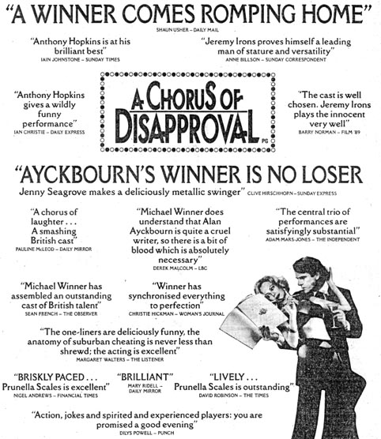

The critical response to Michael Winner's film *A Chorus Of Disapproval* was mixed. The cast tended to come off well, the film less so. This is exemplified by the advertising for the film, an example of which can be seen below.  
The approving critical remarks in the advert do not necessarily reflect the overall view of the same critics as demonstrated by a selection of further quotes from the same reviews in the right hand column.  
It would be unlikely such an advert would appear in the media today as attributed quotes have to accurately reflect the intention of the critic. It does though emphasis the sage advice of don't believe everything you read.

<aside>

</aside>

**What The Critics Actually Wrote…**

**Shaun Usher - Daily Mail:** "Winner turns it into an enjoyable film with laughter, or at least smiles, from start to finish, even if the original's sharper, dark, painful notes are inaudible."

**Anne Billson - Sunday Correspondent:** "The Director has encouraged his cast to ham it up, somewhat, but Jeremy Irons once again proves himself a leading man of stature and vitality."

**Ian Christie - Daily Express:** "Anthony Hopkins gives a wildly funny performance. But apart from the mis-casting of Irons, Michael Winner's heavy-handed direction proves to be a handicap to the venture, badly paced and lapsing on occasion into sentimentality."

**Clive Hirschorn - Sunday Express:** "Subtlety has never been his \[Winner's\] forte. By hammering certain scenes and encouraging Anthony Hopkins to overdo the Welsh bit - quite manically - in the role of Dafydd, he siphons off much of the truth at the core of the play."

**Adam Mars-Jones - The Independent:** "The central trio of performances are satisfyingly substantial. Even here, though, doubts remain about the appropriateness of the whole enterprise."

**Sean French - The Observer:** "He has assembled an outstanding cast of British talent... but Winner has found no way of making the film's highly theatrical conceit work in cinematic terms. Worse still, Winner captures the corruption of the play's characters but in scene after scene fails to make their plight funny ad the result is strangely unpleasant."

**Margaret Walters - The Listener:** "'What a good play this was,' I kept thinking all the way through Michael Winner's coarse-grained adaptation."

**Nigel Andrews - Financial Times:** "*A Chorus Of Disapproval* is tolerably acted, briskly paced and viley photographed."

**David Robinson - The Times:** "It is all lively at its superficial level."

*All research for this page by Simon Murgatroyd.*
