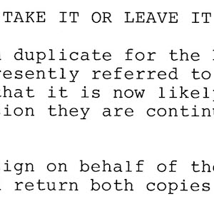
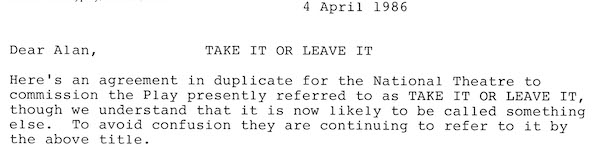
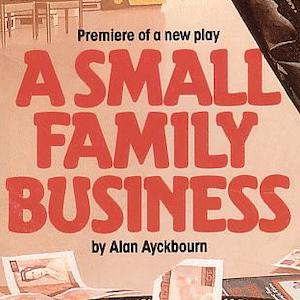
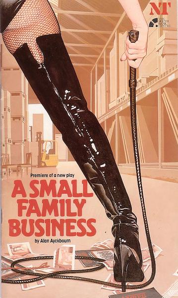
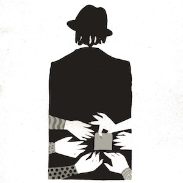
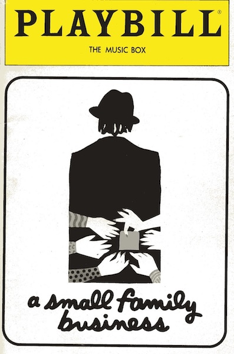
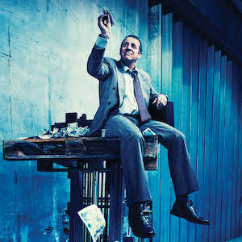
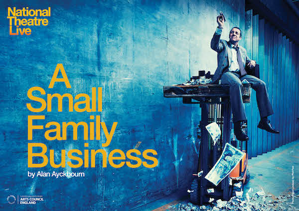

A collection of archive material, posters, rehearsal and production images pertaining to Alan Ayckbourn's *A Small Family Business*. The Archive Images page is presented in association with the **[Borthwick Institute for Archives](/)** at the University of York where the Ayckbourn Archive is held. Click on an image to expand.

### A Small Family Business (1987)

Extract from a letter, dated 4 April 1986, from Alan Ayckbourn's agent to the playwright which refers to the play by its original, temporary title of *Take It Or Leave It* instead rather than *A Small Family Business*.

**Copyright:** Haydonning Ltd  
**Holding:** Borthwick Institute for Archives

*Do not reproduce images without permission of the copyright holder.*

The poster for the world premiere of *A Small Family Business* at the National Theatre in 1987.

**Copyright:** National Theatre  
**Holding:** Borthwick Institute for Archives

*Do not reproduce images without permission of the copyright holder.*

The cover for the Playbill for the New York premiere of *A Small Family Business* at the Manhattan Theater Club in 1992.

**Copyright:** Manhattan Theatre Club  
**Holding:** Borthwick Institute for Archives

*Do not reproduce images without permission of the copyright holder.*

The National Theatre's 2014 revival of *A Small Family Business* also marked the first time an Ayckbourn production had been live-streamed. This is the poster for what was reported as the largest live-stream the National Theatre Live programme has done at that time.

**Copyright:** National Theatre  
**Holding:** Ayckbourn Digital Archive

*Do not reproduce images without permission of the copyright holder.*  
*The Archive Images pages are presented in association with the* ***[Borthwick Institute for Archives](/)*** *at the University of York, where the Ayckbourn Archive is held.*

*All images on this page are copyright of the respective and labelled individual / organisation and should not be reproduced without permission.*  
