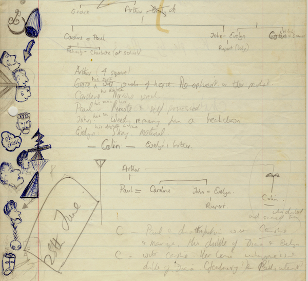
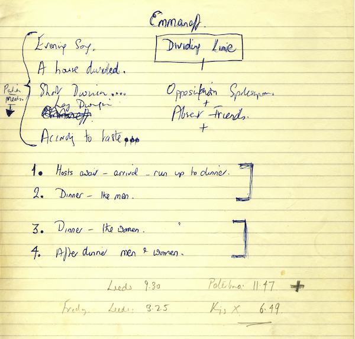
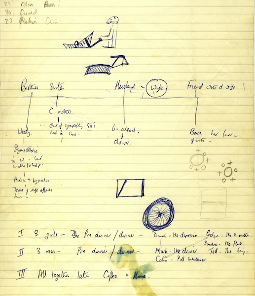
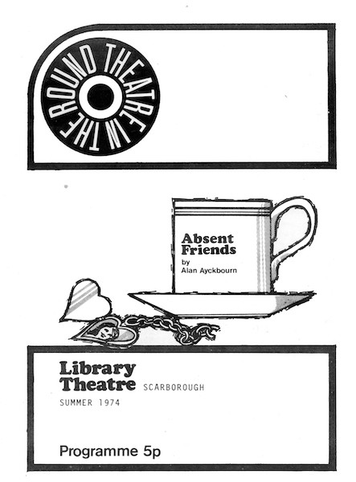
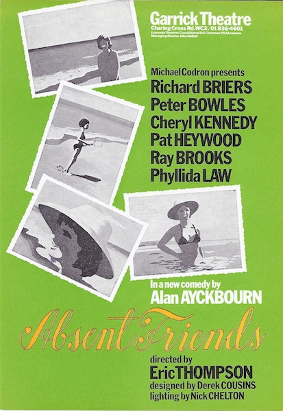
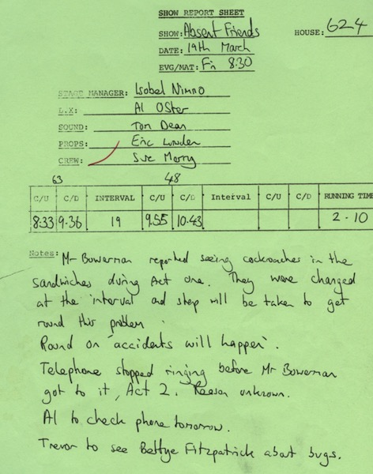
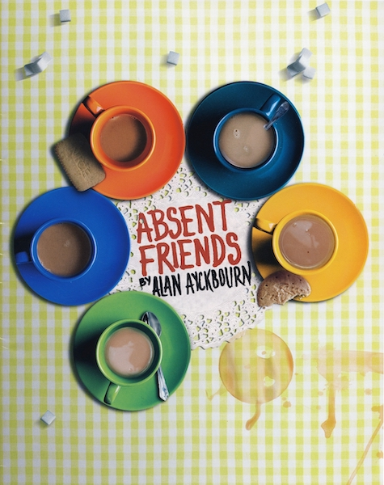
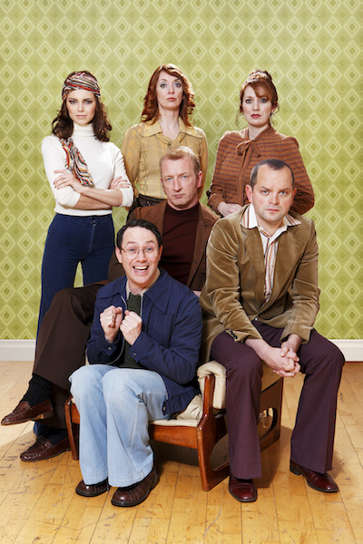

A collection of archive material, posters, rehearsal and production images pertaining to Alan Ayckbourn's *Absent Friends*. The Archive Images page is presented in association with the **[Borthwick Institute for Archives](/)** at the University of York where the Ayckbourn Archive is held. Click on an image to expand.

### Absent Friends (1974)

*Absent Friends* is one of the earliest Ayckbourn plays to have the playwright's early notes and ideas survive in the Ayckbourn Archive at the Borthwick Institute for Archives at the University of York. They offer a fascinating insight into the origins of the play and its very different initial concept.

**Copyright:** Haydonning Ltd  
**Holding:** Borthwick Institute for Archives

*Do not reproduce images without permission of the copyright holder.*

*Absent Friends* is one of the earliest Ayckbourn plays to have the playwright's early notes and ideas survive in the Ayckbourn Archive at the Borthwick Institute for Archives at the University of York. This page is notable for a list of alternative titles for the play as well as an scene breakdown which bears no resemblance to the finished play.

**Copyright:** Haydonning Ltd  
**Holding:** Borthwick Institute for Archives

*Do not reproduce images without permission of the copyright holder.*

*Absent Friends* is one of the earliest Ayckbourn plays to have the playwright's early notes and ideas survive in the Ayckbourn Archive at the Borthwick Institute for Archives at the University of York. This page again features early concepts for the play - very different to what the playwright eventually wrote - as well as some different character names.

**Copyright:** Haydonning Ltd  
**Holding:** Borthwick Institute For Archives

*Do not reproduce images without permission of the copyright holder.*

An interesting quirk of Theatre in the Round at the Library Theatre, Scarborough, where *Absent Friends* premiered is that poster images did not start being used until the early 1970s. As a result, *Absent Friends* is only the second Ayckbourn world premiere to have a poster (or, in this case, an illustrated programme cover). Previously only *Absurd Person Singular* had an illustrated flyer.

**Copyright:** Scarborough Theatre Trust  
**Holding:** Borthwick Institute For Archives

*Do not reproduce images without permission of the copyright holder.*

The poster for the West End premiere of *Absent Friends* in 1975. Despite an impressive cast and the director Eric Thompson - who had previously directed *Absurd Person Singular* and *The Norman Conquests* to great success - the production was not a success and Alan believed its transfer from an intimate theatre-in-the-round to a vast proscenium arch space did the play no favours.

**Copyright:** Michael Codron Productions  
**Holding:** Borthwick Institute For Archives

*Do not reproduce images without permission of the copyright holder.*

During 1982, Alan Ayckbourn toured the Stephen Joseph Theatre in the Round company to the Alley Theatre, Houston, presenting *Way Upstream* and *Absent Friends*. This show report from the latter highlights an unusual problem during performance - cockroaches in the sandwiches…

**Copyright:** TBC  
**Holding:** The Bob Watson Archive

*Do not reproduce images without permission of the copyright holder.*

The poster for the acclaimed 2021 revival of *Absent Friends*, directed by Jeremy Herrin. Alan's plays are frequently noted for the difficulty in creating appealing poster images and, as a result, this clever design has subsequently frequently been copied since.

**Copyright:** To be confirmed  
**Holding:** Borthwick Institute for Archives

*Do not reproduce images without permission of the copyright holder.*

The company of the 2012 West End revival of *Absent Friends*, which received much acclaim and was regarded by Alan Ayckbourn as the first truly successful West End production of the play.

**Copyright:** To be confirmed  
**Holding:** Ayckbourn Digital Archive

*Do not reproduce images without permission of the copyright holder.*  
*The Scene and Archive Images pages are presented in association with the* ***[Borthwick Institute for Archives](/)*** *at the University of York, where the Ayckbourn Archive is held.*

*All images on this page are copyright of the respective and labelled individual / organisation and should not be reproduced without permission.*  
