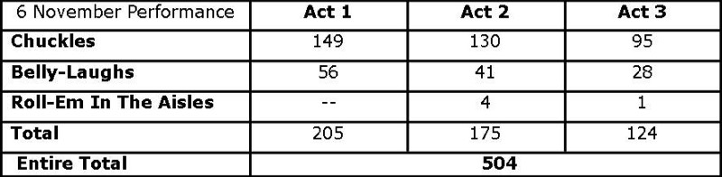

*This section includes articles by Alan Ayckbourn on Absurd Person Singular as well as other authors. All articles are copyright off the respective author and can be accessed through the links in the right-hand column.*

*This article about Absurd Person Singular was written by Alan Ayckbourn's Archivist Simon Murgatroyd and examines the original Broadway production in 1974.*

### Absurd Person Singular: The Broadway Experience

By Simon Murgatroyd

During his long career, Alan Ayckbourn has had few genuine hits in New York. *Absurd Person Singular* stands as his most commercially successful Broadway production and one that is still remembered today.

Prior to *Absurd Person Singular*, only one of Alan’s plays had been produced on Broadway. *How The Other Half Loves*, featuring Phil Silvers of *Sergeant Bilko* fame, opened in March 1971 and was a respectable success but had hardly made Alan a household name.

In 1973, *Absurd Person Singular* opened in London and quickly looked set for a long and successful run. As a result, it was only natural the play’s producer, Michael Codron, should look to transfer the play to Broadway to capitalise on its success. Codron teamed up with The Theatre Guild, specifically Philip Langner and Armina Marshall, and the John F Kennedy Centre For The Performing Arts, to produce the play in New York. Founded in 1919, the Guild’s original purpose was to produce non-commercial plays by American and foreign playwrights and it was responsible for a number of significant premieres on Broadway.

Eric Thompson, director of the London production, agreed to direct it for Broadway with an American cast - which caused some initial confusion as Alan was not told whether the play was to be Americanised in location and / or characters and no doubt feared a repeat of a previous painful attempt to 'Americanise' *Relatively Speaking* for an aborted transfer. Alan also had misgivings as Philip Langner had some vocal issues with the play, despite investing in it.

In a lunch with Alan, Langner had seriously suggested acts two and three be swapped so the play ended on a comic high. Alan refused as the play had been written with a dark dying fall and when contracts were signed it forbade any major changes to the play and noted: “\[The\] Guild shall not make nor permit others to make any alterations in the text of said Play without the written approval of the Author”; the contract also forbade major changes to the action and structure of the play.

Despite this, in pre-production Langner suggested to Thompson “the set should collapse at the end of the third act to give the show a big finish” and that drawers and cupboards in the second act should jam to make it obvious how inadequate Geoff was as an architect. That these would not go down well were, according to the director, met with the rebuke from Langner that Alan was contractually obliged “to make such alterations and additions as the Producers deem necessary.” Alan was naturally furious with this news and could not understand why The Theatre Guild was producing the play if they were so unhappy with it.

Codron, who Thompson had also contacted, was quick to set the record straight and dismissed Langner’s intimation of Alan’s obligations by quoting the Guild's clause (see paragraph above) to him. He also subtly noted it was in everyone’s interest for this play to go well as The Theatre Guild had already expressed interest in producing *The Norman Conquests*, which had recently opened in London.

The cast was remarkably strong and featured Tony award winners Richard Kiley, Sandy Dennis and Larry Blyden, the Golden Globe and Emmy award winning Geraldine Page and two well known actors Carole Shelley and Tony Roberts. Alan himself commented: “They were all top-rate actors who very cannily knew how to play a New York audience.” The play was set in England with English characters with the only notable deviation being the acts were subtitled “Christmas Past”, “Christmas Present” and “Christmas To Come.”

The play opened in late August for a week-long try-out at the Westport Country Playhouse, which had coincidentally staged the American premiere of *Relatively Speaking* in 1967. The play had a record-breaking run before moving to the John F Kennedy Centre in Washington from 4 to 28 September. This also sold out and was greeted by several strong reviews.

The play moved to New York on 27 September and Alan was brought in to help promote the play and, Langner hoped, to edit acts two and three and add some humour to the final act. Alan, of course, did not make any notable alterations to the play with the published American script offering little evidence for any notable changes and in an interview, Alan noted: “I personally haven’t done anything with it.”

The play opened on 8 October 1974 at the Music Box Theatre to excellent reviews and it was soon obvious this was a genuine Broadway hit. The notable cast combined with the strong reviews for the play quickly led to strong a box office. Rather unfortunately, for whatever reasons, The Theatre Guild had not put Alan’s name on any promotional material or even the programme cover. As a result, the only identifiable people concerned with the play were the actors.

Even though the play was a success, Langner’s views on swapping the two acts led to the very famous story that statisticians were brought in to count the laughs in the play. Preposterous as the story sounds, the figures are held in the Ayckbourn Archive at the Borthwick Institute for Archives at the University of York and can be revealed here.

Quite what Langner intended to prove is a mystery. The experiment was conducted six weeks after the play had opened and all it confirms is there are fewer laughs in the third act than the second; something which Alan was patently aware of as the play had deliberately been written that way.

The success of the play was reflected when the Tony Award nominations were announced with Larry Blyden, Geraldine Page and Carole Shelley all nominated in the Best Featured actor category. The play was also nominated for the Drama Desk Outstanding New Play (Foreign) and while the play did not win any of these awards, it demonstrated Alan had his first true major hit on Broadway.

The play would run until March 6 1976 and during that period it became the longest running comedy on Broadway at that time. Although the cast did go through a number of changes, Geraldine Page and Sandy Dennis worked on the show for the majority of its long run. On 28 January 1976, a month before it closed, 45th street was renamed Ayckbourn Alley for the day to mark the fact Alan had four plays running on Broadway with *Absurd Person Singular* and *The Norman Conquests* trilogy. A publicist later told him that the actual reason for the rename of the street was "to compel you to assume a huge tax burden and help New York out of its financial difficulties!"

*Absurd Person Singular* ran for 592 performances and was the most successful comedy on Broadway by a British author since Noël Coward’s *Blithe Spirit*, which ran from 1942 to 1943. It was, according to Philip Langner, who was seemingly obsessed by statistics, the 141st longest running production to have been mounted on Broadway at that time.

Despite the success of *Absurd Person Singular*, it did not propel Alan to the heights of fame he had achieved in London. Although *The Norman Conquests* opened in 1976, again directed by Eric Thompson, it did not reach the same magnitude of success and Alan did not achieve as high a profile hit in New York again until 2005. Then he took the Stephen Joseph Theatre’s production of *Private Fears In Public Places* to the Brits Off Broadway festival, which generated a once-in-a-lifetime reception and reviews. On Broadway, the only Ayckbourn production which can be said to have had similar success is The Old Vic's 2009 transfer of *The Norman Conquests*, which was critically acclaimed and received a number of significant awards including the first Tony for an Ayckbourn play.

Coincidentally a revival of *Absurd Person Singular* opened on Broadway soon after *Private Fears In Public Fears* on 18 October 2005. It closed on 4 December 2005 having received some unflattering comparisons to the original Broadway production and perhaps suffering from the success of *Private Fears In Public Places*, which had shown American audiences how Ayckbourn plays should be directed and performed.

It certainly could not touch the success and obvious affection for the original production: Alan’s original and still most commercially successful Broadway production.
