To celebrate the 50th anniversary of Absurd Person Singular in 2022, an expanded collection of archive material, posters, rehearsal and production images pertaining to Alan Ayckbourn's *Absurd Person Singular* has been created for the Archive page. The Archive Images page is presented in association with the **[Borthwick Institute for Archives](/)** at the University of York where the Ayckbourn Archive is held. Click on an image to expand.

### Absurd Person Singular (1972)

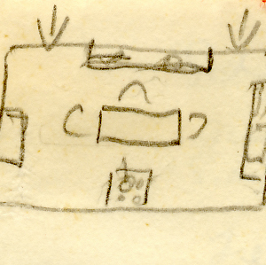

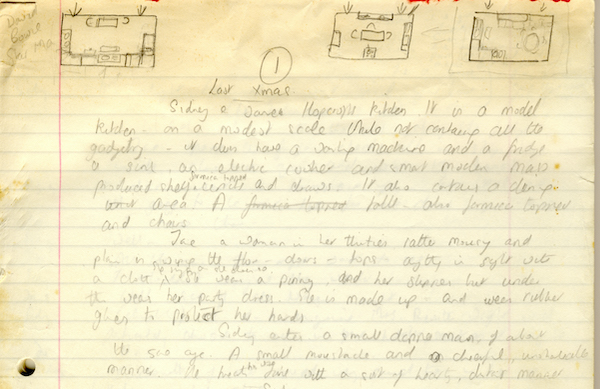

Alan Ayckbourn's handwritten notes for the first scene of *Absurd Person Singular* including his thumbnail sketches for the sets for each act.

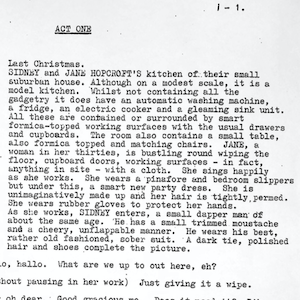

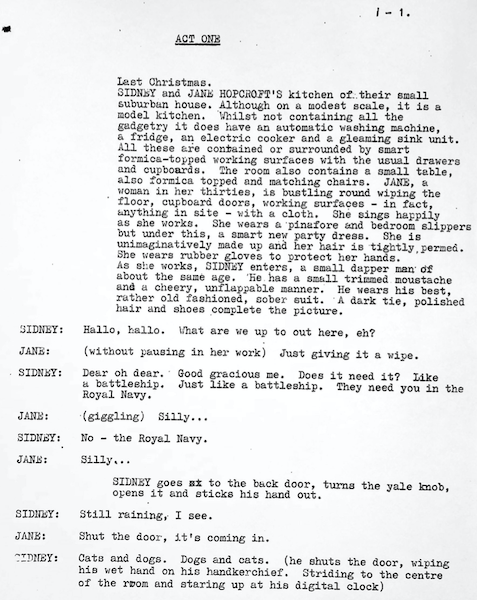

The first page of an original manuscript for the world premiere of *Absurd Person Singular* at Theatre in the Round at the Library Theatre, Scarborough, in 1972.

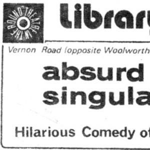

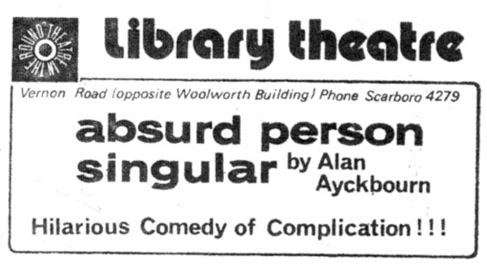

An advertisement for the world premiere production of *Absurd Person Singular*; Alan would frequently have not even begun writing there play at this point and have no little idea what is would be about. Hence the rather inaccurate 'comedy of complication'.

**Copyright:** Scarborough Theatre Trust  
**Holding:** Borthwick Institute for Archives

*© Scarborough Theatre Trust, 1972, all rights reserved. Do not reproduce images without permission of the copyright holder.*

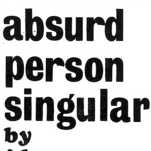

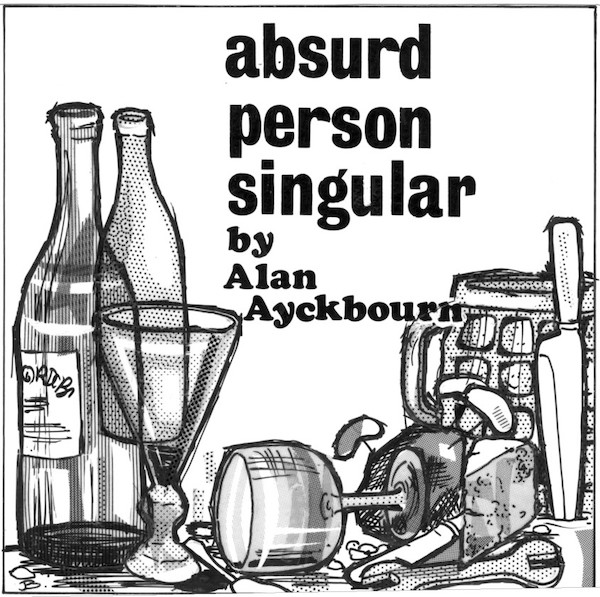

*Absurd Person Singular* is the first world premiere by Alan Ayckbourn at Theatre in the Round at the Library Theatre, Scarborough, to have a promotional image. This lino print, commissioned by Alan Ayckbourn, was only used for flyers though.

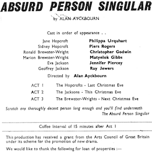

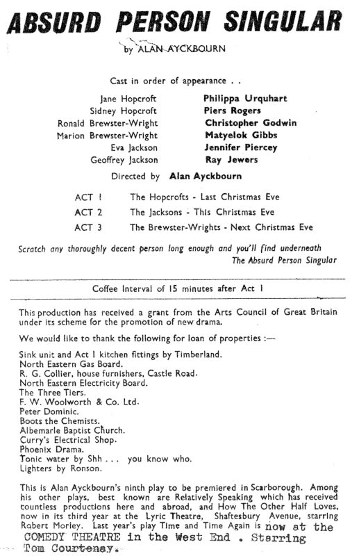

Details from the interior of the programmes for the world premiere of *Absurd Person Singular* at Theatre in the Round at the Library Theatre, Scarborough, listing cast and crew.

**Copyright:** Scarborough Theatre Trust  
**Holding:** Borthwick Institute for Archives

*© Scarborough Theatre Trust, 1972, all rights reserved. Do not reproduce images without permission of the copyright holder.*

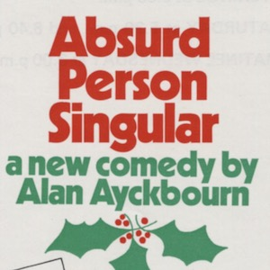

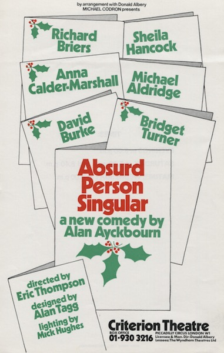

A flyer for the West End premiere of *Absurd Person Singular* at the Criterion Theatre during 1973.

**Copyright:** TBC  
**Holding:** Borthwick Institute For Archives

*Do not reproduce images without permission of the copyright holder.*

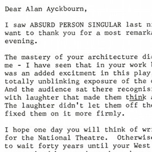

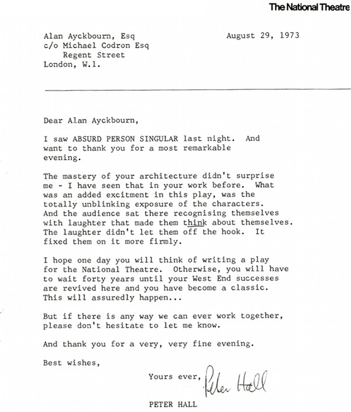

Correspondence from Peter Hall, Artistic Director of the National Theatre, to Alan Ayckbourn congratulating him on Absurd Person Singular, asking him to consider writing a play for the National Theatre.

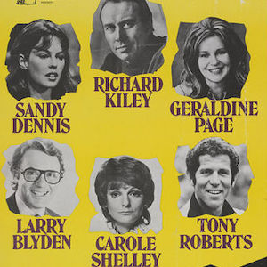

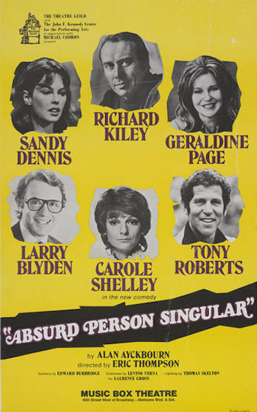

A flyer for the Broadway premiere of *Absurd Person Singular* in 1974: this would go on to become the most successful production of an Ayckbourn play ever staged in New York.

**Copyright:** TBC  
**Holding:** Borthwick Institute For Archives

*Do not reproduce images without permission of the copyright holder.*    *The Scene and Archive Images pages are presented in association with the* ***[Borthwick Institute for Archives](/)*** *at the University of York, where the Ayckbourn Archive is held.*
