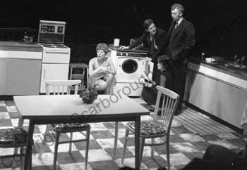
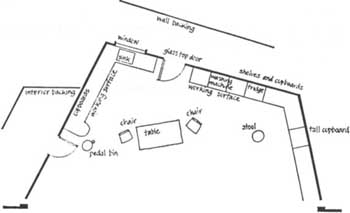
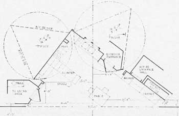

*Absurd Person Singular* is not Alan Ayckbourn’s most complex play to stage but it does pose challenges. The play is set in three palpably different kitchens over three acts. The sets are static for each act with the change from one kitchen to the next occurring between acts.

The play was first performed, in-the-round, at Theatre in the Round at the Library Theatre, Scarborough. The venue had only two stage entrances - hence there are only two exits from each of the kitchens in the play. There were minimal facilities, limited budgets and, being in-the-round, the set could be no taller than waist height. Studio Theatre Company member Heather Stoney recalls: “The same units were used in all three sets - simply moved around in a different configuration as was the gas stove, which was dirtied for the second act.”

During the second act, when Eva attempts to commit suicide, the light fitting was lowered via a cable and the actress playing Eva mimed opening the window: sound effects being used to indicate whether the window was open or closed. Other simple effects such as different chairs also helped to differentiate the kitchens.

This then is the simplest - and cheapest - means of staging the play and was in mind when the play was written. When the play opened in London, it was performed in a proscenium arch space at the Criterion Theatre. The set was designed by Alan Tagg, who decided to install a revolve into the stage containing the substantive part of all three kitchens. The acting space was quite small as a result of having three kitchens on the revolve, but a clever design meant this was not necessarily obvious. An example of the first act kitchen, reprinted from the Samuel French acting edition, can be seen on the right.

When the play premiered on Broadway, the budget had obviously increased as the play utilised two revolves, adjacent to each other, in a set designed by Edward Burbridge. The corner view of the kitchen was retained - as used in London - but the majority of each wall was on its own revolve. The illustration on the right shows each revolve held a triangle, each side being a different kitchen wall. Obviously the double revolve meant that a far larger set could be used incorporating the whole of the stage. The areas of the kitchen not on the revolve were installed with flippers or slides so new surfaces or areas could be revealed. The Act III entrance hall was hidden behind cabinets which slid aside for the final act. Technically this is the most demanding of the sets, yet undoubtedly offers a versatile set for a large stage.

Of course there is no definitive way to stage the play, but each of these three major productions tackled the play in an equally valid way. When *Absurd Person Singular* was revived by Alan Ayckbourn at the Stephen Joseph Theatre In The Round in 1989 and the Stephen Joseph Theatre in 2012, the staging was much as the original demonstrating perhaps that more complex is not necessarily better.

*2) Alan Tagg's design for the Hopcroft kitchen for the 1973 London premiere. (copyright: Alan Tagg, reproduced from the Samuel French edition)*

*3) Edward Burbridge's two revolve design for the Hopcroft kitchen for the 1974 Broadway production. (copyright: Edward Burbridge, reproduced from the Samuel French edition)*
