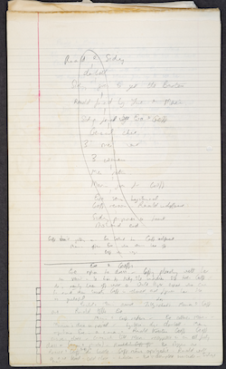
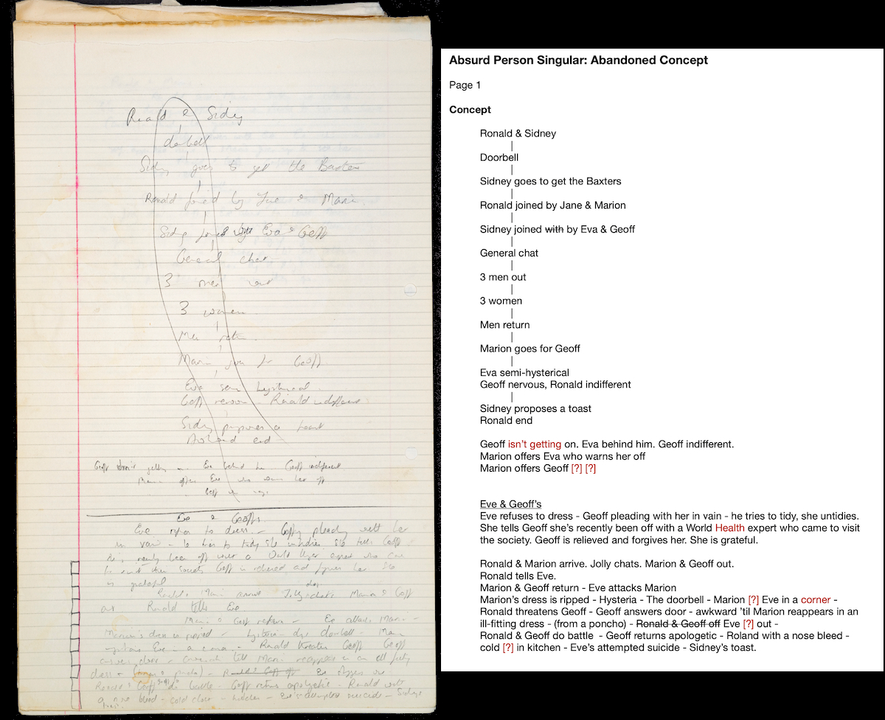
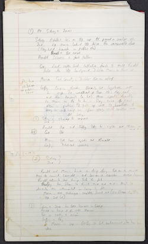
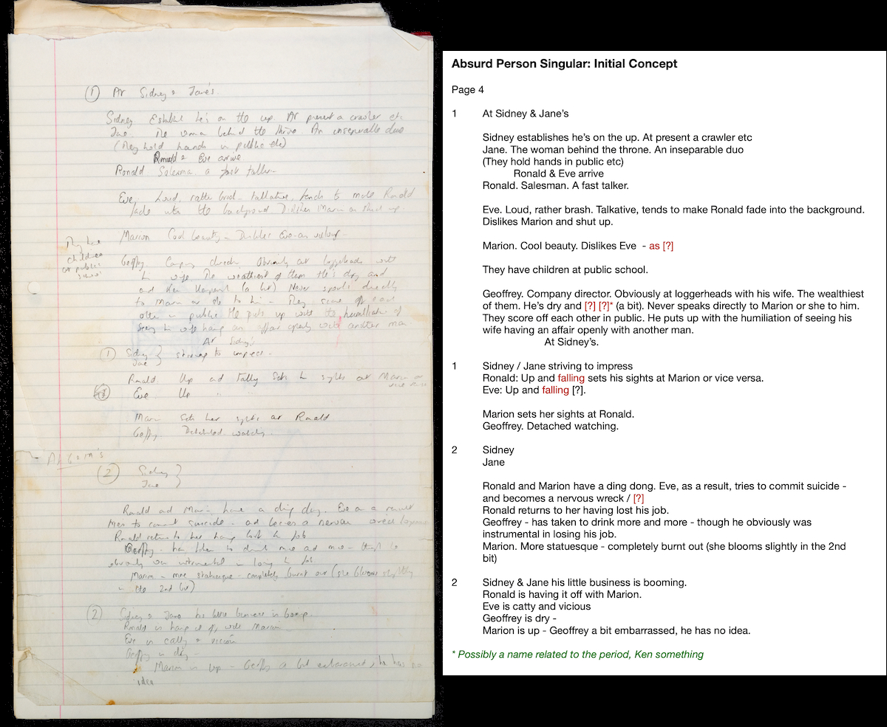
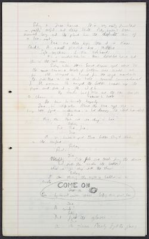
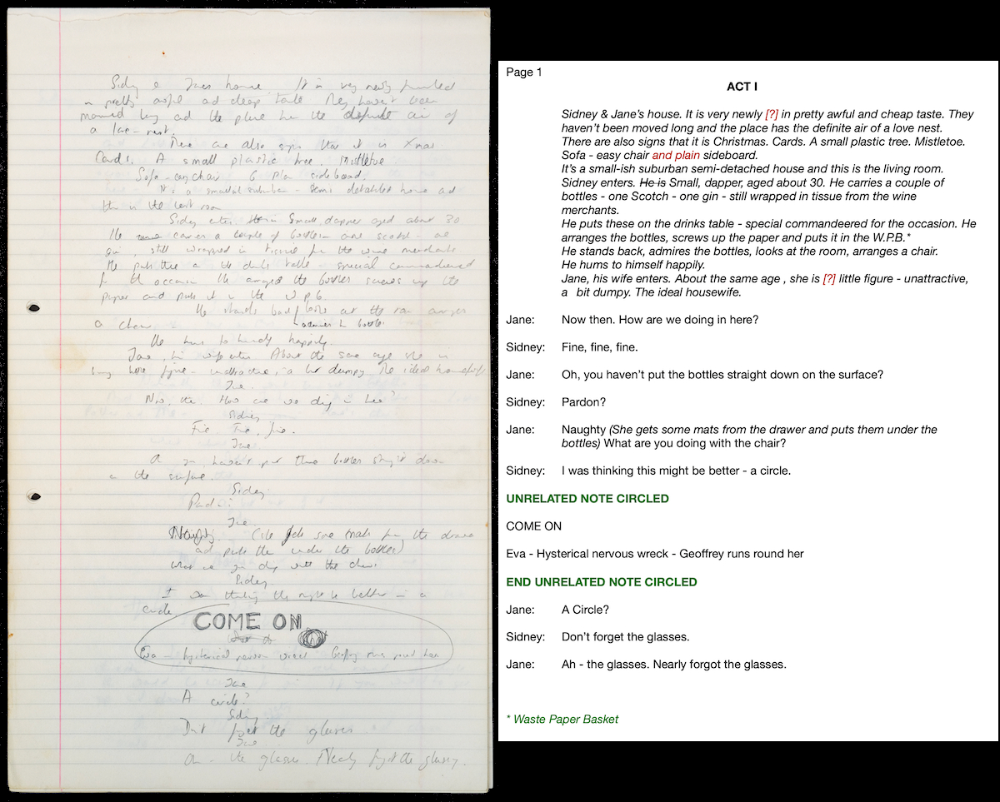
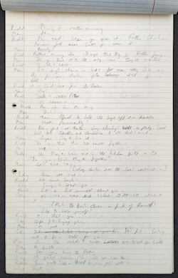
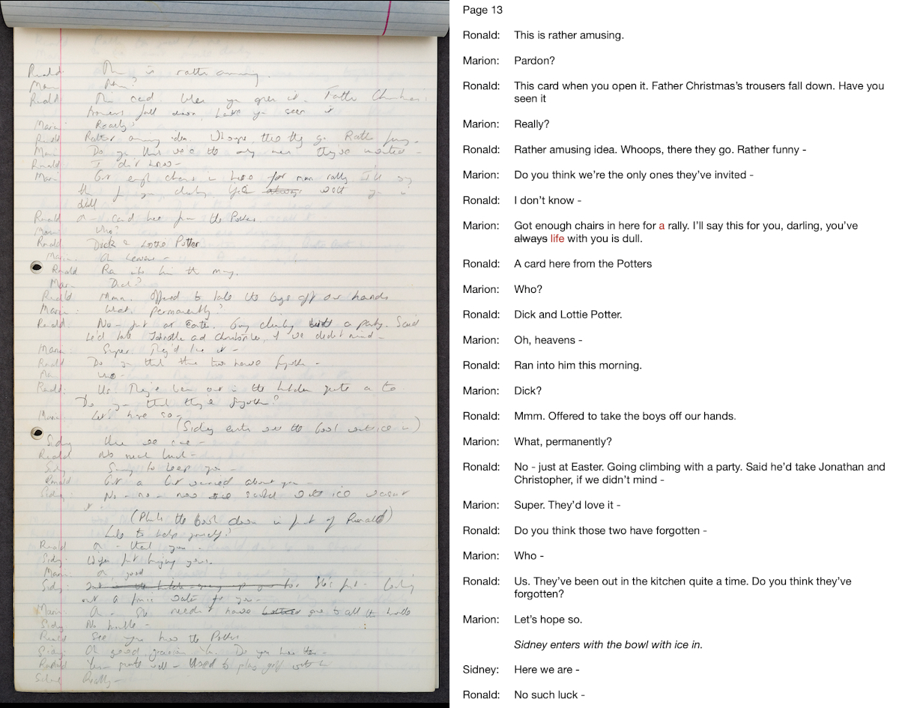
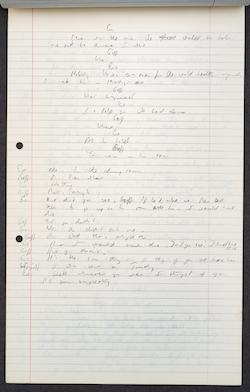
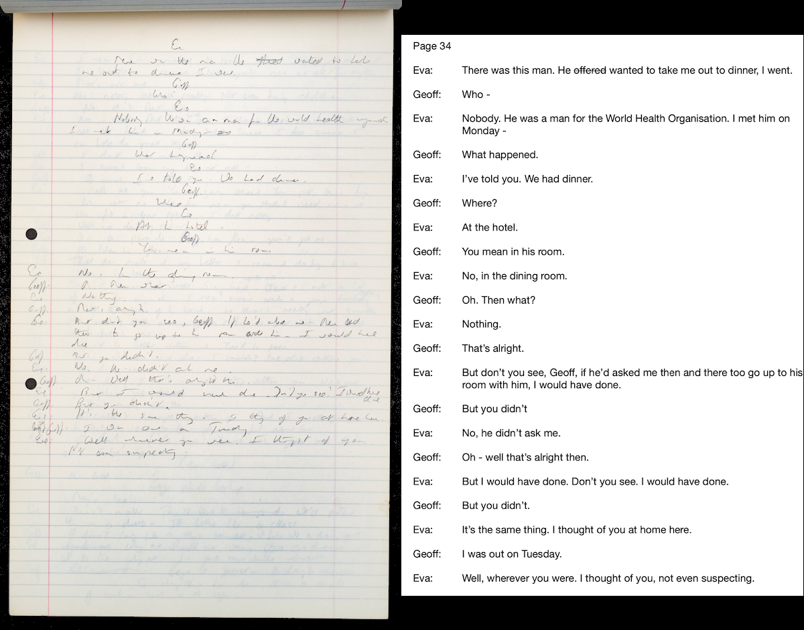

The most significant discovery regarding the history of the writing of *Absurd Person Singular* is a packet of 45 sheets of foolscap paper with Alan Ayckbourn's hand-written, pencil notes. These consist of his earliest concept notes for the play alongside the complete first act and approximately half of the second act of his 'abandoned draft' of the play.

Over a period of several months, the playwright's Archivist - Simon Murgatroyd M.A. - transcribed these pages to unveil the playwright's original intentions for the play; this was a slow process as Alan's handwriting is notoriously difficult to translate and - in several cases - even the playwright himself was baffled as to what he had written!

What emerged is a transcription of approximately 95% of the notes - certain words and phrases have not been possible to transcribe or translate - which offer a clear indication of what the playwright was writing and planning, which is completely different to the play we know today. Whilst character names are largely the same, their motivations and actions are significantly different as are many of the themes explored.

Below are reproduced examples of both the concept pages and the 'abandoned draft', alongside Simon's transcriptions of the relevant pages.

### The Concept Notes

There are four pages of hand-written concept notes split over two pages each. It is difficult to say which are the earliest of the two sets, but given one set contains plot notes recognisable from the 'abandoned draft', this is probably the later of the two pieces.

The initial - longer - notes - are substantially different to both the 'abandoned draft' and are also frequently contradictory: it is not clear when Eva attempts suicide nor whether Sidney works for the same business as Ronald and Geoff.

- Act I is set at Sidney and Jane's house, they are described as inseparable and she is the power behind the throne.
- Ronald and Eva are a couple - he a fast-talking salesman, she loud and brash and dislikes Marion.
- Geoff and Marion are a couple with her a 'cool beauty' and Geoff a company director at loggerheads with Marion and her affairs.
- By Act II, Eva has attempted suicide (presumably off-stage) and Ronald has lost his job.
- Geoff is drinking heavily and was instrumental in Ronald losing his job.
- Sidney and Jane's business is booming.
- Ronald and Marion are having an affair.
- By Act III, Ronald is financially ruined and borrowing from Sidney.
- Eva has attempted suicide (contradicting earlier notes).
- There are notes indicating Sidney goes up in the world whilst Jane is left behind.

The second set of notes are briefer - almost bullet points - but resemble certain plot points from the 'abandoned draft' indicating where the play would have ended up; actually quite close to the as-written third act of the play.

- Each act is set in a different house.
- Eva is described as 'semi-hysterical', Geoff 'nervous' and Ronald 'indifferent'. Geoff is not getting on at work.
- In Act II - at Eva and Geoff Baxter's house - Geoff and Eva are argumentative.
- Eva reveals she nearly had an affair with a work colleague.
- Ronald tells Eva that Geoff and Marion are having an affair.
- Eva attacks Marion and Ronald threatens Geoff before a fight between the two breaks out. Eva attempts suicide off-stage.
- Sidney and Jane are not mentioned in the Act II notes.
- By Act III - set at Ronald and Marion Brewster's house - Marion is now an alcoholic, cared for by Eva.
- Sidney and Jane arrive and insists they all play games.

### The Abandoned Draft

Written over 40 pages, the abandoned draft includes the entirety of Act I (30 pages) and a third to a half of Act II (10 pages). There is very little material or dialogue which crosses over with the actual play with substantial and significant differences to the plot. This is a brief breakdown of notable differences to the final play.

- **Act I:** It is set in the Hopcroft's living room, not the kitchen.
- Despite Alan Ayckbourn repeatedly stating the 'abandoned draft' featured a fourth couple on-stage, the Potters, they are neither seen on-stage nor heard off-stage.
- The other couples surnames differ and are Brewster and Baxter - as opposed to Brewster-Wright and Jackson in the actual play.
- Sidney is a grocer who aims to expand his business ventures by buying land on a new, nearby estate.
- Sidney does not known Mr Brewster's christian name.
- Sidney keeps a detailed model of his plans for the estate run his bedroom, which he shows to Ronald and Geoff.
- The relationship between the Brewsters and the Baxters is different to the actual play and contradicts itself. Initially, Geoff is named as a constant presence in the Brewster's house with whom it is implied Marion has had an affair. Later, Marion recognises Geoff from an amateur operatic company with the implication that Marion finds Geoff very attractive.
- Eva Baxter's name alternates between Eve and Eva throughout the manuscript.
- The Baxters live across the way from the Hopcrofts.
- The Baxter's dog is called Henry, not George.
- The Baxter's relationship is far more combative. Eva is on medication, but is being taken off it by her Doctor.
- Eva runs a play-school whilst Geoff works in displays at the local department store.
- One of the major themes is money and talent - the haves and have-nots - with Eva diametrically opposed to Marion in beliefs and politics.
- Marion offers to put in a word for Geoff to help get him promoted with the implication she expects compensation…
- Eva storms out of the house at one point.
- Henry the dog digs up the entire front garden, which Sidney mistakes for vandalism.
- Act I ends with Sidney giving a speech about making new bonds of friendship.

- **Act II:** It is set in the Jackson's living room, not the kitchen.
- The Baxters are now referred to as the Jacksons and Henry the dog has been renamed George.
- Eva is depressed and frequently self-loathing but is extremely verbose throughout the act - not silent and suicidal as in the actual play.
- Eva talks about recently going out for a meal with a colleague and nearly having a one-night stand.
- Marion is not drinking as frequently as in the actual play.
- Sidney employed Geoff to draw up plans for the site he bought, but which he then sold untouched for a massive profit - there is a resentment from the Jacksons although Ronald is impressed by Sidney's business acumen.
- Geoff has been promoted thanks to Ronald's intervention, although it transpires he would have been promoted anyway.
- Ronald reveals to Eva that Geoff and Marion are having an affair - she is completely unaware.
