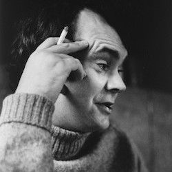
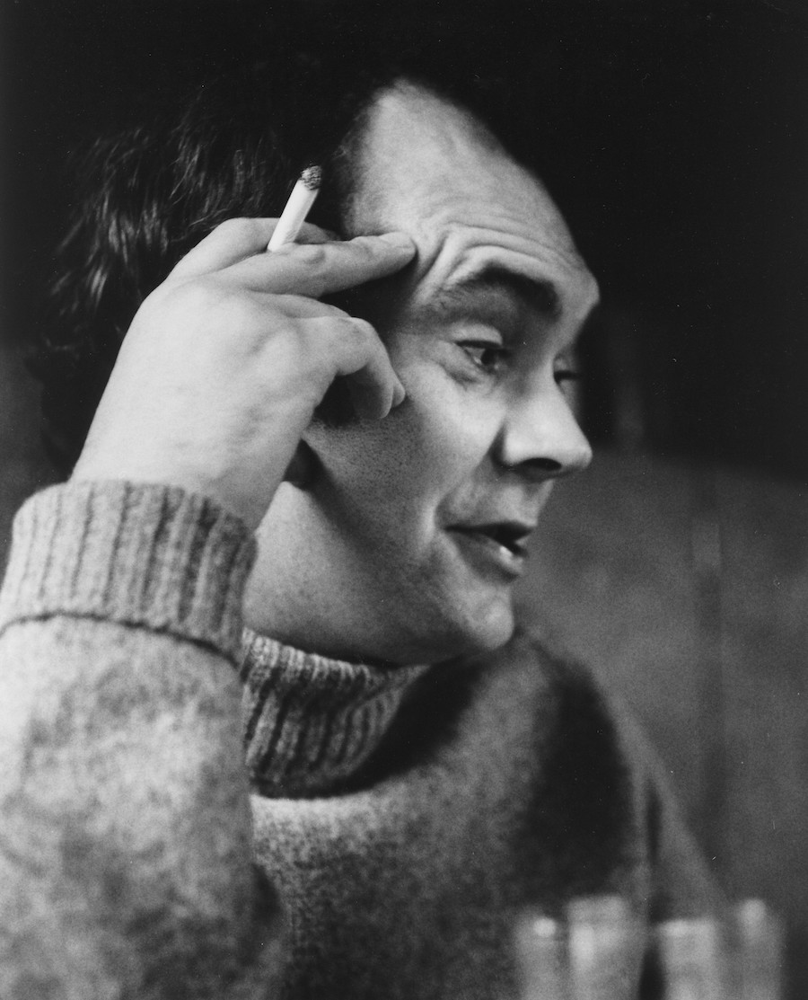
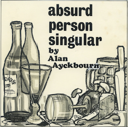
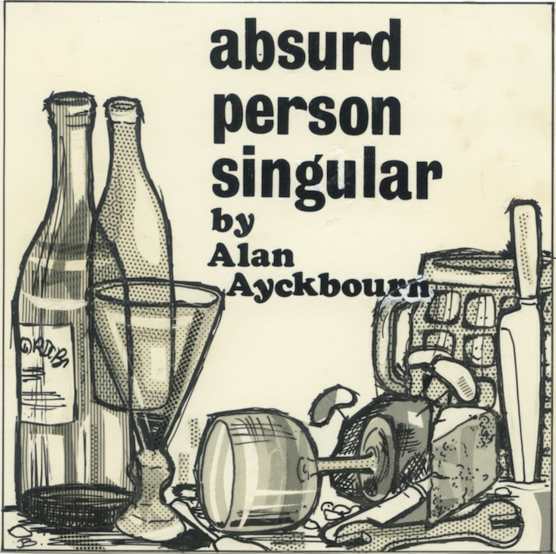
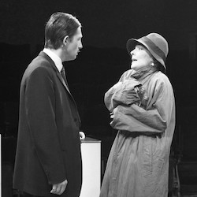
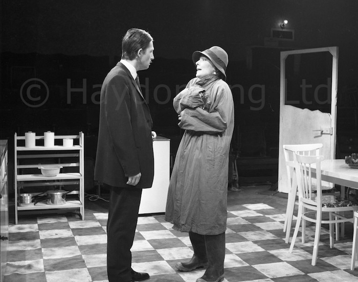
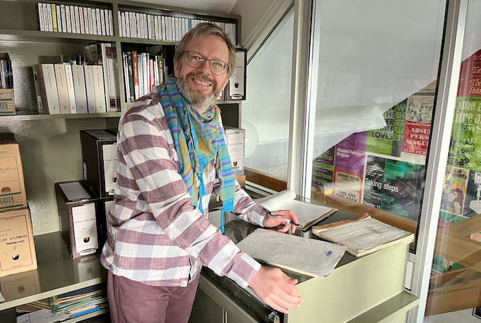

*"When I came to write Absurd Person Singular, I started by setting the action in Jane and Sidney Hopcroft's sitting room, I was halfway through the first act before I realised I was viewing the evening from totally the wrong perspective. By a simple switch of setting to the kitchen, the problem was all but solved, adding incidentally far greater comic possibilities than the sitting room ever held. For in this particular case, the obvious offstage action was far more relevant than its onstage counterpart." Alan Ayckbourn (1977)*

For more than 45 years, this has been the received wisdom of how Alan Ayckbourn wrote his seminal play, *Absurd Person Singular*. He began writing a three-act work set in the sitting rooms of three couples joined by an additional on-stage fourth couple. This was then abandoned - approximately 10 pages into the first act according to published recollections by the playwright - to be rewritten as a play with three couples set in three kitchens.

Except this isn't entirely accurate. In 2022, the playwright's Archivist, **[Simon Murgatroyd M.A.](/plays/absurd-person-singular/writing/simon-murgatroyd)**, working in association with the **[Borthwick Institute for Archives](/plays/absurd-person-singular/writing/the-ayckbourn-archive)** at the University of York, unsealed two packets of handwritten notes, essentially unopened since the mid-1970s and long since forgotten by the playwright himself.

These contained approximately 150 pages of handwritten, foolscap notes in pencil by Alan Ayckbourn. They included several pages of concept notes for *Absurd Person Singular*, an all but complete hand-written first-draft with more than half-an-hour of material later cut from the play and, most significantly, 40 pages of the 'abandoned draft' - written up to midway through the second act. Nothing at all like the playwright's previous descriptions of it.

This astonishing find completely changed the history of *Absurd Person Singular* and is unique in the Ayckbourn Archive: here was a work conceived completely differently with half an abandoned play in existence, which is virtually unrecognisable from the almost complete handwritten first draft of the play with which we are familiar with today.

Even the playwright himself was impressed by the discovery and the retelling of the journey of the play, which he himself had forgotten.

“A little over a decade ago, the Borthwick acquired my Archive with untold thousands of documents collected over more than five decades. My hope was always it would be an archive to be actively enjoyed and which would reveal the previously untold history of my plays.

“It’s exciting to know that on the 50th anniversary of the world premiere of *Absurd Person Singular*, the Borthwick and my Archivist have re-discovered my earliest notes and drafts of the play - which had long since passed from my own mind!

“Whilst my focus is ever forward and always on my next play, I’m delighted that the archive exists at York for people to come and make similar discoveries of the many things that have been forgotten over time - I’m sure there is much still to discover!”

The original lino-cut for the flyer for the world premiere of *Absurd Person Singular* in 1972. Held in a private collection & gratefully reproduced.

Alan Ayckbourn's Archivist, Simon Murgatroyd, working with the *Absurd Person Singular* manuscripts © Kath Dunn-Mines  Further archival research and new acquisitions by the Ayckbourn Archive have resulted in these handwritten notes being supplemented by a world premiere rehearsal manuscript, an actor's manuscript from the world premiere - which includes the playwright's substantive cuts after the first night - as well as a definitive production script from the acclaimed West End premiere production.

Simon Murgatroyd M.A., the playwright's Archivist, emphasised the significance of the discovery and acquisitions both in understanding the play as well as for the Ayckbourn Archive.

"This is the sort of find Archivists dream of making and it was astonishing to read these hand-written pages and realise we had found Alan's long believed lost abandoned draft of the play. This discovery highlights the rare occasion when the playwright gets it wrong, corrects himself and goes on to produce an acknowledged classic of British Theatre. Alongside the discovery of the previously unknown substantial cuts following the first performance of the play, for the first time, in conjunction with the Borthwick Institute for Archives, we can tell the complete story of how this extraordinary piece of British theatre came to be created."

Gary Brannan, Keeper of Archives and Research Collections at the Borthwick Institute for Archives, said: “We are absolutely delighted to have been able to support and facilitate this amazing discovery, which has totally changed our perception of Sir Alan’s early work. It was a really exciting moment when Simon told us about what he’d found! Sir Alan’s archive is a huge resource full of potential moments like these and is an incredible record of a groundbreaking career. The archive is there for everyone to use, be it for study, research or simple enjoyment. We can’t wait to hear about the next big discovery in the archive!”

The handwritten manuscript pages are held in the Ayckbourn Archive in the Borthwick Institute for Archives at the University of York and available to access by the public. They will be joined in 2023 by the production manuscripts for the world and West End premieres of the play, bringing together the full story of the play for the first time ever.
