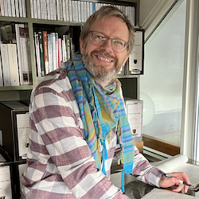

<aside>

Simon Murgatroyd M.A.

Alan Ayckbourn's Archivist, Simon Murgatroyd, working with the *Absurd Person Singular* manuscripts © Kath Dunn-Mines

</aside>

The discovery of the *Absurd Person Person singular* manuscript pages was driven by Alan Ayckbourn's Archivist, **[Simon Murgatroyd M.A.](http://www.simon-murgatroyd.com/)**, working with the Borthwick Institute for Archives at the University of York.

Simon has been the playwright's Archivist since 2005 and created the playwright's official website **[www.alanayckbourn.net](/)** in 2002, which he administers, develops, researches and writes for. He is regarded as one of the world's foremost experts on Alan Ayckbourn and his plays with a particular speciality in the playwright's early writing. In 2007, he was responsible for finding Ayckbourn's lost second play, *Love After All*, in conjunction with the British Library.

He is the author of ***[Unseen Ayckbourn](/)***, which has been published in several edition and looks at the playwright's withdrawn, unpublished and unwritten works as well as abandoned versions of scripts, alternative versions of plays and titles, unwritten concepts and ideas as well as other ephemera. His articles on Alan Ayckbourn have been published around the world including in programmes for the world, West End and New York premieres of the plays.

In 2021, he contacted the Borthwick Institute with regard to *Absurd Person Singular* having recalled two unopened packets of hand-written notes, apparently relating to the play, which were handed over to the Borthwick as part of the transfer of the Ayckbourn Archive in 2011; the notes had previously been held in a bank vault in Leeds and were unseen since the mid-1970s.

Wondering if they might hold something of significance for the 50th anniversary of the play in 2022, Simon spoke with Gary Brannan - Keeper of Archives and Research Collections at the Borthwick Institute - who arranged to have high resolution images taken of all the hand-written pages. The result was above and beyond anything which could have been reasonably expected.

Simon's predominant hope was that the ten pages of the abandoned draft might have survived, which the playwright has mentioned in interviews over the decades. Instead of 10 pages, he found approximately 45 pages dedicated to the concept of the play and the abandoned draft; far in excess of anything the playwright had ever publicly mentioned. Alongside this was the discovery of a near complete first hand-written draft of the actual play. The discovery completely rewrites the history of the creation of *Absurd Person Singular*.

This then led to the discovery of the long-believed lost and little-known material which was cut from the play following its world premiere performance at the Library Theatre, Scarborough, in 1972. More than half-an-hour of dialogue was cut between the first and second performance; a unique occurrence for an Ayckbourn play.

Simon considers the *Absurd Person Singular* discovery alongside the recovery of *Love After All* to be the highlights of his two decades as an Archivist.

Having transcribed the 'abandoned draft' of *Absurd Person Singular* for the 50th anniversary, Simon intends to work on the first draft of the manuscript in the future and to make many more discoveries regarding the most significant play in the Ayckbourn play canon.

You can find out more about Simon and his work as Archivist and professional writer on his professional website, **[www.simon-murgatroyd.com](http://www.simon-murgatroyd.com/)**.
