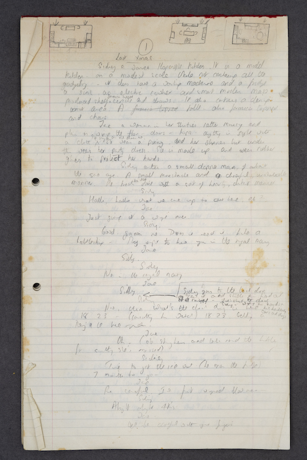
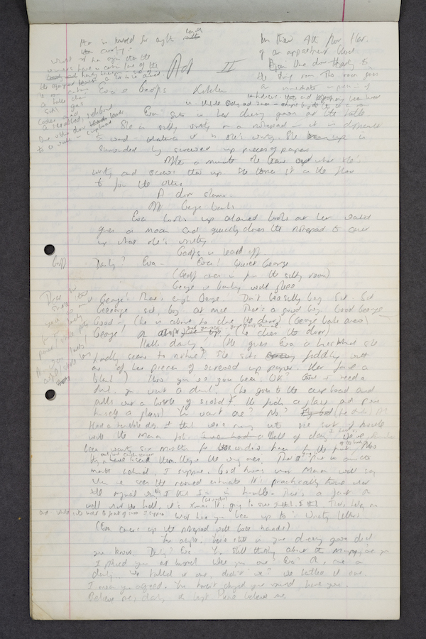
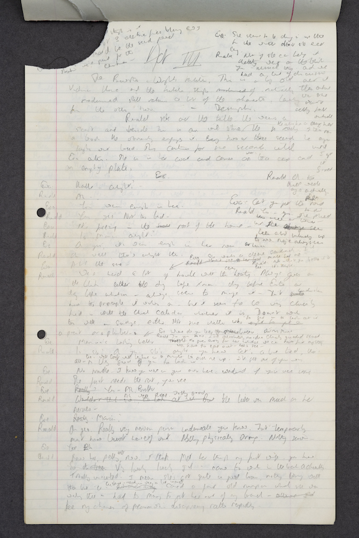
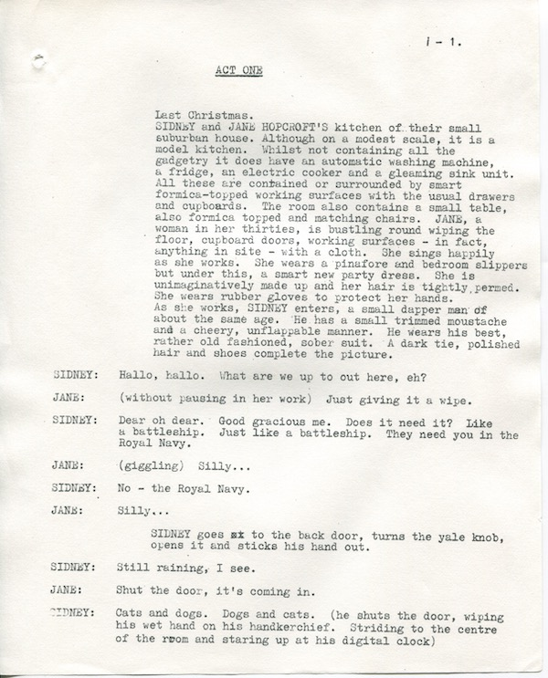
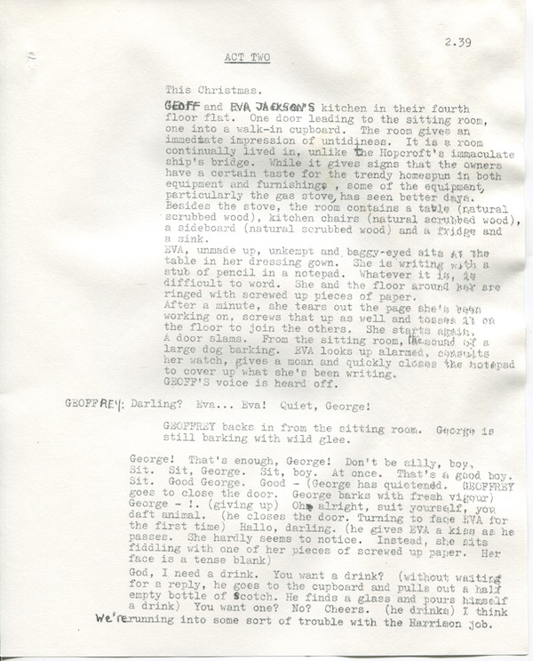
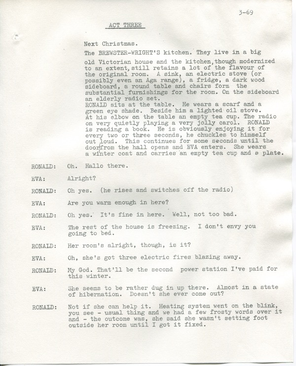
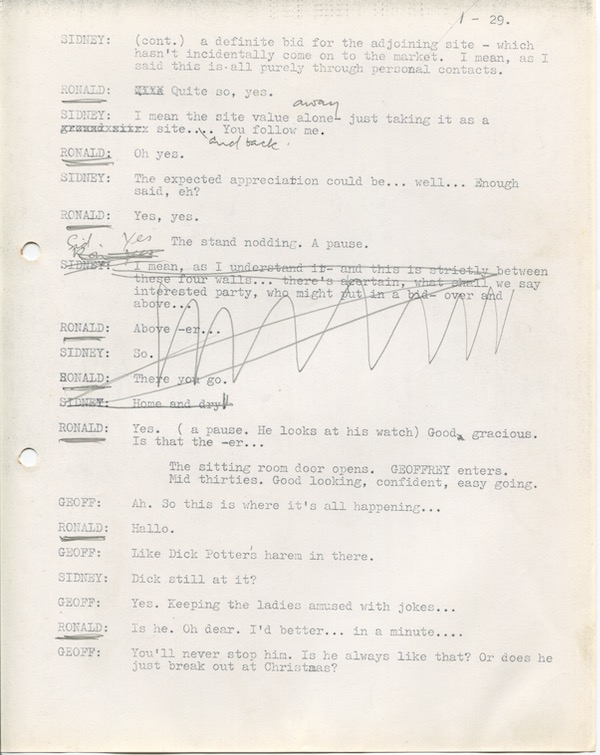
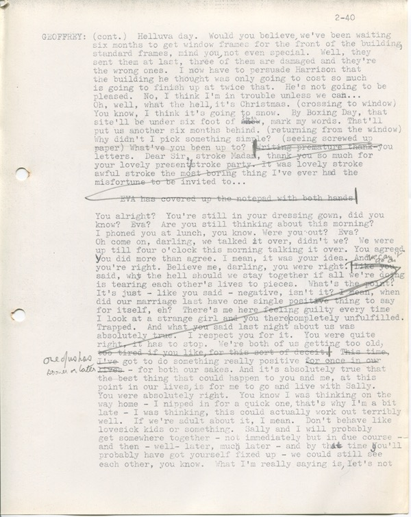
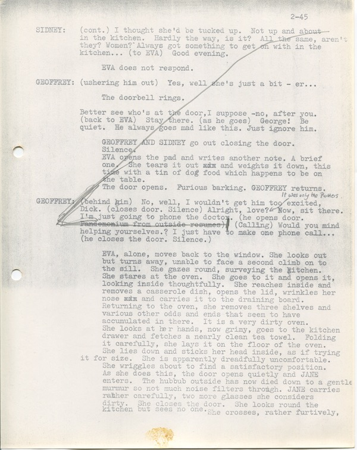
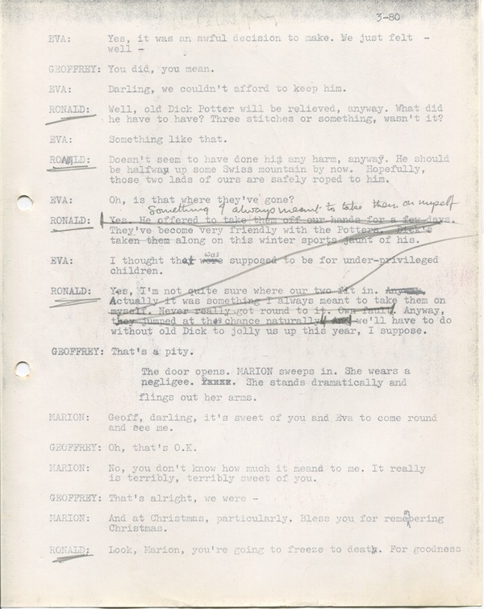

The two packets of hand-written material on foolscap also contained an almost complete first draft of the actual play as we know it today. As is common with practically all of Alan's first drafts, there is very little significant difference between it and the play as performed - with the exception of the material which was cut after the first performance.

The front page includes three thumbnail sketches of the layout of the set for each act (see below) and the stage directions and dialogue are instantly recognisable from the play as published today. The handwritten draft runs to 53 pages and finishes just before the Hopcrofts begin the play's climax of the party game. There are an additional five loose manuscript pages which pertain to the final act and include dialogue both before and after the previously mentioned break in the script.

What makes *Absurd Person Singular* interesting from an archival and research perspective is the existence of different versions of the actual play. So in addition to the concept notes and 'abandoned draft', the archive also contains Alan Ayckbourn's hand-written first draft of *Absurd Person Singular*, a clean production copy of the manuscript for rehearsals, a cut and amended actor's copy of the rehearsal manuscript which includes Alan Ayckbourn's substantial edits after the first performance, a stage manager's copy of the West End production of the play - by which point the play was in its definitive form - as well as several published versions of the play from the UK and the USA.

It is rare for Alan Ayckbourn to make any substantive or notable edits or cuts to a script once the play goes into rehearsals, which makes *Absurd Person Singular* both interesting and practically unique as we have both a clean copy of the rehearsal manuscript and an actor's manuscript which includes all the cuts, edits and amends made by Alan Ayckbourn; he would excise approximately half-an-hour of material from the play following the first performance - this cut material has previously been thought lost - including a substantial amount of dialogue from Geoff's opening monologue in Act II.

The clean rehearsal manuscript was discovered by Alan's archivist, Simon Murgatroyd M.A., in 2019 and the playwright has agreed to incorporate it into the Ayckbourn Archive at the Borthwick Institute for Archives. The actor Christopher Godwin - who played Ronald in the original production - donated his rehearsal manuscript to the Archive after attending a 50th anniversary event for the play and the West End manuscript was anonymously donated to Alan Ayckbourn.

Whilst the handwritten first draft is obviously of huge significance, the two production scripts from the world premiere are, from a research perspective, very important. It is not widely known that the first night of *Absurd Person Singular* was a unique performance with substantial amounts of material which were never performed again. From an archival perspective, there is no other Ayckbourn play where half-an-hour of dialogue was immediately cut; the only comparison is with plays which were produced as intended but Alan then returned to and edited many years later such as *It Could Be Any One Of Us* (1983 revised 1996) and *Body Language* (1990 revised 1999).

It was presumed the excised material was completely lost and researchers would never have this insight into either the first performance or the pristine, unedited script. That we now have the unedited script and an actor's manuscript showing all the definitive edits and amends and how the script altered from the first night again makes *Absurd Person Singular* unique in the Ayckbourn Archive and the playwright's long career.
