A collection of archive material, posters, rehearsal and production images pertaining to Alan Ayckbourn's *Bedroom Farce*. The Archive Images page is presented in association with the **[Borthwick Institute for Archives](/)** at the University of York where the Ayckbourn Archive is held. Click on an image to expand.

### Bedroom Farce (1975)

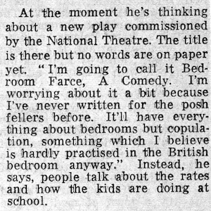

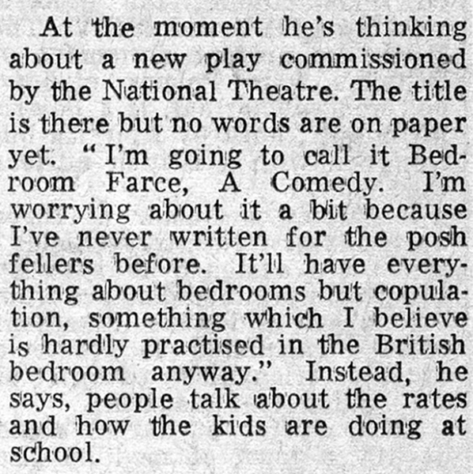

The first public mention of *Bedroom Farce* was in an interview with Alan Ayckbourn published in The Times on 30 June 1974. Within the interview he gives its original intended title *Bedroom Farce, A Comedy*.

**Copyright:** Times Media Ltd  
**Holding:** Borthwick Institute for Archives

*Do not reproduce images without permission of the copyright holder.*

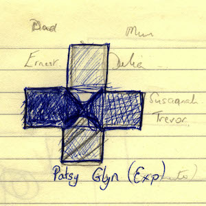

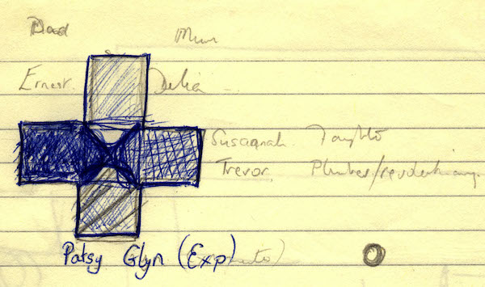

The earliest notes relating to *Bedroom Farce* are this sketch of a cruciform set with four beds which was discovered on the back of a manuscript page on his previous work, *Jeeves*, dating to spring 1975.

**Copyright:** Haydonning Ltd  
**Holding:** Borthwick Institute for Archives

*Do not reproduce images without permission of the copyright holder.*

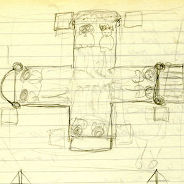

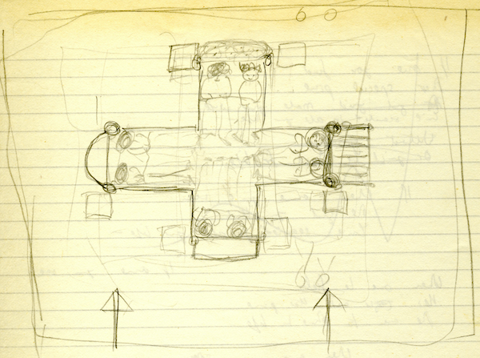

The previous notes for *Bedroom Farce* are expanded here with more details for a set including four beds in a cruciform shape; for the final play, Alan reduced the set to three beds. This note also includes early ideas for character names, several of which are different to the finished play.

**Copyright:** Haydonning Ltd  
**Holding:** Borthwick Institute For Archives

*Do not reproduce images without permission of the copyright holder.*

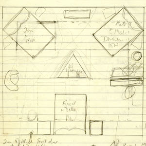

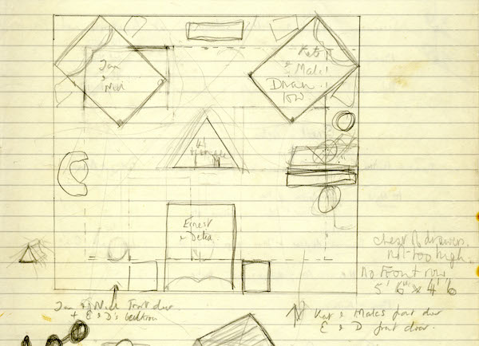

Alan Ayckbourn originally intended the premiere production of *Bedroom Farce* to be performed in-the-round at Theatre in the Round at the Library Theatre, Scarborough, and this is his own unused plan for the in-the-round staging. Unfortunately, the set proved too big for the space and it had to be changed to a three-sided production.

**Copyright:** Haydonning Ltd  
**Holding:** Borthwick Institute For Archives

*Do not reproduce images without permission of the copyright holder.*

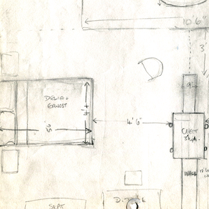

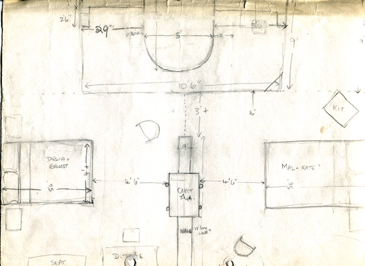

Alan Ayckbourn's sketch of the amended three-sided set for the world premiere of *Bedroom Farce* at Theatre in the Round at the Library Theatre, Scarborough, during 1975.

**Copyright:** Haydonning Ltd  
**Holding:** Borthwick Institute For Archives

*Do not reproduce images without permission of the copyright holder.*

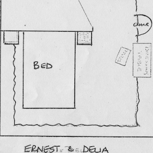

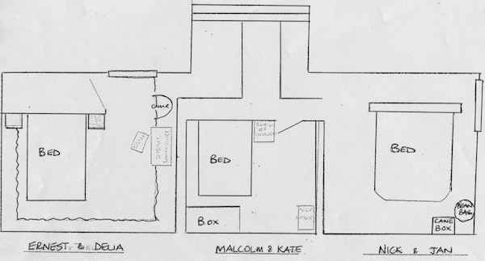

Alan Ayckbourn's sketch for the end-stage stage design of *Bedroom Farce* in the Lyttelton at the National Theatre in 1977.

**Copyright:** Haydonning Ltd  
**Holding:** Borthwick Institute For Archives

*Do not reproduce images without permission of the copyright holder.*

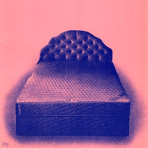

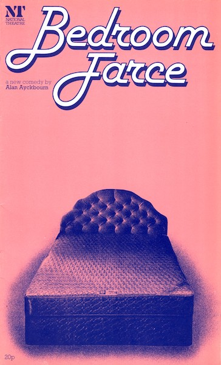

The programme cover for *Bedroom Farce* at the National Theatre in 1977. This was one of several designs utilised by the National Theatre for the play's runs at the National Theatre, in the West End and on Broadway.

**Copyright:** National Theatre  
**Holding:** Borthwick Institute for Archives

*Do not reproduce images without permission of the copyright holder.*

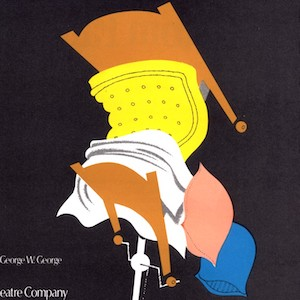

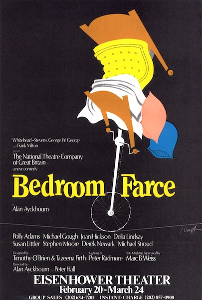

A flyer for the National Theatre's North American transfer of *Bedroom Farce*, which would see Alan Ayckbourn making his debut as a director on Broadway.

**Copyright:** National Theatre  
**Holding:** Borthwick Institute for Archives

*Do not reproduce images without permission of the copyright holder.*  
*The Scene and Archive Images pages are presented in association with the* ***[Borthwick Institute for Archives](/)*** *at the University of York, where the Ayckbourn Archive is held.*

*All images on this page are copyright of the respective and labelled individual / organisation and should not be reproduced without permission.*    
*All images are copyright of the respective individual / organisation and should not be reproduced without permission.*
