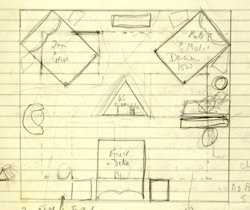
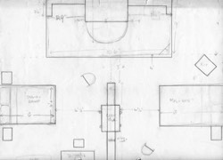
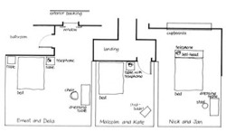
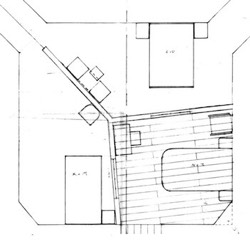
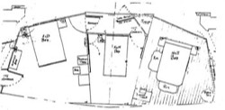

*Bedroom Farce* is design-wise and technically far more complex than it first appears. This is largely due to the cinematic nature of the piece where there are frequent short scenes moving swiftly from one bedroom to the next. The play was commissioned for the end-stage and is considered one of Alan's five end-stage plays; it is notable that in the end-stage, the use of cross-cutting and fading through lights does enhance the play's cinematic feel.  
Unlike other Ayckbourn end-stage plays, such as *Virtual Reality* and *A Small Family Business* though, *Bedroom Farce* can work successfully in other spaces and to this day remains the only play the writer has directed in the round, the end-stage and thrust.

The stage is described as follows in the published script.

*“The first bedroom is Ernest and Delia's. It is large and Victorian, in need of re-decoration. The furniture, including a double bed, bedside tables, dressing-table, etc., are all sturdy, unremarkable family pieces. There is a phone by the bed. A door leads to the landing and the rest of the house, another to a bathroom.  
The second bedroom is Malcolm and Kate's. This is smaller, probably a front bedroom in a terrace house which they are in the process of converting. It is sparsely furnished, a brand new bed, unmade, being the centrepiece. There is in addition a small stepladder. One of the walls has been re-papered, the rest are stripped. In one corner is a cardboard package, unopened.  
There is a phone by the bed. One door leads to the landing, and the rest of the house.  
The third bedroom is Nick and Jan's. This is furnished in a more trendy style, with a brass bedstead and some interesting antique stuff. There are rugs on the floor and a phone by the bed. A single door leads off to the bathroom and everywhere else.”*

As the description indicates, *Bedroom Farce* utilises a composite set; a set which features multiple fixed locations in one space. This is relatively rare in Alan's plays and can pose important problems for the designer. Here Alan Ayckbourn explains why he chose to use a composite set and the potential pitfalls they can pose.

*“These \[composite sets\] do work occasionally: I employed them in Bedroom Farce and Wildest Dreams. However, Bedroom Farce was actually written that way only because Peter Hall had asked me to write something for the newly completed Lyttelton Theatre, and I could not for the life of me think how to fill that big wide stage. So I divided it into three and wrote a play set in three different bedrooms.  
The problem with composite sets, if you're not careful, is that apart from dividing the stage, they also divide the audience. Especially if, like me, you write for the round or an open stage. Some of the audience will have one of the sets continually in their foreground. Therefore, if the stage contains three separate locations, say, those people will be watching two thirds of the action across the distance of another set. Moreover, they will tend, because it's in their foreground, to regard this set as being the most important one even when you don't. In addition, because of the demands of the play, this set closest to them may occasionally have characters not currently in use, sleeping, dreaming, relaxing, or generally frozen, trying to keep a low profile so as not to distract from the far scene that's in progress.  
The result of this, as I say, is a divided audience: a defocusing of attention. For some reason, audiences always find anyone frozen or doing very little on stage utterly riveting, despite the best efforts of the main protagonists who are giving their all in another part of the stage.”  
Alan Ayckbourn*

**Bedroom Farce's Different Permutations**  
*Bedroom Farce* was commissioned by Peter Hall specifically for the end-stage Lyttelton at the National Theatre. The play was written with this space in mind - along with the proviso it would premiere at the Library Theatre, Scarborough. The Library Theatre was in-the-round and Alan intended to stage the play this way. A sketch discovered in 2009, shows Alan's original design for the play in the round (fig.1). Unfortunately when the set was being built, it was realised it would not fit in the round and so had to be rapidly redesigned for performance in the thrust in the Concert Room at Theatre in the Round at the Library Theatre (not, as has sometimes been incorrectly stated, the smaller lecture room at the venue) (see fig.2).

In 1977, *Bedroom Farce* opened in the Lyttelton at the National Theatre in its intended end-stage design (fig.3); it can be strongly argued the play suits this space best and works most effectively end-stage.

In 2000, Alan Ayckbourn had the opportunity to revive the play at the Stephen Joseph Theatre, Scarborough, choosing to stage it in The Round and effectively finally getting the opportunity to do what he intended in 1975. The 2000 stage design (fig.4) is very different though to the original 1975 concept (fig.1). The production also toured in 2001 and as a result, Alan re-directed the play for a limited run in the Stephen Joseph Theatre's end-stage space, The McCarthy, which then went on an end-stage tour. Designer Pip Leckenby, who had designed the round production, produced an end-stage design (fig.5) that not only reflected Alan's needs for the end-stage production, but which was adaptable to the needs of different venues.

*(1) Alan Ayckbourn originally intended to stage Bedroom Farce at Theatre in the Round at the Library Theatre, Scarborough, in the round. This is a rare sketch of the proposed but never realised staging.  
(copyright: Alan Ayckbourn)*

*(2) Unable to produce the world premiere in the round Theatre in the Round at the Library Theatre, Alan Ayckbourn adapted the stage for thrust performance with the audience on three sides of the set.  
(copyright: Alan Ayckbourn)*

*(3) Bedroom Farce was commissioned by the National Theatre for The Lyttelton and this design shows how the play looked for its original end-stage production.  
(copyright: National Theatre)*

*(4) Alan Ayckbourn revived Bedroom Farce at the Stephen Joseph Theatre, Scarborough in 2000. For the first time he was able to stage it in the round in a design by Pip Leckenby.  
(copyright: Pip Leckenby)*

