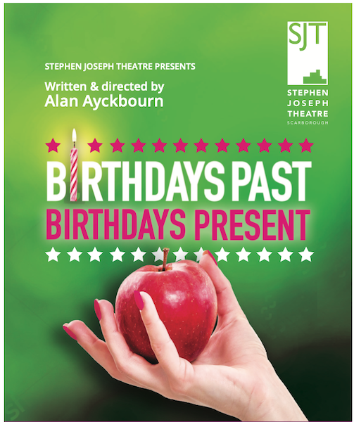
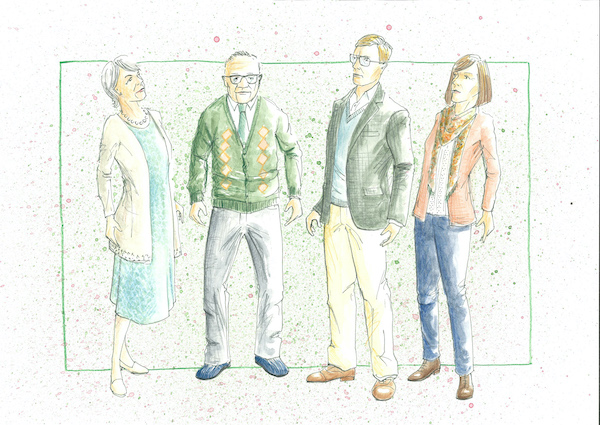
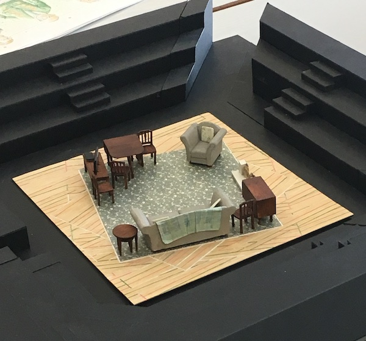

A collection of archive material, posters, rehearsal and production images pertaining to Alan Ayckbourn's *Birthdays Past, Birthdays Present*.The Archive Images page is presented in association with the **[Borthwick Institute for Archives](/)** at the University of York where the Ayckbourn Archive is held. Click on an image to expand.

### Birthdays Past, Birthdays Present (2019)

An unused concept design for the poster for the 2019 world premiere of *Birthdays Past, Birthdays Present* at the Stephen Joseph Theatre, Scarborough.

**Copyright:** Scarborough Theatre Trust  
**Holding:** The Bob Watson Archive

*Do not reproduce images without permission of the copyright holder.*

The poster for the world premiere of *Birthdays Past, Birthdays Present* at the Stephen Joseph Theatre, Scarborough, in 2019.

**Copyright:** Scarborough Theatre Trust  
**Holding:** Ayckbourn Digital Archive

*Do not reproduce images without permission of the copyright holder.*

Costume designs by Kevin Jenkins for the first scene of the world premiere of *Birthdays Past, Birthdays Present* at the Stephen Joseph Theatre during 2019.

**Copyright:** Kevin Jenkins  
**Holding:** The Bob Watson Archive

*Do not reproduce images without permission of the copyright holder.*

Kevin Jenkins model box for the design of the set for scene 1 of the world premiere of *Birthdays Past, Birthdays Present* at the Stephen Joseph Theatre, Scarborough, in 2019.

**Copyright:** Kevin Jenkins  
**Holding:** Ayckbourn Digital Archive

*Do not reproduce images without permission of the copyright holder.*  
*The Scene and Archive Images pages are presented in association with the* ***[Borthwick Institute for Archives](/)*** *at the University of York, where the Ayckbourn Archive is held.*

*All images on this page are copyright of the respective and labelled individual / organisation and should not be reproduced without permission.*  
