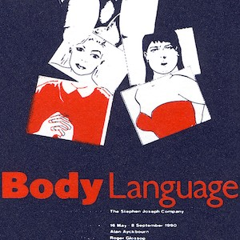
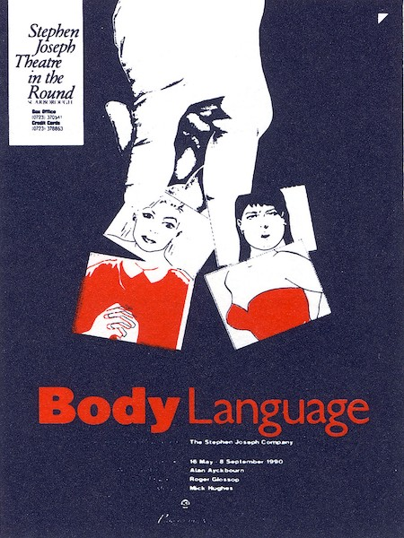
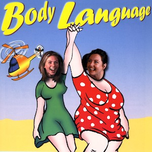
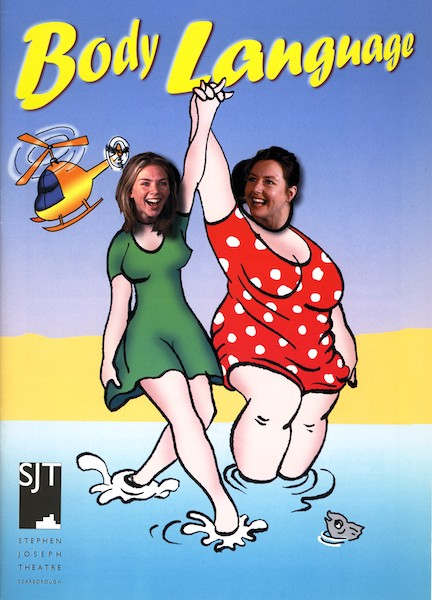

A collection of archive material, posters, rehearsal and production images pertaining to Alan Ayckbourn's *Body Language*. The Archive Images page is presented in association with the **[Borthwick Institute for Archives](/)** at the University of York where the Ayckbourn Archive is held. Click on an image to expand.

### Body Language (1990)

The poster for the world premiere of *Body Language* at the Stephen Joseph Theatre in the Round, Scarborough, in 1990. This is one of the rarest Ayckbourn premiere posters and there are believed to be less than a handful in existance.

**Copyright:** Scarborough Theatre Trust  
**Holding:** The Bob Watson Archive

*Do not reproduce images without permission of the copyright holder.*

The poster for Alan Ayckbourn's 1999 revival of *Body Language* at the Stephen Joseph Theatre, Scarborough. The poster is meant to evoke a classic seaside postcard image.

**Copyright:** Scarborough Theatre Trust  
**Holding:** Borthwick Institute for Archives

*Do not reproduce images without permission of the copyright holder.*  
*The Archive Images pages are presented in association with the* ***[Borthwick Institute for Archives](/)*** *at the University of York, where the Ayckbourn Archive is held.*

*All images on this page are copyright of the respective and labelled individual / organisation and should not be reproduced without permission.*  
