A collection of archive material, posters, rehearsal and production images pertaining to Alan Ayckbourn's *Jeeves* & *By Jeeves*. The Archive Images page is presented in association with the **[Borthwick Institute for Archives](/)** at the University of York where the Ayckbourn Archive is held. Click on an image to expand.

### Jeeves (1975) / By Jeeves (1996)

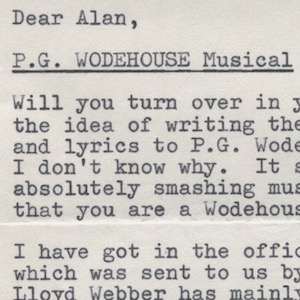

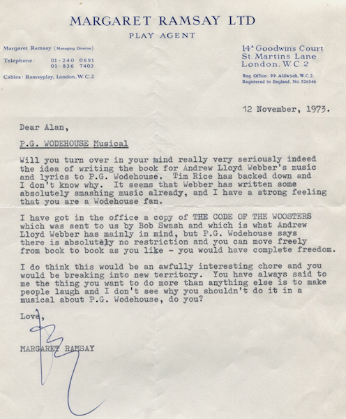

The earliest correspondence regarding the musical *Jeeves* is this letter rom 12 November 1973 in which Alan's agent, Margaret Ramsay, asks him to consider writing the book for the Andrew Lloyd Webber musical. The original is held in the Ayckbourn Archive at the Borthwick Institute for Archives at the University of York.

**Copyright:** Haydonning Ltd  
**Holding:** Borthwick Institute for Archives

*Do not reproduce images without permission of the copyright holder.*

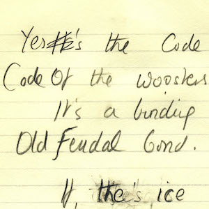

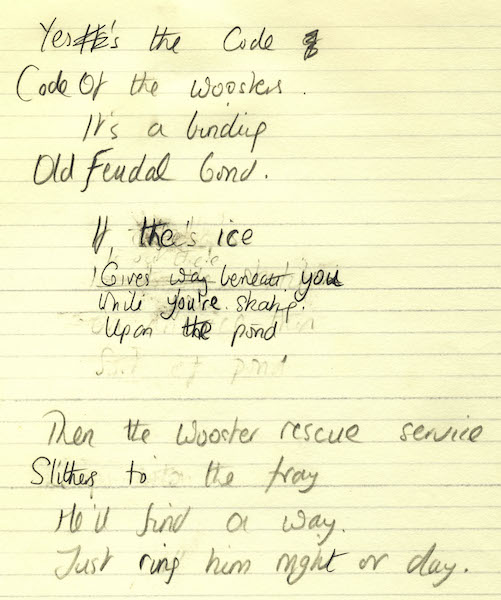

The musical *Jeeves* opens with the song *Code of the Woosters* and this is Alan Ayckbourn's earliest lyric notes for the song from 1974.

*Do not reproduce images without permission of the copyright holder.*

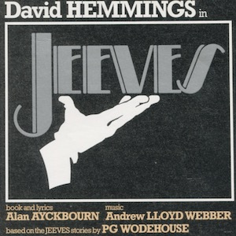

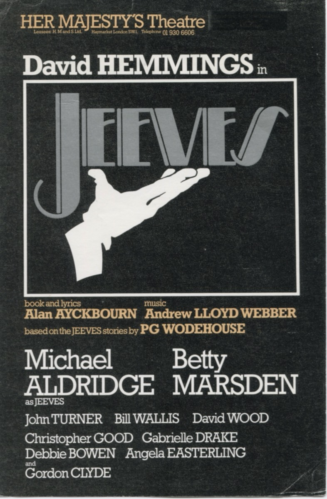

A rare flyer for the West End premiere of *Jeeves* published prior to Betty Marsden being removed from the production due to the length of the musical.

**Copyright:** To be confirmed  
**Holding:** Borthwick Institute For Archives

*Do not reproduce images without permission of the copyright holder.*

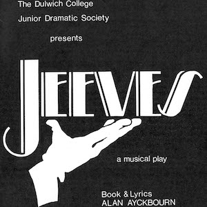

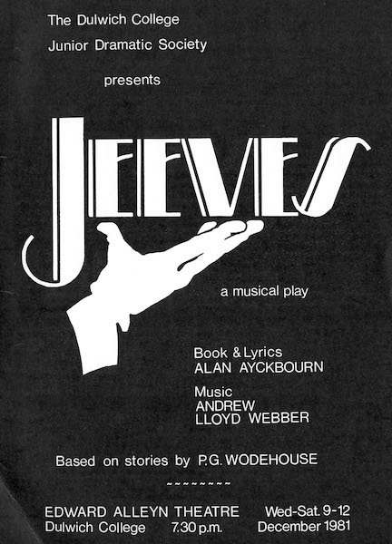

There has only been one other production of the original *Jeeves* musical and this was in 1981 with an abridged production presented at Dulwich College. The musical was entirely withdrawn following this performance.

**Copyright:** Dulwich College  
**Holding:** Borthwick Institute For Archives

*Do not reproduce images without permission of the copyright holder.*

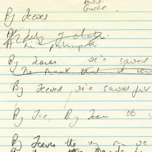

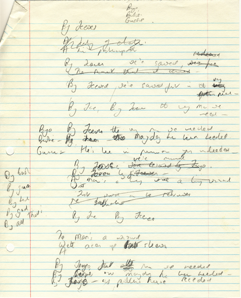

Alan Ayckbourn's notes for the revised song *By Jeeves* for the musical of the same name premiered in 1996 at the Stephen Joseph Theatre, Scarborough.

**Copyright:** Haydonning Ltd  
**Holding:** Borthwick Institute For Archives

*Do not reproduce images without permission of the copyright holder.*

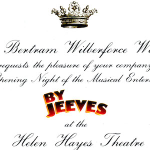

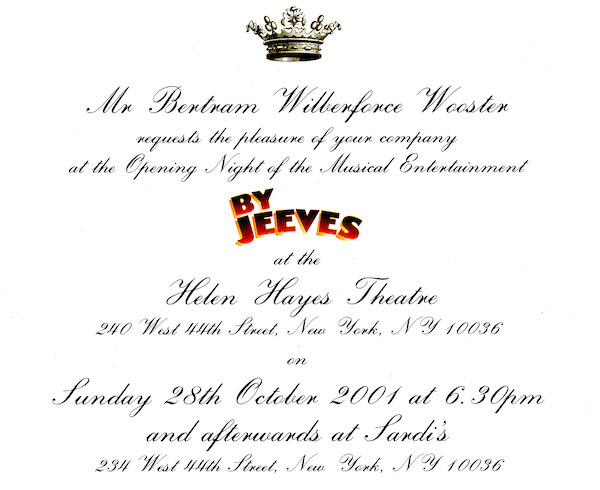

In 2001, *By Jeeves* transferred to Broadway at the Helen Hayes Theatre. This is the invite for the opening night.

**Copyright:** To be confirmed  
**Holding:** Borthwick Institute for Archives

*Do not reproduce images without permission of the copyright holder.*  
*The Scene and Archive Images pages are presented in association with the* ***[Borthwick Institute for Archives](/)*** *at the University of York, where the Ayckbourn Archive is held.*

*All images on this page are copyright of the respective and labelled individual / organisation and should not be reproduced without permission.*  
