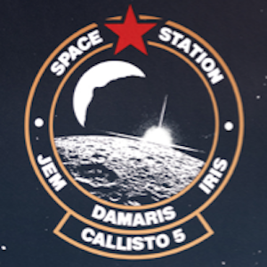
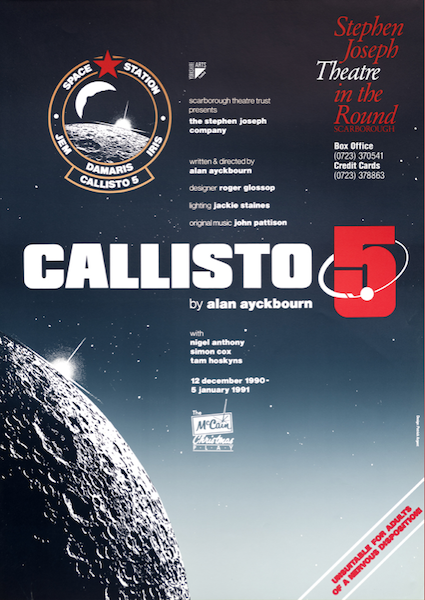
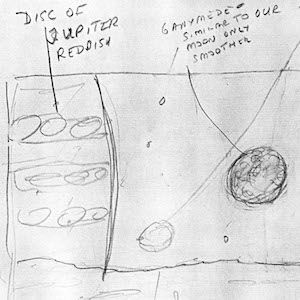
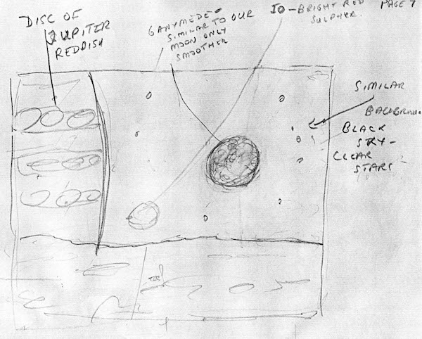
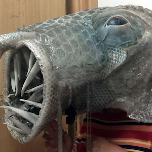
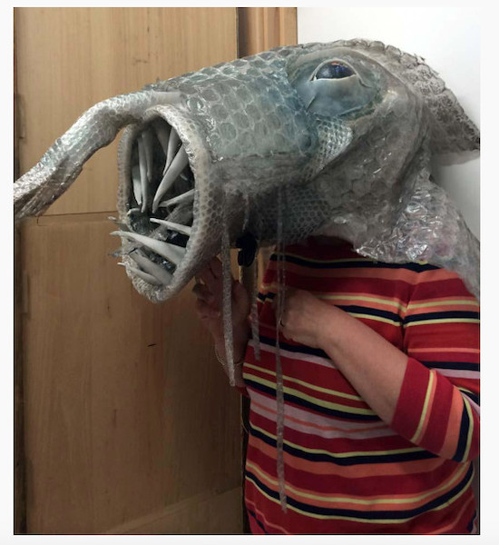

A collection of archive material, posters, rehearsal and production images pertaining to Alan Ayckbourn's *Callisto 5 / Callisto#7*. The Archive Images page is presented in association with the **[Borthwick Institute for Archives](/)** at the University of York where the Ayckbourn Archive is held. Click on an image to expand.

### Callisto 5 (1990) / Callisto#7 (1999)

The poster for the world premiere of *Callisto 5* at the Stephen Joseph Theatre in the Round, Scarborough, in 1990.

**Copyright:** Scarborough Theatre Trust  
**Holding:** Borthwick Institute for Archives

*Do not reproduce images without permission of the copyright holder.*

One of Alan Ayckbourn's storyboards for the video elements which feature prominently in the *Callisto* plays; this one show the planet Jupiter with the moon of Ganymede.

*Do not reproduce images without permission of the copyright holder.*

The mask for the alien creature seen on the video screens in *Callisto#7*. In the best traditions of British low-budget sci-fi, it's mainly constructed of cardboard and bubble wrap….

**Photographer:** Simon Murgatroyd (© Simon Murgatroyd)  
**Holding:** Ayckbourn Digital Archive

*Do not reproduce images without permission of the copyright holder.*     *The Archive Images pages are presented in association with the* ***[Borthwick Institute for Archives](/)*** *at the University of York, where the Ayckbourn Archive is held.*

*All images on this page are copyright of the respective and labelled individual / organisation and should not be reproduced without permission.*
