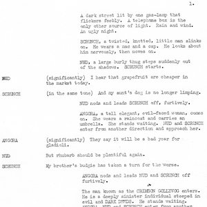
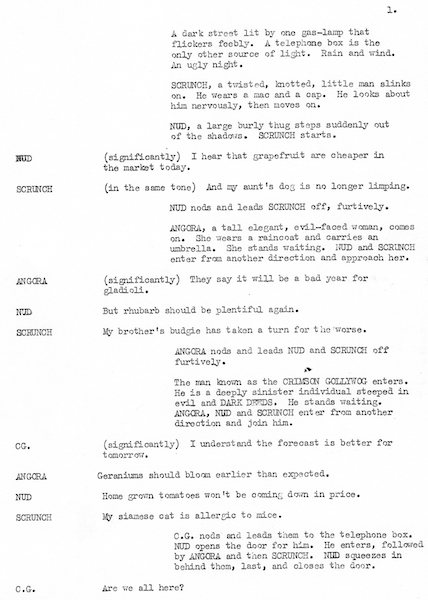
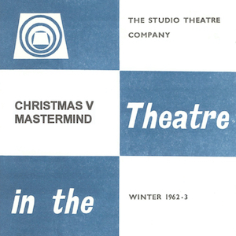
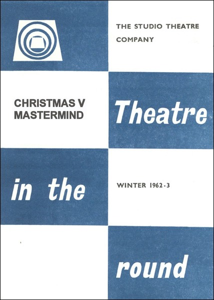
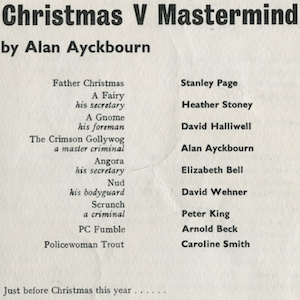
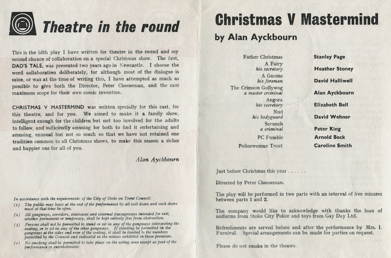

A collection of archive material, posters, rehearsal and production images pertaining to Alan Ayckbourn's *Christmas V Mastermind*. The Archive Images page is presented in association with the **[Borthwick Institute for Archives](/)** at the University of York where the Ayckbourn Archive is held. Click on an image to expand.

### Christmas V Mastermind (1962)

The copy of the opening page of *Christmas V Mastermind* taken from the a rare surviving copy held in the Lord Chamberlain's Collection at the British Library.

*Do not reproduce images without permission of the copyright holder.*

A poster for *Christmas V Mastermind* designed by Alan Ayckbourn's Archivist, Simon Murgatroyd, in the style of Studio Theatre Ltd, as part of the celebrations to mark the playwright's 70th birthday in 2009.

*Do not reproduce images without permission of the copyright holder.*

The interior of the programme for the world premiere of *Christmas V Mastermind* at the Victoria Theatre, Stoke-on-Trent, in December 1962.

**Copyright:** Scarborough Theatre Trust  
**Holding:** Borthwick Institute For Archives

*Do not reproduce images without permission of the copyright holder.*     *The Scene, Archive Images and Research pages are presented in association with the* ***[Borthwick Institute for Archives](/)*** *at the University of York, where the Ayckbourn Archive is held.*

*All images on this page are copyright of the respective and labelled individual / organisation and should not be reproduced without permission.*  
