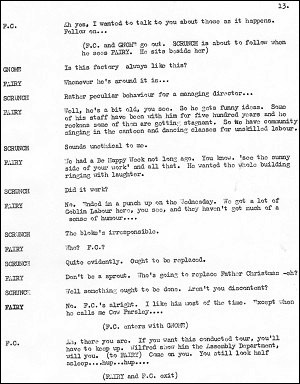

*This page reproduces a scene from the play offering an insight into and a taste of the unpublished work. The dialogue is reproduced in the style of the original including grammatical choices / errors.*

**Act 2** (pages 11 - 13)  
*Father Christmas’s toy factory. His fairy secretary is leading Scrunch on a tour of the facility.*  
**Scrunch:** Is this factory always like this?  
**Fairy:** Whenever he's around it is...  
**Scrunch:** Rather peculiar behaviour for a managing director…  
**Fairy:** He's a bit old, you see. So he gets funny ideas. Some of his staff have been with him for five hundred years and he reckons some of them are getting stagnant. So we have community-singing in the canteen and dancing classes for unskilled labour…  
**Scrunch:** Sounds unethical to me.  
**Fairy:** We had a Be Happy Week not long ago. You know. “See the sunny side of your work” and all that. He wanted the whole building ringing with laughter.  
**Scrunch:** Did it work?  
**Fairy:** No. Ended in a punch up on the Wednesday. We got a lot of Goblin labour here, you see, and they haven't got much of a sense of humour....  
**Scrunch:** The bloke's irresponsible.  
**Fairy:** Who? F.C.?  
Scrunch: Quite evidently. Ought to be replaced.  
**Fairy:** Don't be a sprout. Who's going to replace Father Christmas - eh?  
**Scrunch:** Well something ought to be done. Aren’t you discontent?  
**Fairy:** No. F.C.’s alright. I like him most of the time - except when he calls me Cow Parsley....  
*(GNOME enters, FAIRY leaves)*  
**Gnome:** I don't know how we manage to keep going. Here I am. Up to my oars in it… and him… having sports day in the middle of the workshop.  
**Scrunch:** Not the proper way for the management to carry on...  
**Gnome:** No.  
**Scrunch:** Not responsible is it?  
**Gnome:** You're right there. I have enough trouble with the staff.  
**Scrunch:** *(Quickly)* Trouble? What sort of trouble?  
**Gnome:** Well, they keep knocking off.  
**Scrunch:** Overworked, no doubt. You should press for a shorter working week.  
**Gnome:** No, it's the pixies, you see...  
**Scrunch:** Pixies?  
**Gnome:** I told him. I said “Don't have pixies in your works”, I said, “Pixies is troublemakers” Got a frivolous sort of nature, you see. Now us Gnomes are traditional workers...  
**Scrunch:** Quite, quite.  
**Gnome:** Goblins will do the job. They're individuals mark you, but they get on with the job.  
**Scrunch:** What about elves?  
**Gnome:** *(With scorn)* Elves? White collar workers, mate. That's all they are.  
**Scrunch:** So it'd be reasonable to say that if it wasn't for you nothing much would get done round here.  
**Gnome:** Doubt it.  
**Scrunch:** Bit of a heavy responsibility.  
**Gnome:** Well - I don't avoid it, you know…  
**Scrunch:** Still, it's hardly fair is it? One little bloke like you…  
**Gnome:** See what you mean.  
**Scrunch:** Look I think I may be able to help a bit  
**Gnome:** How?  
**Scrunch:** Don't think I’m interfering. Don't think that. It's just lucky for you that I came over when I did....  
**Gnome:** *(Secretively)* Come in the workshop, we won't be overheard...
