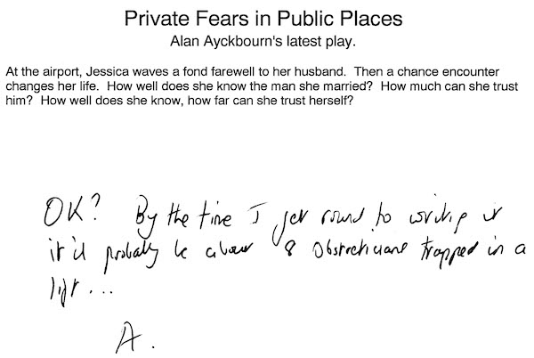
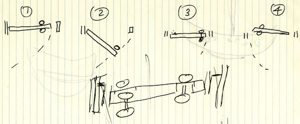
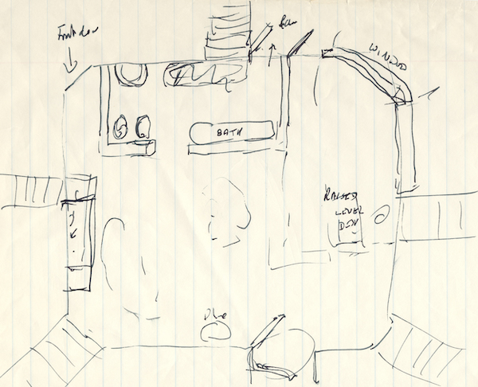
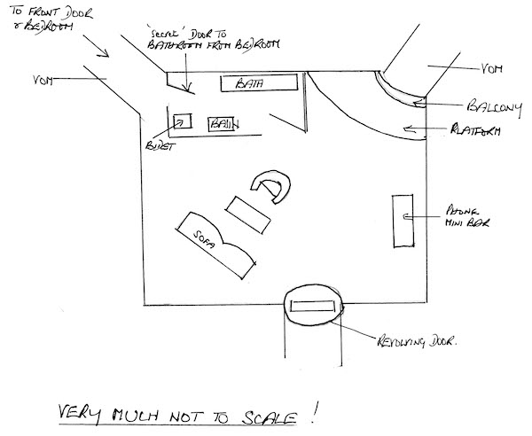
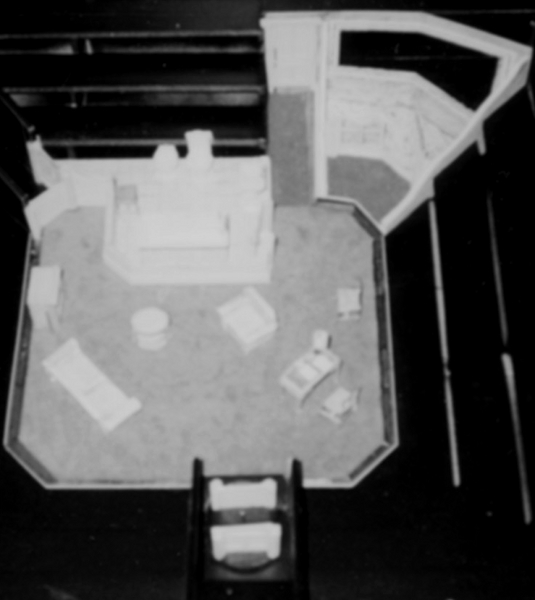
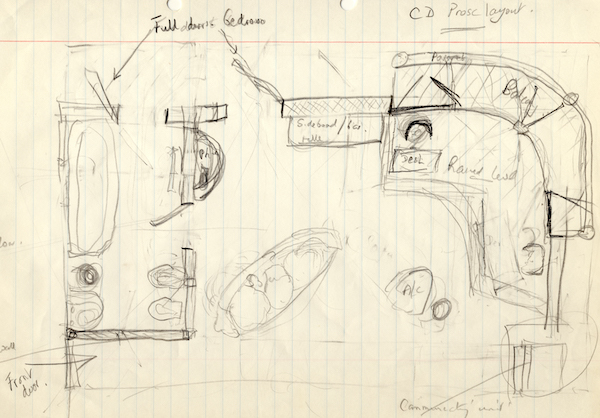
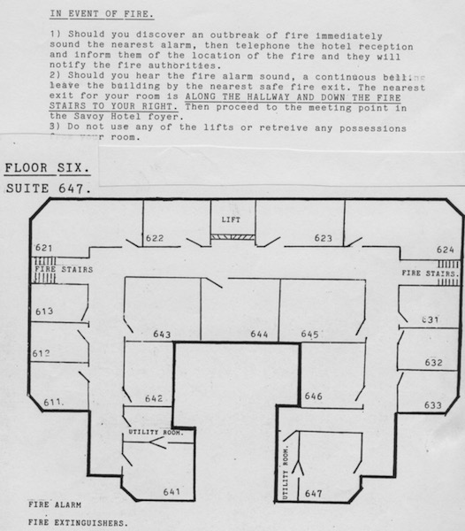
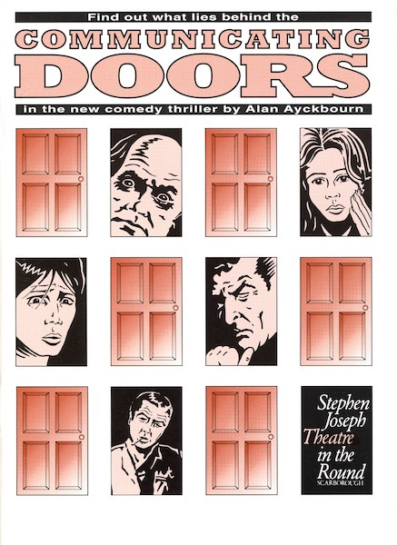
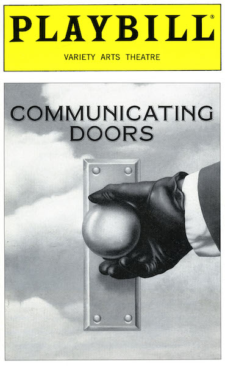
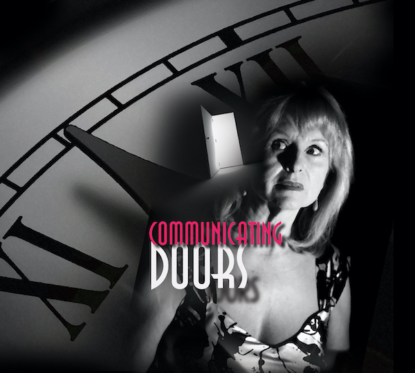

A collection of archive material, posters, rehearsal and production images pertaining to Alan Ayckbourn's *Communicating Doors*. The Archive Images page is presented in association with the **[Borthwick Institute for Archives](/)** at the University of York where the Ayckbourn Archive is held. Click on an image to expand.

### Communicating Doors (1994)

*Communicating Doors* was not the play Alan Ayckbourn was supposed to write for 1994. *Private Fears In Public Places* was advertised, but then replaced when Alan couldn't write the intended play. This memo has the brochure copy for the original play and a premonition to the theatre's press officer, it might not go as planned!

**Copyright:** Haydonning Ltd  
**Holding:** Borthwick Institute for Archives

*Do not reproduce images without permission of the copyright holder.*

Alan Ayckbourn's own sketch for the design of the pivotal - literally - communicating door for the play's set.

**Copyright:** Haydonning Ltd  
**Holding:** Borthwick Institute For Archives

*Do not reproduce images without permission of the copyright holder.*

Alan Ayckbourn's hand-drawn sketch of the in-the-round set for the world premiere of *Communicating Doors* at the Stephen Joseph Theatre in the Round, Scarborough, during 1994.

**Copyright:** Haydonning Ltd  
**Holding:** Borthwick Institute For Archives

*Do not reproduce images without permission of the copyright holder.*

A clearer sketch by the playwright from 1994 showing the basic layout of the set for the world premiere of *Communicating Doors*.

**Copyright:** Haydonning Ltd  
**Holding:** Borthwick Institute For Archives

*Do not reproduce images without permission of the copyright holder.*

A photo - not of great quality - of the model box for the in-the-round set for the world premiere of *Communicating Doors* during 1994. The model box and set were designed by Roger Glossop.

**Copyright:** Roger Glossop  
**Holding:** Ayckbourn Digital Archive

*Do not reproduce images without permission of the copyright holder.*

Alan Ayckbourn's hand-drawn sketch for the stage design for either a proscenium arch tour of *Communicating Doors* from the Stephen Joseph Theatre in the Round or the West End premiere of the play, both in 1995.

**Copyright:** Haydonning Ltd  
**Holding:** Borthwick Institute For Archives

*Do not reproduce images without permission of the copyright holder.*

A rare surviving prop from the world premiere of *Communicating Doors* being the fire escape for the plan for the Regal Hotel on display in the hotel room.

**Copyright:** Scarborough Theatre Trust  
**Holding:** The Bob Watson Archive

*Do not reproduce images without permission of the copyright holder.*

The poster for the world premiere of *Communicating Doors* at the Stephen Joseph Theatre in the Round, Scarborough, in 1992. Unknown to the theatre, the design company copied the portrait images from a then little known comic book series called *V For Vendetta* - which has subsequently became rather more famous.

**Copyright:** Scarborough Theatre Trust  
**Holding:** Borthwick Institute for Archives

*Do not reproduce images without permission of the copyright holder.*

The Playbill cover for the New York premiere of *Communicating Doors* at the Variety Arts Theatre in 1989.

**Copyright:** Playbill  
**Holding:** Borthwick Institute For Archives

*Do not reproduce images without permission of the copyright holder.*

The poster for Alan Ayckbourn's 2010 revival of *Communicating Doors* at the Stephen Joseph Theatre, Scarborough.

**Copyright:** Scarborough Theatre Trust  
**Holding:** Ayckbourn Digital Archive

*Do not reproduce images without permission of the copyright holder.*  
*The Archive Images pages are presented in association with the* ***[Borthwick Institute for Archives](/)*** *at the University of York, where the Ayckbourn Archive is held.*

*All images on this page are copyright of the respective and labelled individual / organisation and should not be reproduced without permission.*  
