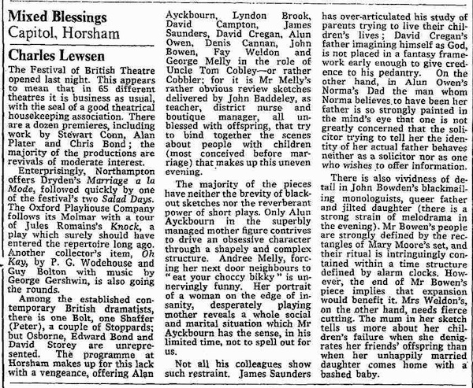
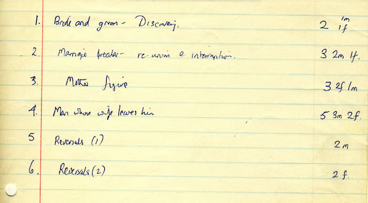
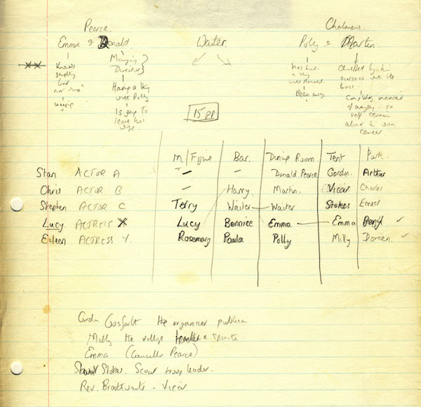
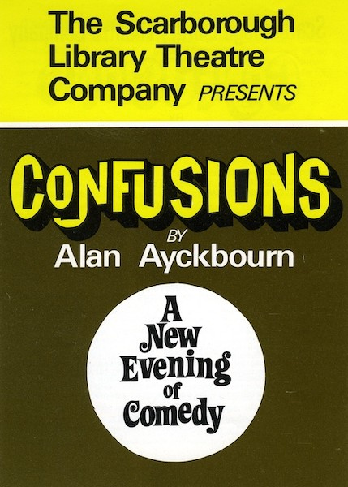

A collection of archive material, posters, rehearsal and production images pertaining to Alan Ayckbourn's *Confusions*. The Archive Images page is presented in association with the **[Borthwick Institute for Archives](/)** at the University of York where the Ayckbourn Archive is held. Click on an image to expand.

### Confusions (1974)

The first play in *Confusions* is *Mother Figure*, but this was written several years earlier for an entirely different production. It was commissioned for a show entitled *Mixed Blessings* - a follow-up to a previously successful anthology *Mixed Doubles*. It was premiered in Horsham and reviews in The Times on 18 September 1973. But when the production did not transfer to the West End, Alan took his play back and used it for *Confusions*.

**Copyright:** Times Media Ltd  
**Holding:** Borthwick Institute for Archives

*Do not reproduce images without permission of the copyright holder.*

The earliest notes by Alan Ayckbourn relating to *Confusions* show a completely different structure with six one act plays - the second of which is *Mother Figure*. These notes are held in the Ayckbourn Archive at the Borthwick Institute for Archives at the University of York.

**Copyright:** Haydonning Ltd  
**Holding:** Borthwick Institute for Archives

*Do not reproduce images without permission of the copyright holder.*

More early notes by Alan Ayckbourn relating to *Confusions* which include notes for *Between Mouthfuls* / *Gosforth's Fête* as well as a breakdown of which characters / actors appear in each play. These notes are held in the Ayckbourn Archive at the Borthwick Institute for Archives at the University of York.

**Copyright:** Haydonning Ltd  
**Holding:** Borthwick Institute for Archives

*Do not reproduce images without permission of the copyright holder.*

The cover for the rarely seen programme for the world premiere of *Confusions* at Theatre in the Round at the Library Theatre, Scarborough, in 1974. This was just a glossy doubled sided, folded A4 print and not as common as the regular programme produced for the playwright's 1975 revival of the play at the same venue.

**Copyright:** Scarborough Theatre Trust  
**Holding:** Borthwick Institute For Archives

*Do not reproduce images without permission of the copyright holder.*  
*The Scene and Archive Images pages are presented in association with the* ***[Borthwick Institute for Archives](/)*** *at the University of York, where the Ayckbourn Archive is held.*

*All images on this page are copyright of the respective and labelled individual / organisation and should not be reproduced without permission.*  
