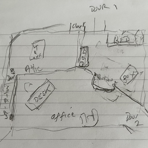
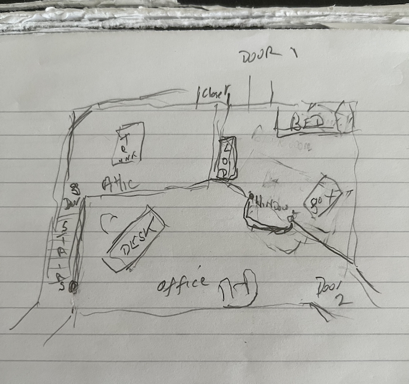
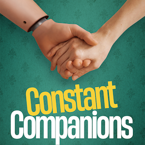
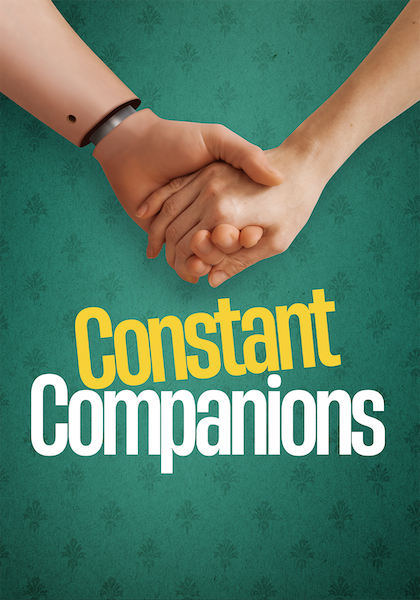
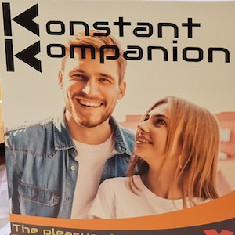
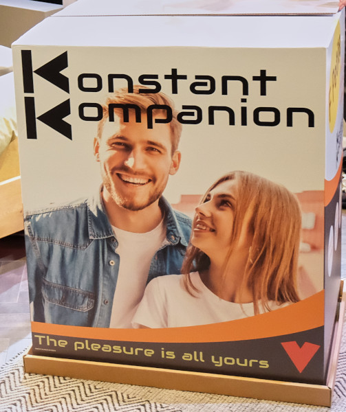
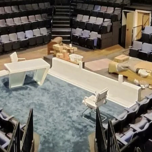
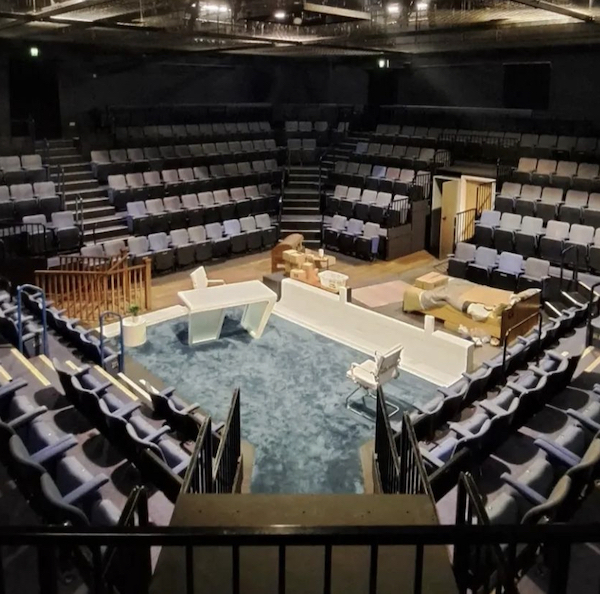

A collection of archive material, posters, rehearsal and production images pertaining to Alan Ayckbourn's *Constant Companions*. The Archive Images page is presented in association with the **[Borthwick Institute for Archives](/)** at the University of York where the Ayckbourn Archive is held. Click on an image to expand.

### Constant Companions (2023)

Alan Ayckbourn's early notes for the staging of *Constant Companions*.

*Do not reproduce images without permission of the copyright holder.*

The poster for the world premiere of *Constant Companions* at the Stephen Joseph Theatre, Scarborough, in 2023.

**Copyright:** Scarborough Theatre Trust  
**Holding:** The Bob Watson Archive

*Do not reproduce images without permission of the copyright holder.*

The Konstant Kompanions box prop used in the world premiere of Constant Companions at the SJT in 2023, designed by Kevin Jenkins.

**Photographer:** Tony Bartholomew (© Tony Bartholomew)  
**Holding:** Ayckbourn Digital Archive

*Do not reproduce images without permission of the copyright holder.*

The set for the in-the-round world premiere of *Constant Companions* at the SJT in 2023, designed by Kevin Jenkins.

**Set Copyright:** Kevin Jenkins  
**Photographer:** Tanya-Loretta Dee (© Tanya Loretta Dee)  
**Holding:** Ayckbourn Digital Archive

*Do not reproduce images without permission of the copyright holder.*    *The Archive Images pages are presented in association with the* ***[Borthwick Institute for Archives](/)*** *at the University of York, where the Ayckbourn Archive is held.*

*All images on this page are copyright of the respective and labelled individual / organisation and should not be reproduced without permission.*  
