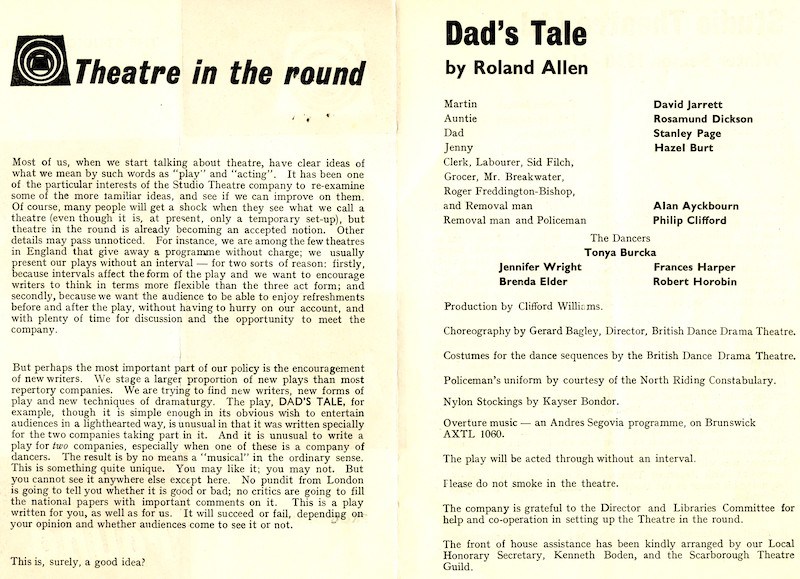
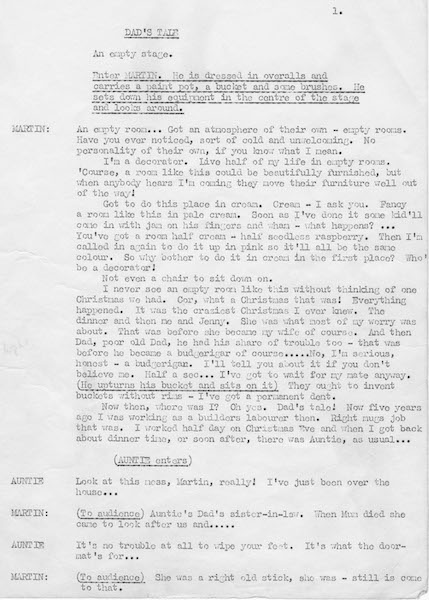
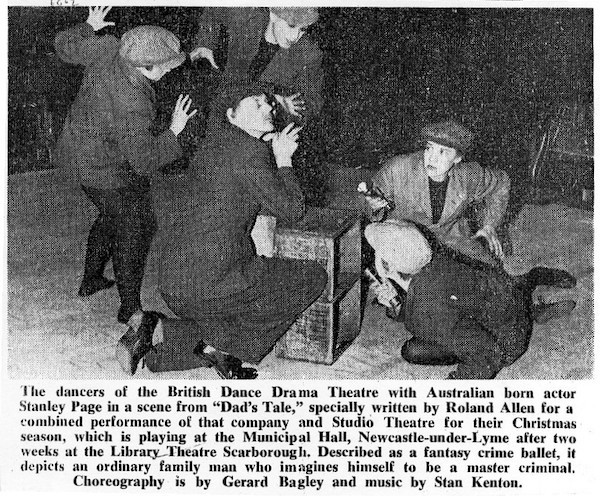
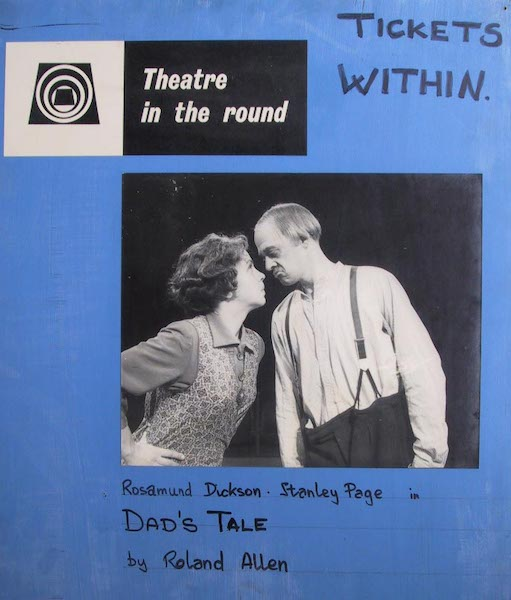

A collection of archive material, posters, rehearsal and production images pertaining to Alan Ayckbourn's *Dad's Tale*. The Archive Images page is presented in association with the **[Borthwick Institute for Archives](/)** at the University of York where the Ayckbourn Archive is held. Click on an image to expand.

### Dad's Tale (1960)

The programme for the world premiere of *Dad's Tale* at Theatre in the Round at the Library Theatre, Scarborough.

**Copyright:** Scarborough Theatre Trust  
**Holding:** Borthwick Institute For Archives

*Do not reproduce images without permission of the copyright holder.*

The first page of Dad's Tale from one of several original manuscripts of *Dad's Tale* held in the Ayckbourn Archive in the Borthwick Institute for Archives at the University of York.

**Copyright:** Haydonning Ltd  
**Holding:** Borthwick Institute For Archives

*Do not reproduce images without permission of the copyright holder.*

An article from The Stage on 12 January 1961 promoting the transfer of *Dad's Tale* to Newcastle-under-Lyme and highlighting British Dance Drama Theatre members.

**Copyright:** The Stage Media Company Ltd  
**Holding:** Borthwick Institute For Archives

*Do not reproduce images without permission of the copyright holder.*

A 'poster' for *Dad's Tale* which was mounted outside Scarborough's Theatre in the Round at the Library Theatre in 1960.

**Copyright:** Scarborough Theatre Trust  
**Holding:** The Bob Watson Archive

*Do not reproduce images without permission of the copyright holder.*  
*The Scene, Archive Images and Research pages are presented in association with the* ***[Borthwick Institute for Archives](/)*** *at the University of York, where the Ayckbourn Archive is held.*

*All images on this page are copyright of the respective and labelled individual / organisation and should not be reproduced without permission.*  
