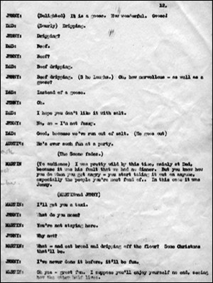

*This page reproduces a scene from the play offering an insight into and a taste of the unpublished work. The dialogue is reproduced in the style of the original including grammatical choices / errors.*

**Act 2** (pages 11 - 13)  
*(A bare living room).*  
**Jenny:** Martin and I were just saying that we didn’t think furniture mattered that much, especially not at Christmas I mean, it’ll be much more fun having our Christmas dinner on the floor and so on…  
**Auntie:** *(Uncertainly)* Yes.  
**Jenny:** I always think it’s much more fun eating a turkey with one’s fingers than fiddling with a knife and fork. I find I always splash the gravy all over the table cloth anyway! *(She laughs)*  
**Auntie:** *(Joining in half-heartedly)* Well, we….  
**Jenny:** You are having a turkey, aren’t you? Martin said you were.  
**Auntie:** Well now….  
**Jenny:** Please don’t worry if it’s a chicken. Is it a chicken?  
**Auntie:** Er….  
**Jenny:** Actually to be honest I prefer chicken to turkey. It seems to have more taste.  
**Auntie:** We’re not quite sure….  
**Jenny:** You’re not having duck, are you?  
**Auntie:** *(Hurriedly)* Oh no, no.  
**Jenny:** Or a goose – is it a goose?  
**Auntie:** *(Vaguely)* Goose….  
**Jenny:** *(Delighted)* It is a goose. How wonderful! Goose.  
**Dad:** *(Dourly)* Dripping.  
**Jenny:** Dripping?  
**Dad:** Beef.  
**Jenny:** Beef?  
**Dad:** Beef dripping.  
**Jenny:** Beef dripping. *(She laughs)* Oh, how marvellous - as well as a goose?  
**Dad:** Instead of a goose.  
**Jenny:** Oh.  
**Dad:** I hope you don’t like it with salt.  
**Jenny:** No, no - I’m not fussy.  
**Dad:** Good, because we’ve run out of salt. *(He goes out)*.  
**Martin:** *(To audience)* I was pretty wild by this time, mainly at Dad, because it was his fault that we had no dinner. But you know how you do when you get angry - you start taking it out on anyone, especially the people you’re most fond of… In this case it was Jenny.  
**Martin:** I’ll get you a taxi.  
**Jenny:** What do you mean?  
**Martin:** You’re not staying here.  
**Jenny:** Why not?  
**Martin:** What - and eat bread and dripping off the floor? Some Christmas that’ll be.  
**Jenny:** I’ve never done it before, it’ll be fun.  
**Martin:** Oh yes - great fun. I suppose you’ll enjoy yourself no end, seeing how the other half lives.  
**Jenny:** What a horrid thing to say.  
**Martin:** So you can go back and tell all those friends of yours what a quaint Christmas you had.  
**Jenny:** What’s the matter with you?  
**Martin:** You don’t have to be polite to me you know.  
**Jenny:** Martin, for Heaven’s sake! Alright then - if you don’t want me to stay here. Come back with me - you, Auntie and your father. Daddy’s longing to meet you properly. We’ll all have Christmas dinner at my place. How about that? *(Martin does not reply)* Martin! *(Martin stands away, brooding angrily)* Martin, will you come back with me?  
**Martin:** Of course I can’t. It’s very kind of you to….  
**Jenny:** I don’t want to be kind. I love you.  
**Martin:** *(Muttering)* There are some things that are more important than love sometimes.  
**Jenny:** Are there? Listen, I shall go out and buy us all a meal then. I can afford it I think I’ve got enough money on me.  
**Martin:** It’s so easy for you, isn’t it? Just a few pounds here and a few pounds there and everyone’s happy. You think this is just one big joke, having no money? Just another Christmas game - like Postman’s Knock. If you knew what it was like, you’d think again. Still you never will now, we were brought up different that’s all and it seems to me it would be better if we stayed different.  
**Jenny:** Do you mean I should go for good?  
**Martin:** Yes.  
**Jenny:** Alright, if you think so. I’ll find my own way home. There’s no need to come with me. Goodbye, Martin. *(Exit Jenny)*  
**Martin:** *(To audience)* I just sat by the window and stared out. I didn’t want to live any more. I just kept staring out. I had planned such a lovely Christmas for Jenny and me… It was then I heard it… Music - coming from outside.  
At first I thought the people next door had got the telly turned up too loud, but then suddenly, there it was - lights all over the place. It was a circus procession coming right past our window.

### Notes
