A collection of archive material, posters, rehearsal and production images pertaining to Alan Ayckbourn's *Family Circles*. The Archive Images page is presented in association with the **[Borthwick Institute for Archives](/)** at the University of York where the Ayckbourn Archive is held. Click on an image to expand.

### Family Circles (1970)

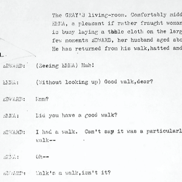

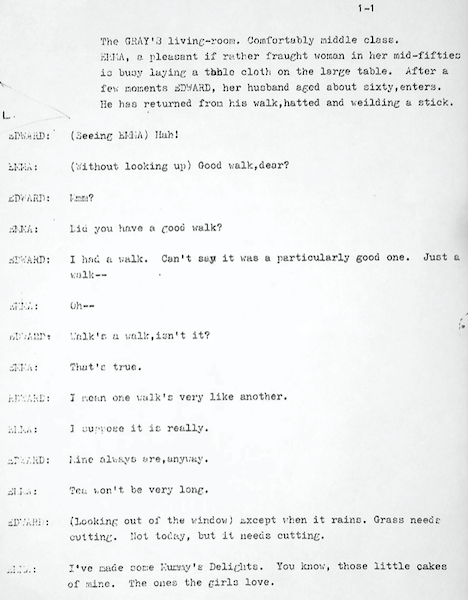

The first page of the only original manuscript for *The Story So Far…* believed to still exist and held in the Ayckbourn Archive in the Borthwick Institute for Archives at the University of York. This manuscript is substantially different to the heavily revised play *Family Circles* we know today.

*Do not reproduce images without permission of the copyright holder.*

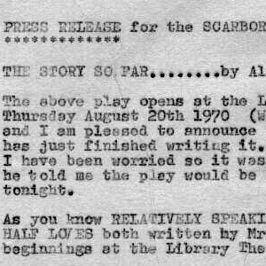

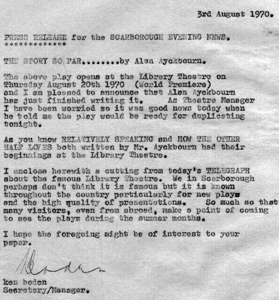

A strangely informal press release for world premiere of *The Story So Far…* at Theatre in the Round at the Library Theatre, Scarborough, in 1970. The company had no dedicated press officer at the time and the role was taken by the theatre manager, Ken Boden - who makes clear his delight that Alan has written the script in time!

**Copyright:** Scarborough Theatre Trust  
**Holding:** The Bob Watson Archive

*Do not reproduce images without permission of the copyright holder.*

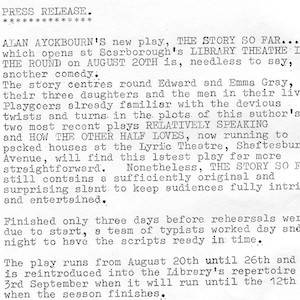

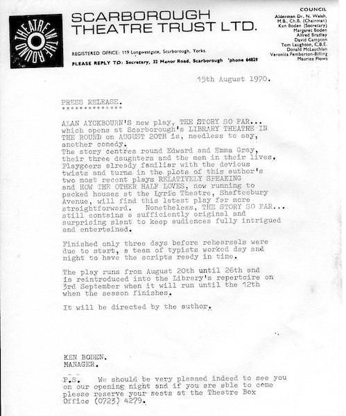

The general press release for the world premiere of *The Story So Far…* at Theatre in the Round at the Library Theatre, Scarborough, making note that it was completed only three days prior to rehearsals starting.

**Copyright:** Scarborough Theatre Trust  
**Holding:** The Bob Watson Archive

*Do not reproduce images without permission of the copyright holder.*

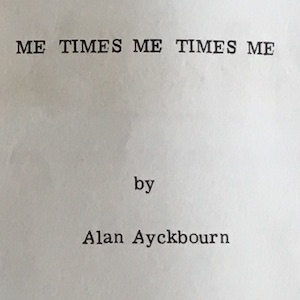

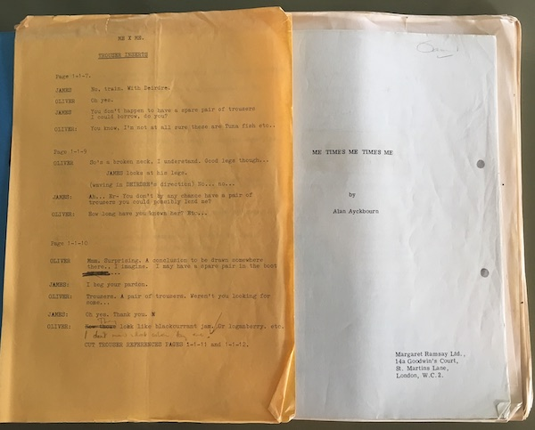

Pages from the only known surviving manuscript of *Me Times Me Times Me* donated to the Ayckbourn Archive by David Wood. This script began the rewrite of *The Story So Far…* for a pre-West End tour of the play in 1971 which never reached the West End.

*Do not reproduce images without permission of the copyright holder.*

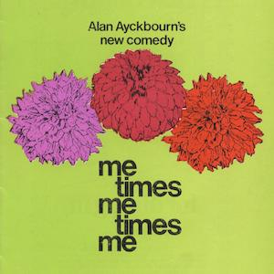

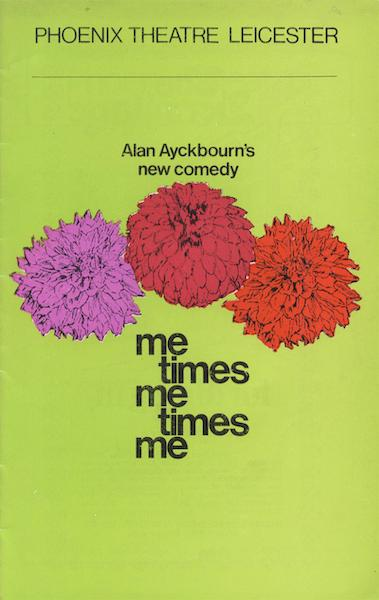

The pre-West End tour of *Me Times Me Times Me* is notable also for the fact it changed its title halfway through the tour. This programme illustrates the title of the play when the tour began…

**Copyright:** TBC  
**Holding:** Borthwick Institute For Archives

*Do not reproduce images without permission of the copyright holder.*

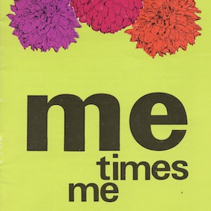

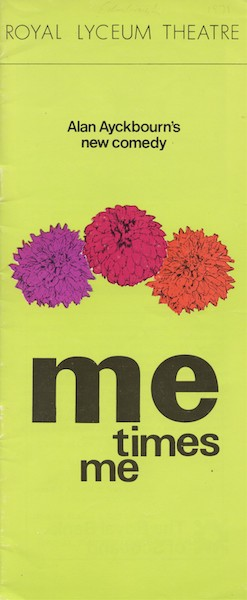

…and this programme shows the abridged title, *Me Times Me*, which came into force midway through the tour.

**Copyright:** TBC  
**Holding:** Borthwick Institute fo Archives

*Do not reproduce images without permission of the copyright holder.*

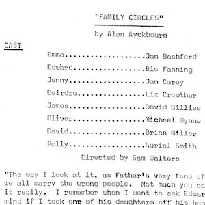

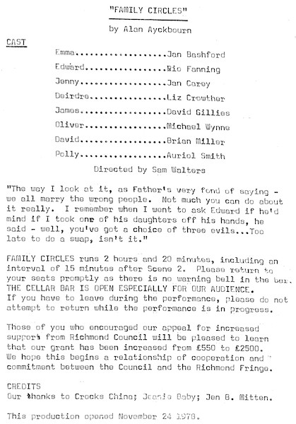

The interior of the programme for the London premiere of *Family Circles* at the Orange Tree Theatre, Richmond in 1978. This marked the final itineration (and title) of the play.

**Copyright:** Orange Tree Theatre  
**Holding:** Borthwick Institute for Archives

*Do not reproduce images without permission of the copyright holder.*     *The Archive Images page is presented in association with the* ***[Borthwick Institute for Archives](/)*** *at the University of York, where the Ayckbourn Archive is held.*

*All images on this page are copyright of the respective and labelled individual / organisation and should not be reproduced without permission.*  
