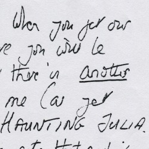
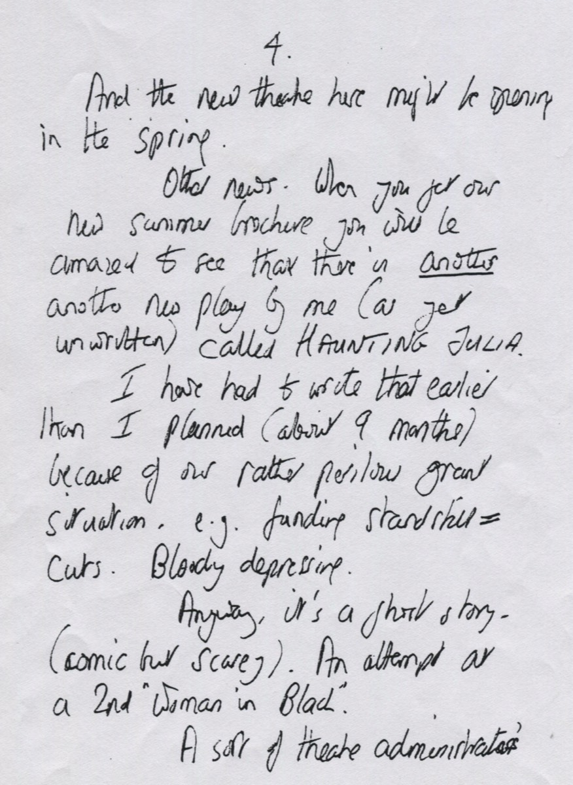
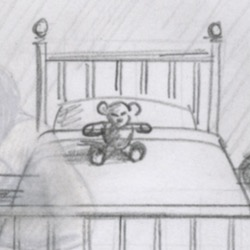
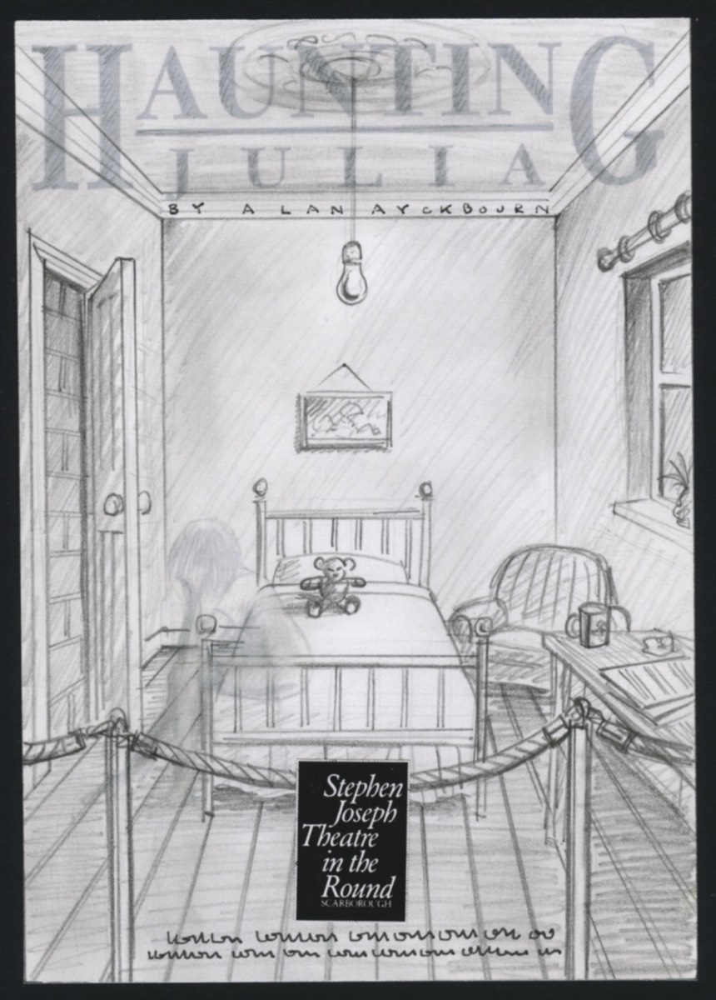
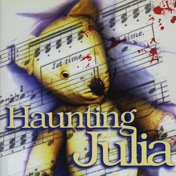
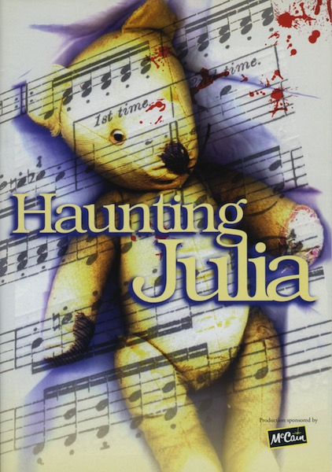
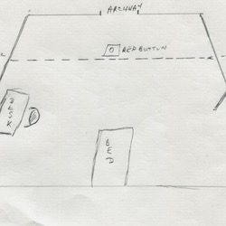
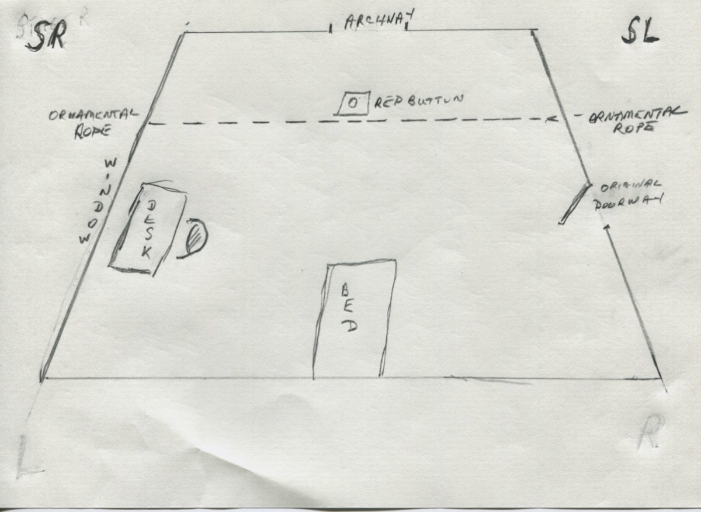

A collection of archive material, posters, rehearsal and production images pertaining to Alan Ayckbourn's *Haunting Julia*. The Archive Images page is presented in association with the **[Borthwick Institute for Archives](/)** at the University of York where the Ayckbourn Archive is held. Click on an image to expand.

### Haunting Julia (1994)

This letter from Alan Ayckbourn to the West End producer Michael Codron is the earliest known reference to *Haunting Julia*. It also confirms the play was an unscheduled choice due to funding issues at the Stephen Joseph Theatre in the Round, Scarborough, in 1994.

*Do not reproduce images without permission of the copyright holder.*

A concept for the original poster for the world premiere of *Haunting Julia* in 1994. Designed by Pure Design in Hull, the poster was simplified for the final design to just the bed, the teddy and the ghostly figure.

**Copyright:** TBC  
**Holding:** Private Collection

*Do not reproduce images without permission of the copyright holder.*

The programme cover for the tour of Alan Ayckbourn Ayckbourn's 1999 revival of *Haunting Julia* at the Stephen Joseph Theatre, Scarborough. This production marked the first time, the play had been performed in the end-stage as it was initially conceived.

**Copyright:** Scarborough Theatre Trust  
**Holding:** Borthwick Institute For Archives

*Do not reproduce images without permission of the copyright holder.*

During the Covid-19 pandemic of 2020 which closed all the UK's theatres, Alan Ayckbourn adapted *Haunting Julia* as an audio play for Christmas. This is his basic design of the set for Paul Stear, responsible for the final sound mix, to indicate the layout of the single-set play.

*Do not reproduce images without permission of the copyright holder.*    *The Archive Images pages are presented in association with the* ***[Borthwick Institute for Archives](/)*** *at the University of York, where the Ayckbourn Archive is held.*

*All images on this page are copyright of the respective and labelled individual / organisation and should not be reproduced without permission.*  
