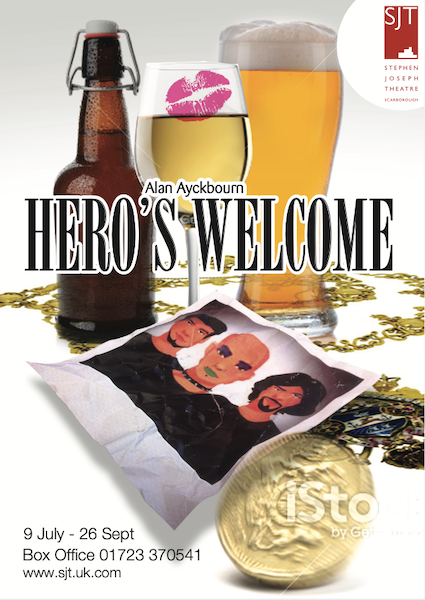
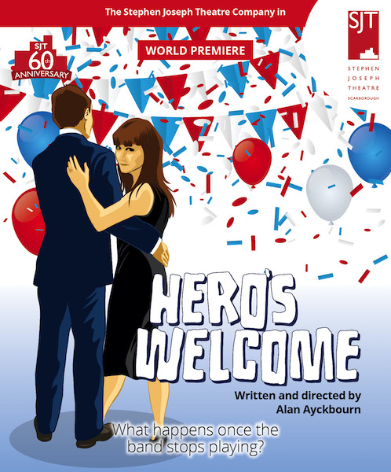
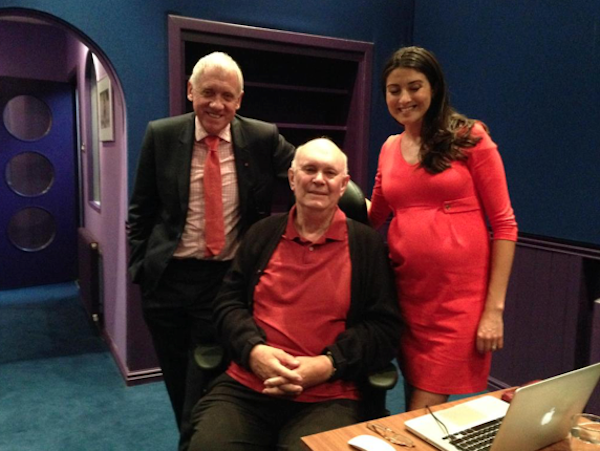

A collection of archive material, posters, rehearsal and production images pertaining to Alan Ayckbourn's *Hero's Welcome*. The Archive Images page is presented in association with the **[Borthwick Institute for Archives](/)** at the University of York where the Ayckbourn Archive is held. Click on an image to expand.

### Hero's Welcome (2015)

The playwright became frustrated with the Stephen Joseph Theatre during the creation of the poster for the world premiere of *Hero's Welcome*, feeling that the brief given to the designers did not appreciate nor understand the play. This is one of the rejected designs.

**Copyright:** Scarborough Theatre Trust  
**Holding:** The Bob Watson Archive

*Do not reproduce images without permission of the copyright holder.*

The actual poster for the world premiere of *Hero's Welcome* at the Stephen Joseph Theatre, Scarborough during its 60th anniversary year of 2015.

**Copyright:** Scarborough Theatre Trust  
**Holding:** The Bob Watson Archive

*Do not reproduce images without permission of the copyright holder.*

For the opening scene in which Murray & Baba are interviewed on television, BBC Look North presenters Harry Gration & Amy Garcia came to Alan Ayckbourn's rehearsal room and recorded the dialogue of the interviewers for the world premiere production.

**Photographer:** TBC  
**Holding:** Ayckbourn Digital Archive

*Do not reproduce images without permission of the copyright holder.*  
*The Scene and Archive Images pages are presented in association with the* ***[Borthwick Institute for Archives](/)*** *at the University of York, where the Ayckbourn Archive is held.*

*All images on this page are copyright of the respective and labelled individual / organisation and should not be reproduced without permission.*  
