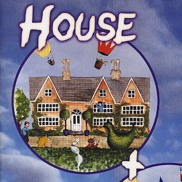
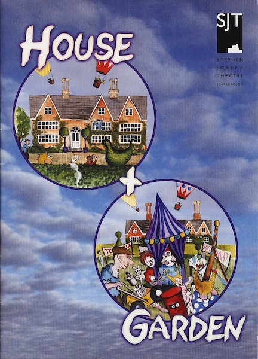
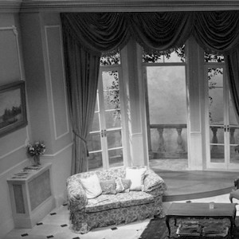
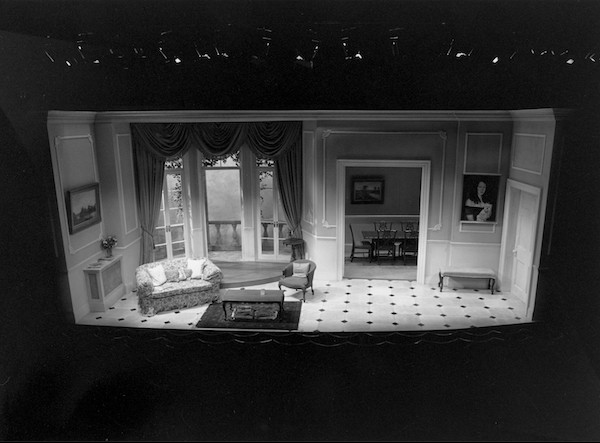
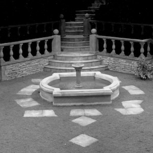
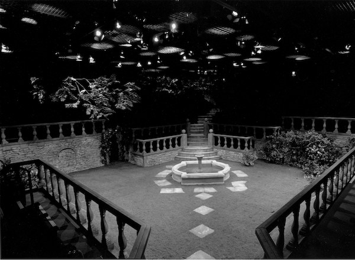

A collection of archive material, posters, rehearsal and production images pertaining to Alan Ayckbourn's *House & Garden*. The Archive Images page is presented in association with the **[Borthwick Institute for Archives](/)** at the University of York where the Ayckbourn Archive is held. Click on an image to expand.

### House & Garden (1999)

The poster for the world premiere of *House & Garden* at the Stephen Joseph Theatre, Scarborough, during 1999.

**Copyright:** Scarborough Theatre Trust  
**Holding:** Borthwick Institute for Archives

*Do not reproduce images without permission of the copyright holder.*

The set of *House*, designed by Roger Glossop, for the world premiere of *House & Garden* at the Stephen Joseph Theatre, Scarborough, during 1999.

**Photographer:** Tony Bartholomew (© Tony Bartholomew)  
**Holding:** Ayckbourn Digital Archive

*Do not reproduce images without permission of the copyright holder.*

The set of *Garden*, designed by Roger Glossop, for the world premiere of *House & Garden* at the Stephen Joseph Theatre, Scarborough, during 1999.

**Photographer:** Tony Bartholomew (© Tony Bartholomew)  
**Holding:** Ayckbourn Digital Archive

*Do not reproduce images without permission of the copyright holder.*     *The Archive Images pages are presented in association with the* ***[Borthwick Institute for Archives](/)*** *at the University of York, where the Ayckbourn Archive is held.*

*All images on this page are copyright of the respective and labelled individual / organisation and should not be reproduced without permission.*  
