A collection of archive material, posters, rehearsal and production images pertaining to Alan Ayckbourn's *How The Other Half Loves*. The Archive Images page is presented in association with the **[Borthwick Institute for Archives](/)** at the University of York where the Ayckbourn Archive is held. Click on an image to expand.

### How The Other Half Loves (1969)

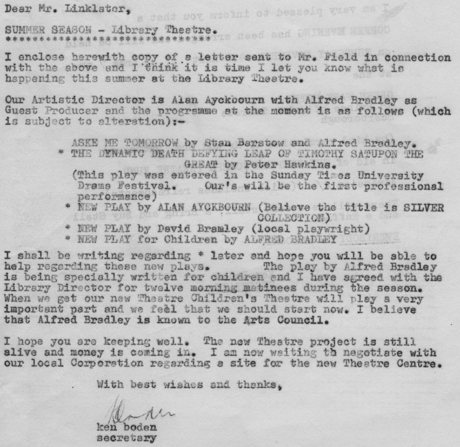

A letter to the Arts Council from Ken Boden, manager of Scarborough's The Library Theatre, noting the planned 1969 summer season including an untitled play by Alan Ayckbourn, which he believes will be called *Silver Collection;* this had also been considered as a title for Alan's 1967 play *The Sparrow*. The play would be officially titled *How The Other Half Loves* in July.

**Copyright:** Haydonning Ltd  
**Holding:** Borthwick Institute for Archives

*Do not reproduce images without permission of the copyright holder.*

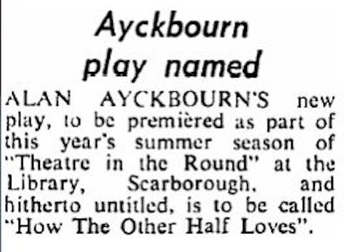

A report in The Stage newspaper, published on 3 July 1969, noting the new Ayckbourn play had finally been named *How The Other Half Loves* - just three weeks before its world premiere at The Library Theatre, Scarborough.

**Copyright:** Stage Media Ltd  
**Holding:** Borthwick Institute for Archives

*Do not reproduce images without permission of the copyright holder.*

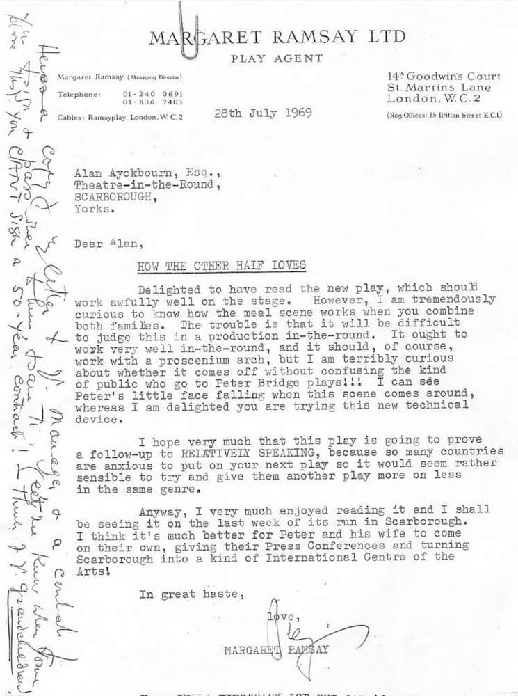

A letter to Alan Ayckbourn from his literary agent Margaret 'Peggy' Ramsay, dated 28 July 1969, offering congratulations on *How The Other Half Loves* and potential issues with the famed 'dinner-party scene'. Peter Bridge, referenced in the letter, had produced *Relatively Speaking* in the West End but had previously declined to produce plays he thought might be difficult to transfer - no matter their appeal.

**Copyright:** Haydonning Ltd  
**Holding:** Borthwick Institute for Archives

*Do not reproduce images without permission of the copyright holder.*

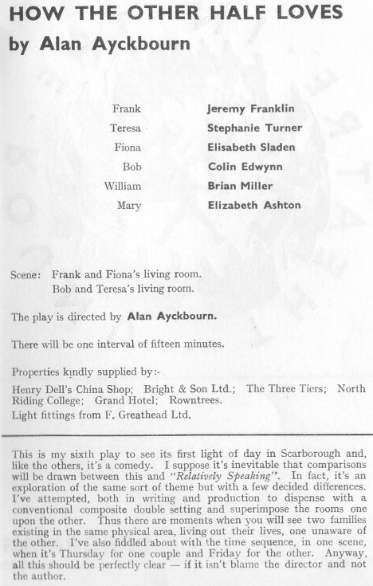

A cast list for the world premiere production of *How The Other Half Loves* at The Library Theatre, Scarborough, reproduced from the original programme. The page also includes a programme note by Alan Ayckbourn.

**Copyright:** Scarborough Theatre Trust Ltd  
**Holding:** Borthwick Institute for Archives

*Do not reproduce images without permission of the copyright holder.*

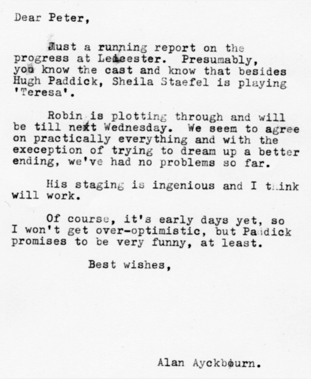

A letter from Alan Ayckbourn to the producer Peter Bridge reporting on progress of *How The Other Half Love*'s West End try-out in Leicester. Note how Alan says he is unhappy with the climax of the play and is still re-writing it.

**Copyright:** Haydonning Ltd  
**Holding:** Borthwick Institute for Archives

*Do not reproduce images without permission of the copyright holder.*

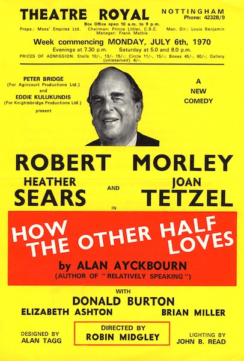

A flyer for the pre-West End tour of *How The Other Half Loves* in 1969. Despite being conceived as an ensemble piece by Alan Ayckbourn, the West End was entirely promoted and centred on the actor Robert Morley, who's precense changed this production from an ensemble piece into an ungainly star vehicle.

**Copyright:** Agincourt Productions Ltd  
**Holding:** Borthwick Institute For Archives

*Do not reproduce images without permission of the copyright holder.*

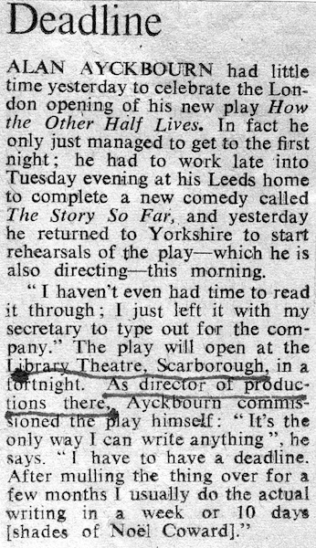

The Times newspaper report from 7 August 1970 reporting on how Alan Ayckbourn nearly missed the West End premiere of *How The Other Half Loves* due to rushing to complete his new play for Scarborough and the need to immediately return for rehearsals.

**Copyright:** Times Newspaper Ltd  
**Holding:** Borthwick Institute For Archives

*Do not reproduce images without permission of the copyright holder.*

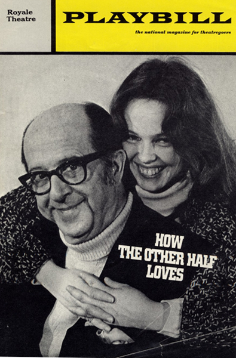

The cover for the Playbill for the Broadway premiere of *How The Other Half Loves* starting Phil Silvers and Sandy Dennis.

**Copyright:** Playbill Inc.  
**Holding:** Borthwick Institute for Archives

*Do not reproduce images without permission of the copyright holder.*

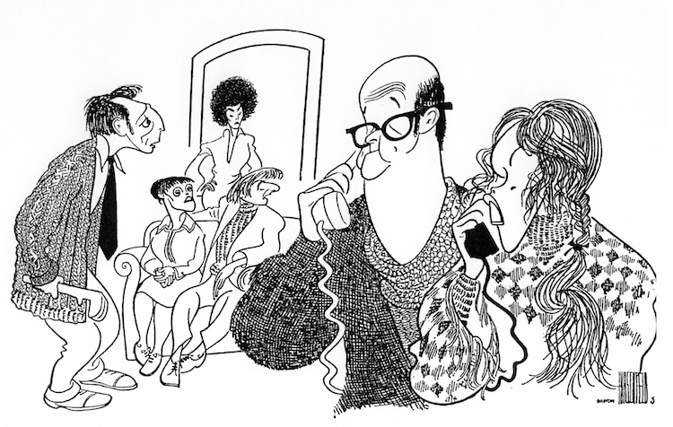

Al Hirschfeld's drawing of the cast of the Broadway production of *How The Other Half Loves* for the New York Times review in 1971.

**Copyright:** Al Hirschfeld Foundation  
**Holding:** Borthwick Institute for Archives

*Do not reproduce images without permission of the copyright holder.*

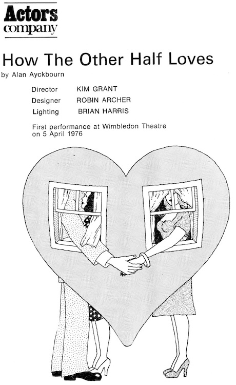

Programme details and image for the Actors' Company 1976 revival of *How The Other Half Loves*. This production is widely seen as launching the re-evaluation of the play and rescuing it from the undeserved reputation it carried from the original West End production starring Robert Morley.

**Copyright:** Actors Company  
**Holding:** Borthwick Institute for Archives

*Do not reproduce images without permission of the copyright holder.*

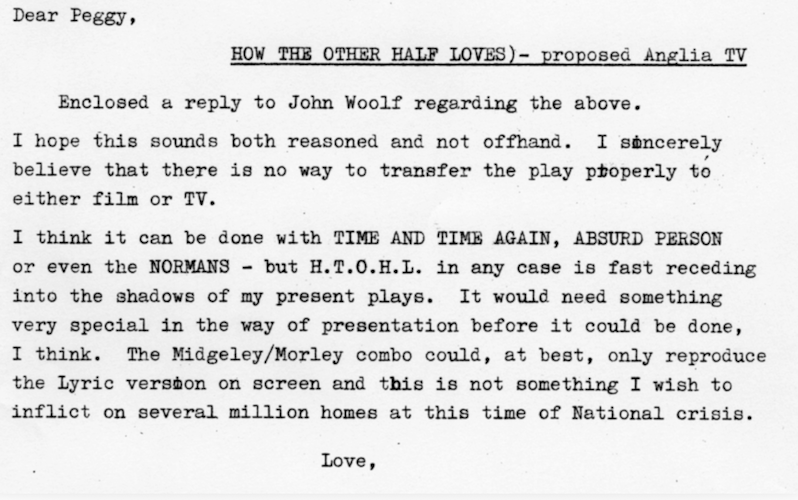

A letter from Alan Ayckbourn to his agent Margaret 'Peggy' Ramsay from 12 January 1975. Within it, he rebuffs a request to adapt *How The Other How Loves* for television by Anglia TV, noting the play is not suitable for adaptation and also his desire not to re-associate the play with Robert Morley.

**Copyright:** Haydonning Ltd  
**Holding:** Borthwick Institute For Archives

*Do not reproduce images without permission of the copyright holder.*

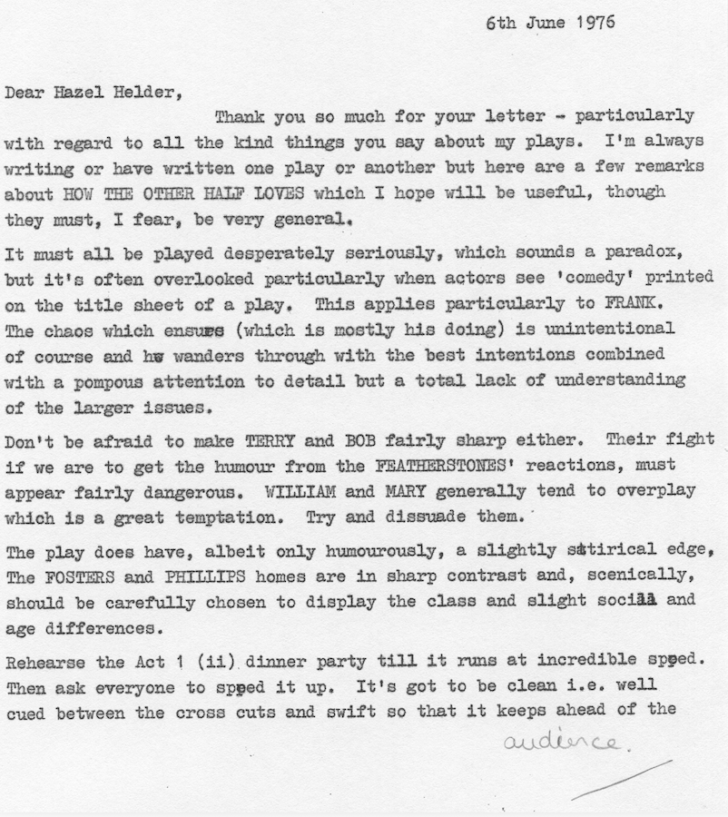

An interesting letter from Alan Ayckbourn, dated 6 June 1976, in which he offers his thoughts on how to direct *How The Other Half Loves*. The advice is still relevant today, particularly given the penchant for playing it as a farce (which is not what the playwright intended).

**Copyright:** Haydonning Ltd  
**Holding:** Borthwick Institute for Archives

*Do not reproduce images without permission of the copyright holder.*

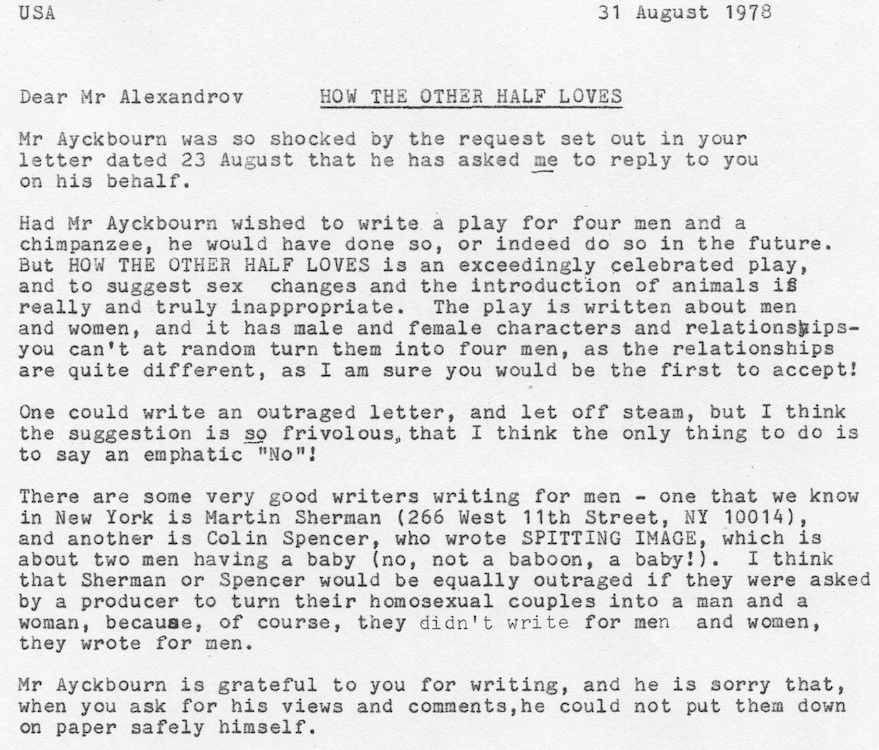

An extraordinary letter - and a gem in the Ayckbourn Archive - in which Alan's agent, Margaret 'Peggy' Ramsay responds on Alan's behalf to a request for a West Coast revival of *How The Other Half Loves* with two of the couples now same-sex with a chimpanzee somehow also in the mix. Easily one of the most usual requests for an Ayckbourn production ever!

**Copyright:** Haydonning Ltd  
**Holding:** Borthwick Institute for Archives

*Do not reproduce images without permission of the copyright holder.*

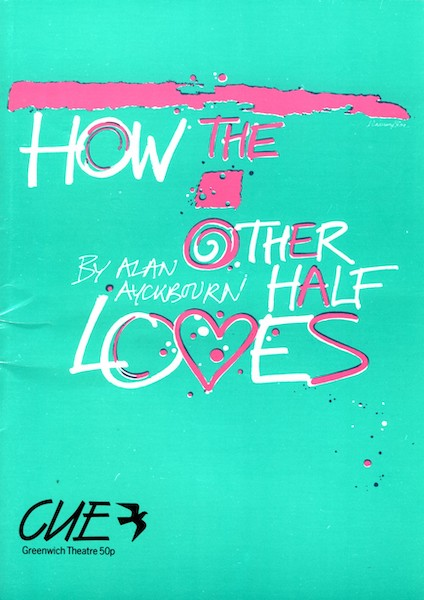

The programme cover for Alan Strachan's 1988 revival of *How The Other Half Loves*, which would later transfer into the West End later that year.

**Copyright:** Greenwich Theatre  
**Holding:** Borthwick Institute for Archives

*Do not reproduce images without permission of the copyright holder.*

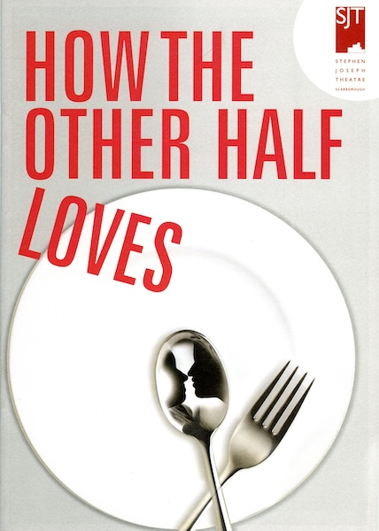

Aside from possibly vying for the most boring poster image for *How The Other Half Loves* ever produced, this is notably the cover of the programme which neglected to credit Alan Ayckbourn as author of the play anywhere aside from his biography! This is despite the fact Alan directed this production at his home theatre in Scarborough. It is fair to say the playwright was not impressed by the Communications Manager who approved this!

**Copyright:** Scarborough Theatre Trust Ltd  
**Holding:** Borthwick Institute for Archives

*Do not reproduce images without permission of the copyright holder.*

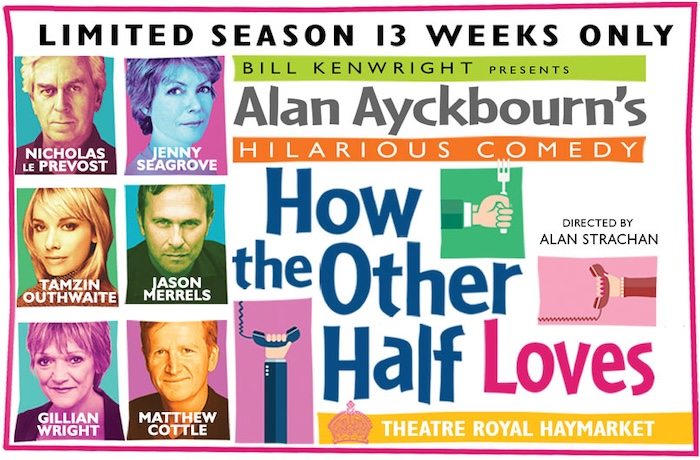

A poster for the 2016 West End revival of *How The Other Half Loves* - again directed by Alan Strachan - which would then transfer into The Duke of York's Theatre.

**Copyright:** Stage Media Ltd  
**Holding:** Borthwick Institute for Archives

*Do not reproduce images without permission of the copyright holder.*  
*The Archive Images page is presented in association with the* ***[Borthwick Institute for Archives](/)*** *at the University of York, where the Ayckbourn Archive is held.*

*All images on this page are copyright of the respective and labelled individual / organisation and should not be reproduced without permission.*  
