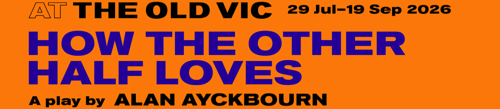

*This page contains details of significant productions of Alan Ayckbourn's How The Other Half Loves, such as the world and London premieres as well as Ayckbourn-directed revivals. It is not a complete list of productions given how frequently it has been performed by professionals and amateur companies around the world.*

### World Premiere (1969)

**First performance:** 31 July 1969  
**World premiere:** 31 July 1969  
**Final performance:** 13 September 1969  
**Venue:** Theatre in the Round at the Library Theatre, Scarborough  
**Staging:** Round

**Director:** Alan Ayckbourn  
**Lighting:** Peter Boden

**Stage Manager:** Robin Holmes  
**Deputy Stage Manager:** Leslie Tomson  
**Assistant Stage Manager:** Charles Boyle  
**Assistant Stage Manager:** Sharon Duce  
**Assistant Stage Manager:** Robert Peck**Character**  
Frank Foster  
Teresa Phillips  
Fiona Foster  
Bob Phillips  
William Featherstone  
Mary Featherstone**Actor**  
Jeremy Franklin  
Stephanie Turner  
Elisabeth Sladen  
Colin Edwynn  
Brian Miller  
Elizabeth Ashton

### Pre-London Try-Out (1970)

**Premiere:** 19 March 1970  
**Venue:** Phoenix Theatre, Leicester  
**Staging:** End-stage

**Director:** Robin Midgley  
**Design:** Franco Colavecchia  
**Producer:** Peter Bridge**Character**  
Frank Foster  
Teresa Phillips  
Fiona Foster  
Bob Phillips  
William Featherstone  
Mary Featherstone**Actor**  
Hugh Paddick  
Sheila Steafel  
Anna Barry  
Stephen MacDonald  
Roy Macready  
Hilda Braid**Note:** Unconvinced of the play's West End potential, the producer Peter Bridge organised a try-out production in Leicester with a different company to that which eventually took the play to London later in the same year.

### London Premiere (1970)

**First performance:** 5 August 1970  
**Premiere:** 5 August 1970  
**Final performance:** 30 September 1972  
**Venue:** Lyric Theatre, London  
**Staging:** End-stage

**Director:** Robin Midgley  
**Design:** Alan Tagg  
**Lighting:** John B. Read  
**Producers:** Peter Bridge & Eddie Kulukundis**Character**  
Frank Foster  
Teresa Phillips  
Fiona Foster  
Bob Phillips  
William Featherstone  
Mary Featherstone**Actor**  
Robert Morley  
Heather Sears  
Joan Tetzel  
Donald Burton  
Brian Miller  
Elizabeth Ashton**Note:** During the course of its run, there were several cast alterations. Jan Holden took over the role of Fiona Foster (probably in 1971) with Ian McCulloch and Sheila Steafel taking over the roles of Bob and Terry Phillips (probably in 1972).

### Broadway Premiere (1971)

**First performance:** 29 March 1971  
**Final performance:** 26 June 1971  
**Performances:** 104  
**Venue:** Royale Theatre

**Director:** Gene Saks  
**Design:** David Mitchell  
**Lighting:** Peggy Clark**Character**  
Frank Foster  
Fiona Foster  
Bob Phillips  
Teresa Phillips  
William Detweiler  
Mary Detweiler**Actor**  
Phil Silvers  
Bernice Massi  
Richard Mulligan  
Sandy Dennis  
Tom Aldredge  
Jeanne Hepple

### Tour (1973)

**First performance:** 13 March 1973  
**Venue:** Theatre Royal Windsor  
**Staging:** End-stage

**Director:** Hugh Goldie  
**Design:** Richard Berry  
**Lighting:** Jane Laws  
**Producer:** Bill Kenwright**Character**  
Frank Foster  
Teresa Phillips  
Fiona Foster  
Bob Phillips  
William Featherstone  
Mary Featherstone**Actor**  
Derek Bond  
Paula Wilcox  
Miriam Karlin  
Ray Lonnen  
Derek Seaton  
Sue Nicholls

### Revival (1976)

**Premiere:** 5 April 1976  
**Venue:** Wimbledon Theatre  
**Company:** Actors Company  
**Staging:** End-stage

**Director:** Alan Strachan  
**Design:** Robin Archer  
**Lighting:** Brian Harris

**Stage Manager:** Jonathan Bartlett  
**Assistant Stage Manager:** Harriet Eastcote**Character**  
Frank Foster  
Teresa Phillips  
Fiona Foster  
Bob Phillips  
William Featherstone  
Mary Featherstone**Actor**  
Moray Watson  
Stephanie Turner  
Barbara Murray  
Neil Stacy  
Simon Cadell  
Helen Cotterill

### Revival (1988)

**First performance:** 8 February 1988  
**Final performance:** 9 March 1988  
**Venue:** Greenwich Theatre, London  
**Staging:** End-stage

**Director:** Alan Strachan  
**Design:** Michael Pavelka  
**Lighting:** Mick Hughes**Character**  
Frank Foster  
Teresa Phillips  
Fiona Foster  
Bob Phillips  
William Featherstone  
Mary Featherstone**Actor**  
Christopher Benjamin  
Louisa Rix  
Gabriella Drake  
Stuart Organ  
Richard Kane  
Lavinia Bertram

### London Revival (1988)

**First performance:** 14 June 1988  
**Final performance:** 26 November 1988  
**Venue:** Duke Of York's Theatre, London  
**Staging:** End-stage

**Director:** Alan Strachan  
**Design:** Michael Pavelka  
**Lighting:** Mick Hughes**Character**  
Frank Foster  
Teresa Phillips  
Fiona Foster  
Bob Phillips  
William Featherstone  
Mary Featherstone**Actor**  
Christopher Benjamin  
Louisa Rix  
Gabriella Drake  
Stuart Organ  
Richard Kane  
Lavinia Bertram**Note:** This production was a transfer of Greenwich Theatre’s 1988 revival.

### Tour (1998)

**Premiere:** 16 November 1998  
**Venue:** Yvonne Arnaud Theatre, Guildford  
**Staging:** End-stage

**Director:** Alan Strachan  
**Design:** Julian Saxton  
**Lighting:** Leonard Tucker  
**Sound:** Dan Last**Character**  
Frank Foster  
Teresa Phillips  
Fiona Foster  
Bob Phillips  
William Featherstone  
Mary Featherstone**Actor**  
Anton Rodgers  
Dariel Pertwee  
Angela Thorne  
Michael Lumsden  
Paul Raffield  
Suzy Aitchison

### Revival (2007)

**Tour Premiere:** 7 August 2007  
**Venue:** Theatre Royal, Bath  
**Company:** The Peter Hall Company  
**Staging:** End-stage

**Director:** Alan Strachan  
**Design:** Paul Farnsworth  
**Lighting:** Jason Taylor**Character**  
Frank Foster  
Teresa Phillips  
Fiona Foster  
Bob Phillips  
William Featherstone  
Mary Featherstone**Actor**  
Nicholas le Provost  
Amanda Royle  
Marsha Fitzalan  
Richard Stacey  
Paul Kemp  
Claudia Elmhirst

### Revival (2009)

**First performance:** 4 June 2009  
**Premiere:** 9 June 2009  
**Final performance:** 29 August 2009  
**Venue:** Stephen Joseph Theatre, Scarborough  
**Staging:** Round

**Director:** Alan Ayckbourn  
**Design:** Jan Bee Brown  
**Lighting:** Jason Taylor  
**Fight Director:** Kate Waters

**Company Stage Manager:** Andy Hall  
**Deputy Stage Manager:** Den Body  
**Assistant Stage Manager:** Rebecca Mason**Character**  
Frank Foster  
Teresa Phillips  
Fiona Foster  
Bob Phillips  
William Featherstone  
Mary Featherstone**Actor**  
Robert Austin  
Rosie Jenkins  
Marilyn Cutts  
Theo Cross  
Ian McLarnon  
Anna Lowe

### London Revival (2016)

**First performance:** 23 March 2016  
**Premiere:** 31 March 2016  
**Final performance:** 25 June 2016  
**Venue:** Theatre Royal Haymarket  
**Staging:** End-stage

**Director:** Alan Strachan  
**Design:** Julie Godfrey  
**Lighting:** Jason Taylor  
**Sound:** Dan Samson  
**Producer:** Bill Kenwright**Character**  
Frank Foster  
Teresa Phillips  
Fiona Foster  
Bob Phillips  
William Featherstone  
Mary Featherstone**Actor**  
Nicholas le Provost  
Tamzin Outhwaite  
Jenny Seagrove  
Jason Merrells  
Matthew Cottle  
Gillian Wright

### London Transfer (2016)

**First performance:** 7 July 2016  
**Final performance:** 1 October 2016  
**Venue:** Duke of York's Theatre  
**Staging:** End-stage

**Director:** Alan Strachan  
**Design:** Julie Godfrey  
**Lighting:** Jason Taylor  
**Sound:** Dan Samson  
**Producer:** Bill Kenwright**Character**  
Frank Foster  
Teresa Phillips  
Fiona Foster  
Bob Phillips  
William Featherstone  
Mary Featherstone**Actor**  
Nicholas le Provost  
Andrea Lowe  
Jenny Seagrove  
Jason Merrells  
Matthew Cottle  
Gillian Wright

### Tour (2017)

**First performance:** 30 August 2017  
**Venue:** Theatre Royal, Windsor  
**Staging:** End-stage

**Director:** Alan Strachan  
**Design:** Julie Godfrey  
**Lighting:** Jason Taylor  
**Sound:** Dan Samson  
**Producer:** Bill Kenwright**Character**  
Frank Foster  
Teresa Phillips  
Fiona Foster  
Bob Phillips  
William Featherstone  
Mary Featherstone**Actor**  
Robert Daws  
Charlie Brooks  
Caroline Langrishe  
Leon Ockenden  
Matthew Cottle  
Sara Crowe

### London Revival (2026)

**First performance:** 29 July 2026  
**Premiere:** 11 August 2026  
**Final Performance:** 19 September 2026  
**Venue:** The Old Vic  
**Staging:** Round

**Director:** Phillip Breen  
**Design:** Rob Howell  
**Lighting:** Azusa Ono  
**Sound:** Dyfan Jones  
**Associate Director:** Phillippe Cato  
**Associate Costume:** Lucy Geiger  
**Wigs. Hair & Make-Up:** Campbell Young Associates**Character**  
Frank Foster  
Fiona Foster  
Bob Phillips  
Teresa Phillips  
William Featherstone  
Mary Featherstone**Actor**  
Roger Allam  
Dorothy Atkinson  
Rowan Polonski  
Ayesha Antoine  
Adam Gillen  
Laura Elsworthy    *All research for this page by Simon Murgatroyd.*
