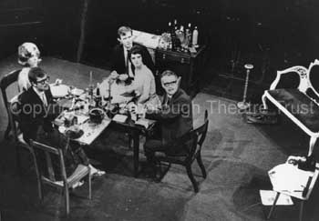
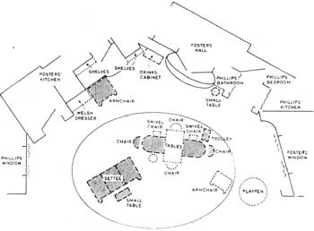
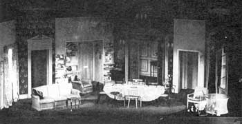
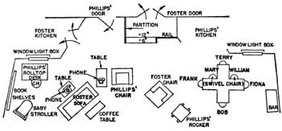

One of the major challenges of staging *How The Other Half Loves* is its set-design. Both living rooms have to share the same space, but each has also be clearly defined and the conceit understood by the audience. While the play breaks conventions, its own conventions have to be understood very quickly by the audience for the play to work and not to leave the audience scratching its collective head.The importance of the stage space for this play is emphasised by Alan Ayckbourn in his book *The Crafty Art Of Playmaking*.

*“In How The Other Half Loves the superimposed composite set - half the sofa and half the dining table belong to one family, half to another - contributes enormously to the storytelling and, incidentally, brings about fifty per cent of the laughs. \[This play\], of course, grew out of my experience of working in the round.*

*“Whilst How The Other Half Loves has transferred reasonably successfully to the proscenium…. Privately I believe \[the play\] works infinitely better in the round, where the floor is in full view of everyone. It is, after all, a play about floor space and where the round is concerned, the floor is the equivalent of the backdrop: the floor seen by everyone is the area where the designers can make their strongest scenic statement.”*

Some of the solutions to this challenge can be found on this page. Unfortunately, no plans exist for the original production at Theatre in the Round at the Library Theatre, Scarborough, in 1969. All that exists are the stage directions as printed in the original manuscript.

**Note: as of July 2026, drawings of the original production have been found and this article will be updated to reflect them in the near future.**

*“The lights come up on the main set to reveal two living rooms. Not a composite setting but with the two rooms contained and overlapping in the same area. Only the furnishings themselves, both in colour and style, indicate clearly which belongs to which room. Also, perhaps, a certain lighting emphasis from time to time.*  
*The FOSTERS’ (FIONA and FRANK'S) is smart period reproduction - A settee, matching armchair and a small coffee table.*  
*The PHILLIPS’ (TERESA and BOB'S) has identical items, but more modern trendy and badly looked after.*  
*Common to both rooms, a sideboard. At one end of this the FOSTERS’ drinks are arranged. At the other, the PHILLIPS’ muddle.”*

Sadly, there are no clear photographs of the set either, but a picture exists of the dinner sequence (fig.1) which shows how the table was laid out in the original production. Descriptions of the set from contemporary reviews do suggest that there was more split furniture (furniture which contained elements of both households) than was found in subsequent productions, but without more detailed plans or images, it is difficult to substantiate this.

The photograph clearly shows the cruciform table layout which allows the Featherstones to move from one dinner party to the next at the twist of a seat. It also gives an impression of how the living rooms were divided as elements of both couples’ spaces can be seen in the image.

When the play transferred to London, it moved into a proscenium theatre and the staging had to be altered substantially with full use being made of the back of the stage with a complex series of alternating flats. The set was designed by Alan Tagg and apparently differed substantially from the play’s try-out at the Phoenix Theatre, Leicester (designed by Frank Colavecchia).

The plan (fig.2) is from the second scene with the dining table in place. During the London run, the dining table was only present during the second scene with coffee tables replacing it during the rest of the play. The set and photo (fig.3) illustrate how the stage was divided to show both living rooms simultaneously. The current acting edition of the play (published by Samuel French) has different plans for each of the scenes, but realistically the only alterations necessary to any production is the addition of the dining table for the second scene, if it is not already an integral part of the set as occurred in the Broadway production.

When the play opened on Broadway, the production was not allowed to use the same set as the London production as apparently Alan Tagg had patented his design with regard to the alternating flats. As a result, the set (designed by David Mitchell) is notably different again (fig.4). This is not a real loss as Alan Ayckbourn believes Tagg's set was compromised and unsatisfactory anyway and added unnecessary distractions to the play.

With the play having been Americanised for New York audiences, it is no surprise that the set would alter. The most substantive difference, as can be seen from the plan (fig.4) is the stage contains the entire set. The dining table is not just present in the second scene but is integrated into the permanent set. Judging from the design, it was simpler than the London version and perhaps a slightly better reflection of the original intent for the play.

*1) The dinner scene from Act 1 Scene 2 as seen in the original production at Theatre in the Round at the Library Theatre, Scarborough, in 1969 (copyright: Scarborough Theatre Trust)*

*2) A floor-plan for the first act second scene of How The Other Half Loves as designed by Alan Tagg for the London premiere in 1970 (copyright: Alan Tagg).*

*3) An image of the set of the London premiere production of How The Other Half Loves in 1970. Note the alternating flats at the rear, designed by Alan Tagg, and which Alan Ayckbourn believes were not a good design decision, overly complicating the set and distracting to the play.*

