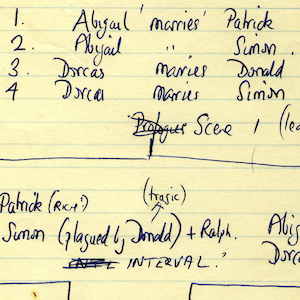
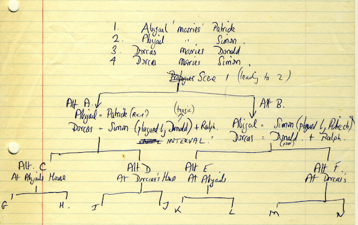
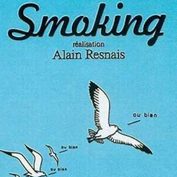
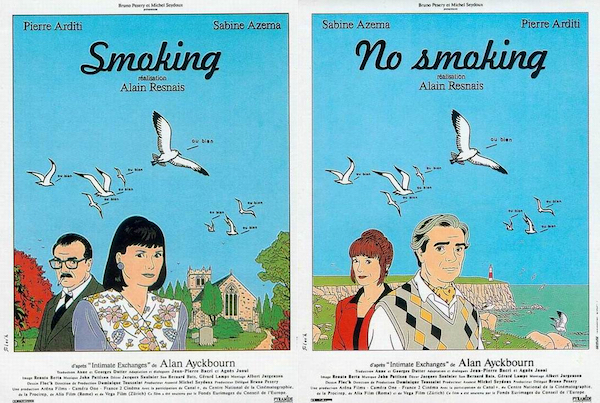
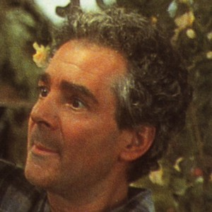
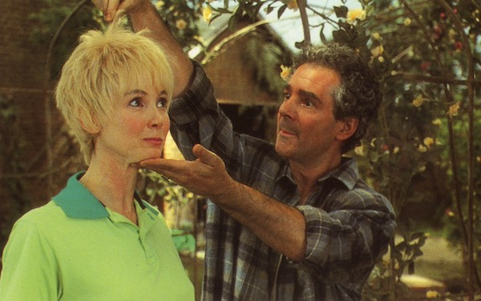
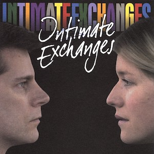
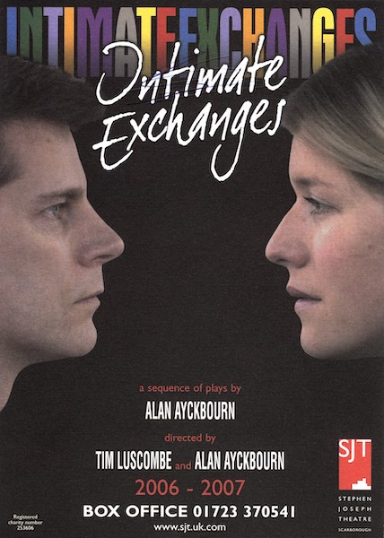

A collection of archive material, posters, rehearsal and production images pertaining to Alan Ayckbourn's *Intimate Exchanges*. The Archive Images page is presented in association with the **[Borthwick Institute for Archives](/)** at the University of York where the Ayckbourn Archive is held. Click on an image to expand.

### Intimate Exchanges (1982)

The complex branching structure for *Intimate Exchanges* (a single scene leading to 16 possible variations of the play) was actually initially conceived for his 1979 play *Sisterly Feelings* - as these early notes by the playwright show. He would simplify the structure for this play, but re-use the structure for *Intimate Exchanges*.

*Do not reproduce images without permission of the copyright holder.*

The French film auteur Alain Resnais adapted *Intimate Exchanges* into two films, *Smoking* & *No Smoking*, in 1993. These are the posters for the films which adapted 12 of the 16 possible permutations of the film.

**Copyright:** To be confirmed  
**Holding:** Ayckbourn Digital Archive

*Do not reproduce images without permission of the copyright holder.*

Sabine Azéma & Pierre Arditi in the films *Smoking* / *No Smoking*. The director, Alain Resnais, stayed faithful to the play with both actors playing all 10 roles.

**Copyright:** Mainline Pictures  
**Holding:** Borthwick Institute for Archives

*Do not reproduce images without permission of the copyright holder.*

The poster for the 2006 / 2007 revival of *Intimate Exchanges* at the Stephen Joseph Theatre, Scarborough. As Alan Ayckbourn had a stroke just prior to rehearsals beginning, the play was initially directed by Tim Luscombe in 2006 before Alan took over in 2007.

**Copyright:** Scarborough Theatre Trust  
**Holding:** Borthwick Institute for Archives

*Do not reproduce images without permission of the copyright holder.*    *The Archive Images pages are presented in association with the* ***[Borthwick Institute for Archives](/)*** *at the University of York, where the Ayckbourn Archive is held.*

*All images on this page are copyright of the respective and labelled individual / organisation and should not be reproduced without permission.*  
