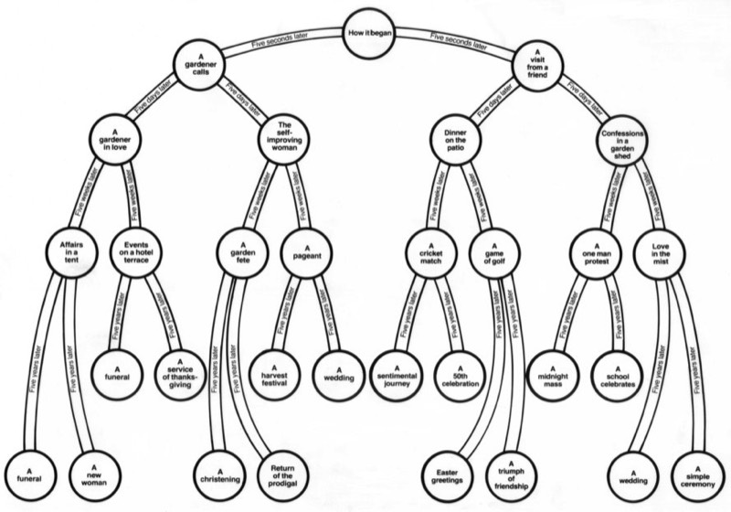

*Intimate Exchanges* comprises of eight plays generated from a single opening scene. At the end of each scene, a choice is made and the play divides into its various permutations from this, leading to a basic structure of one prologue; 2 first scenes; 4 second scenes; 8 third scenes and 16 fourth scenes. Although there are 16 different permutations, the play is split into eight distinct plays, each of which has an alternate ending. This structure is shown below and the names of the eight variants can be found in the third scene choices.

